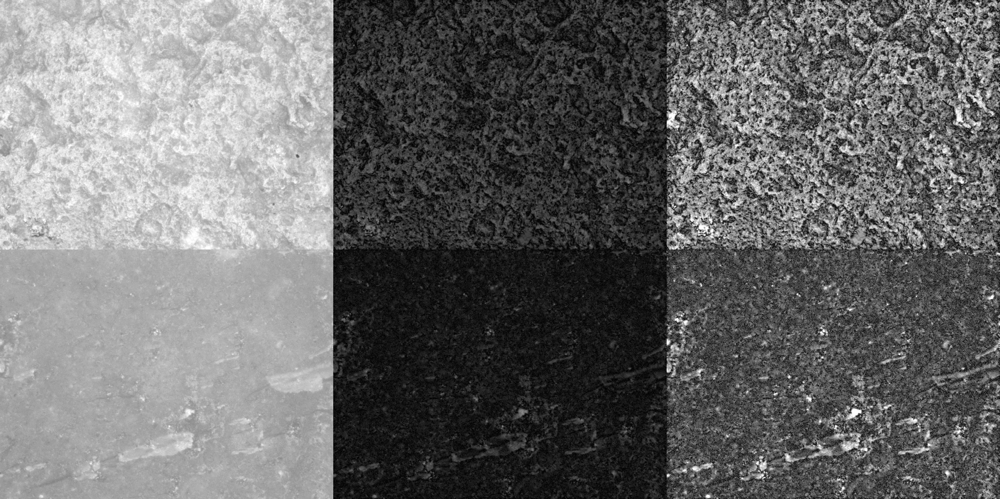

# Quantification of surface abrasion on flint stone tools

Guillermo Bustos-Pérez $^{1,2,3}$  
Andreu Ollé $^{2,3}$

$^1$ Universidad Autónoma de Madrid. Departamento de Prehistoria y
Arqueología, Campus de Cantoblanco, 28049 Madrid, Spain.  
$^2$ Institut Català de Paleoecologia Humana i Evolució Social (IPHES),
Zona Educacional 4, Campus Sescelades URV (Edifici W3), 43007 Tarragona,
Spain.  
$^3$ Àrea de Prehistoria, Universitat Rovira i Virgili (URV), Avinguda
de Catalunya 35, 43002 Tarragona, Spain.

 

<div align="justify">

**Abstract**

Lithic artifacts are some of the most common and numerous remains
recovered from paleolithic archaeological sites. However, these
materials can undergo multiple post-depositional alterations after their
introduction into the archaeological record. Due to the high quantity of
lithic remains recovered, a quick, flexible, and effective method for
identifying degrees of alteration on the surface of lithic implements is
highly desirable. The present study examines the use of gray level
images to obtain quantitative data from the surface of flint artifacts
and determine whether these images can detect the presence of
post-depositional alterations. An experimental collection of flints was
subjected to sequential episodes of rounding in a tumbling machine.
After each episode, photographs were taken with a microscope, resulting
in quantitative surface values using gray level values. The quantitative
surface values were used as variables in machine learning models to
determine time of exposure and the most salient variables for
discrimination. Our results indicate that the extraction of metrics from
gray level images successfully capture changes in the surface of flint
artifacts caused by post-depositional processes. Additional results
provide insight into which areas to sample when seeking
post-depositional alterations and underscore the importance of particle
size in the generation of alterations.

**Key words**: lithic taphonomy; experimental archaeology; machine
learning

 

## **1. Introduction**

  Some of the most common remains recovered from paleolithic
archaeological sites are lithic artifacts. Because eco-cultural
inferences can be drawn from lithic artifacts, post-depositional
alterations are a key factor to consider when analyzing an assemblage.
Methods for determining assemblage integrity usually focus on the
assemblage as a whole, and often include a spatial analysis of the
artifacts as well as fabric analysis to determine whether water flow has
reorganized the spatial distribution and orientations of the pieces
([Shackley 1974](#ref-shackley_stream_1974); [Petraglia and Potts
1994](#ref-petraglia_water_1994); [McPherron
2005](#ref-mcpherron_artifact_2005); [McPherron
2018](#ref-mcpherron_additional_2018)). Also, the size distribution of
the lithics is analyzed to determine whether post-depositional processes
have resulted in the sorting of materials ([Maíllo Fernández
1998](#ref-maillo_fernandez_proporciones_1998); [Hiscock
2002](#ref-hiscock_quantifying_2002); [Bertran et al.
2012](#ref-bertran_particle_2012); [Byers et al.
2015](#ref-byers_flake_2015)). Another option is to focus specifically
on individual lithic artifacts to determine the degree of alteration
that they have undergone ([Levi Sala 1986](#ref-levi_sala_use_1986);
[Chu et al. 2015](#ref-chu_micro-abrasion_2015)). Although more time
consuming, this type of analysis establishes an individual graduation in
the degree of post-depositional alterations. It can also be combined
with spatial analysis to potentially dissect distinct archaeological
episodes or detect instances of recycling. The individual determination
of the degree of alteration undergone by a lithic artifact makes use of
a microscopic analysis to measure ridge width, a visual analysis of the
surface to determine the existence and intensity of abrasion, and an
examination of the edges to determine the presence of detachments caused
by particle impact, or dulling in more extreme cases ([Shackley
1974](#ref-shackley_stream_1974); [Bustos-Pérez et al.
2019](#ref-bustos-perez_experimental_2019)).

Broadly speaking, how post-depositional alterations can affect and
interact with stone tools depends on two factors: firstly, the types of
fluvial sedimentary processes an artifact might have encountered and,
secondly, the degree to which an artifact has been exposed to the source
of alteration and when it enters into the archaeological record. Fluvial
sedimentary processes are characterized by particle transport. Lithic
artifacts can form part of these processes as another component, or
remain static and be affected by the particles being transported across
their surfaces. Commonly, three modes of particle transport are
described in fluvial sedimentary contexts: rolling, sliding and
saltation ([Alhusban and Valyrakis 2021](#ref-alhusban_assessing_2021)),
although alterations cause by saltation are rarely seen on stone tools
([Petraglia and Potts 1994](#ref-petraglia_water_1994)). In addition to
alterations resulting from fluvial contexts, stone artifacts might also
be affected by aeolian particle transport, which results in wind
abrasion ([Stapert 1976](#ref-stapert_natural_1976)). The second factor
of variability affecting the post-depositional alterations of stone
tools is the degree of exposure they have had and the speed with which
they enter the archaeological record ([Schiffer
1972](#ref-schiffer_archaeological_1972); [Schick
1986](#ref-schick_stone_1986); [Petraglia and Potts
1994](#ref-petraglia_water_1994)). For example, partially buried
artifacts with water and sediment flowing above them are expected to
present modifications on the exposed surface, while the edges and the
buried surface will remain semi-intact ([Petraglia and Potts
1994](#ref-petraglia_water_1994)). Meanwhile, artifacts that are
transported by rolling in coarse sediments will exhibit abrasion across
their entire surface and have dulled edges. However, the impact from
coarse particles might result in freshly detached surfaces and edges
which then undergo new modifications until the artifact enters the
archaeological record ([Harding et al.
1987](#ref-sieveking_transport_1987); [Petraglia and Potts
1994](#ref-petraglia_water_1994)). Finally, the same homogeneous lithic
assemblage might be affected differentially by stream abrasion. This
differential alteration is a consequence of the complex structure of
water streams, in which the overall slope of the terrain, energy and
charge of the flow, morphology of the channel (which also affects the
lateral deposition of sediments) and several other factors result in
complex and uneven structures \[Rust ([1972](#ref-rust_structure_1972));
Montgomery and Buffington ([1997](#ref-montgomery_channel-reach_1997));
Jain et al. ([2008](#ref-jain_where_2008))).

Use-wear studies have shown that quantification of the surface can offer
a higher resolution of analysis ([Evans and Donahue
2008](#ref-evans_laser_2008); [Stemp et al.
2009](#ref-stemp_quantification_2009); [Ibáñez et al.
2016](#ref-ibanez_cereal_2016); [Ibáñez et al.
2019](#ref-ibanez_identifying_2019); [Pedergnana et al.
2020](#ref-pedergnana_polish_2020); [Ibáñez and Mazzucco
2021](#ref-ibanez_quantitative_2021); [Boström and Lundin
2022](#ref-bostrom_quantifying_2022)). Obtaining quantitative data on
surface modifications caused by post-depositional processes can also
increase the resolution of these analyses and complement other features
of post-depositional studies. However, as previously mentioned, stone
artifacts are some of the most common remains recovered from paleolithic
archaeological sites. Thus, a fast, versatile method is highly desirable
since it would enable the analysis of large quantities of lithic
materials. Previous approaches in the study of use-wear have used gray
values to analyze the surfaces of different worked materials ([Grace et
al. 1985](#ref-grace_quantification_1985); [Vila and Gallart
1993](#ref-vila_caracterizacion_1993); [Bietti
1996](#ref-bietti_image_1996); [Barceló et al.
2001](#ref-barcelo_image_2001); [Pijoan-López et al.
2002](#ref-pijoan-lopez_variabilidad_2002); [Adán et al.
2003](#ref-adan_spatial_2003)). The present research seeks to determine
whether changes in flint surface caused by sedimentary abrasion can be
captured and quantified from grayscale images.

## **2. Methods**

### **2.1 Experimental sample and setting**

Two blocks of flint representing two different types (Type I and Type
II) were experimentally knapped. Both types are south Madrid Miocene
flint ([Bustillo and Pérez-Jiménez
2005](#ref-bustillo_caracteristicas_2005); [Bustillo et al.
2012](#ref-bustillo_caracterizacion_2012)) although sourced from two
different locations. South Madrid Miocene flints were formed by the
replacement of sedimentary rocks which had filled the original basin.
This replacement of the sedimentary rocks is considered to have taken
place under continental conditions such as alluvial plain deposits,
shallow lacustrine waters, and marshes ([Bustillo et al.
2012](#ref-bustillo_caracterizacion_2012)). The macroscopic analysis of
the flints evidences a fine opaque homogeneous surface that is blue/grey
and reddish/ocher in color. There is also a relative absence of opal,
although geodes and pseudo-morphs can be observed. From these two
blocks, three flakes were selected from Type 1, and four flakes.

<figure>

<figcaption aria-hidden="true">“Experimental sample of flint flakes
(photographs by M. D. Guillén).”</figcaption>
</figure>

In order to simulate sedimentary abrasion, the flakes were introduced in
pairs into a tumbler machine (KT-3010 SUPER-TUMBLER) along with a mix of
sand and water (30/40% water with a total weight of 5 kg). The sediment
was obtained from the quaternary levels of the Madrid basin and is made
up of fine sands with silt and partial carbonation. The tumbler machine
was set to turn in a continuous direction at 83 rpm.

All of the flakes were submitted to three cumulative cycles of tumbling
with times set to 1 h, 5 h and 10 h. Prior to placement in the tumbling
machine, six photographs (three on each side) were taken of the surface
of each flake to act as references for the texture metrics of the flint
flakes. Previous research ([Chu et al.
2015](#ref-chu_micro-abrasion_2015); [Bustos-Pérez et al.
2019](#ref-bustos-perez_experimental_2019)) suggests that for the
development of post-depositional alterations decreased particle size
results in increased heterogeneity in the speed, intensity and location
of their development. Thus, after the first cycle of rounding (1 h),
each flint flake was screened using the Dino-Lite Edge 3.0 AM73915MZT
USB microscope in order to determine and photograph areas which had
developed sedimentary abrasion. These areas were photographed in the
subsequent rounding cycles, thereby generating sequential images and
data on surface changes for cumulative times of 1 h, 5 h and 10 h. The
dataset of images was supplemented by the inclusion of sample
photographs of macroscopically recognizable geological neocortex of
flints from the same formation, resulting in a total of 269 photographs:
42 of fresh surfaces, 68 from each cycle of rounding (i.e., 204 in
total), and 23 of neocortex.

``` r
# Load and inspect the data
load("Data/Sequential Data v1.01.RData")
head(Sequential.Data)
```

    ##                               ID    Mean      SD Modal Median  Kurtosis
    ## 1 HDisc_01_11 Neocortex 01c.tif  78.8051 48.0084    52     72  0.192800
    ## 2  HDisc_01_11 Neocortex 2c.tif  79.4588 49.0694    57     72  0.220100
    ## 3  HDisc_01_11 Neocortex 3c.tif  79.2460 48.6480    48     72  0.096450
    ## 4  HDisc_01_11 Neocortex 4c.tif  83.6360 49.8806    52     80 -0.184100
    ## 5  HDisc_01_11 Neocortex 5c.tif  72.9310 42.9089    57     65  1.112800
    ## 6 Hdisc_01_12 Neocortex 01c.tif  81.6403 47.6198    78     78  0.006416
    ##   Skewness     Rq     Ra   Rsk   Rku          ASM     CONT         CORR
    ## 1   0.6877 92.238 78.962 1.404 2.265 0.0007548563 2590.374 0.0001906969
    ## 2   0.7342 93.279 79.431 1.425 2.324 0.0006760500 2580.717 0.0001932169
    ## 3   0.6573 92.902 79.279 1.412 2.268 0.0005304562 2622.327 0.0001890238
    ## 4   0.5215 97.097 83.571 1.384 2.157 0.0004967000 2769.124 0.0001788550
    ## 5   0.9028 84.399 73.105 1.428 2.390 0.0009690375 2430.545 0.0001859788
    ## 6   0.5100 94.272 81.652 1.365 2.125 0.0005128812 2489.187 0.0001995875
    ##          IDM      ENT    Flake.ID Flake.Time Dorsal.Ventral No.Photo Photo.Type
    ## 1 0.04392375 7.478644 HDisc_01_11  Neocortex             01        1   Screened
    ## 2 0.04356938 7.616038 HDisc_01_11  Neocortex             01        2   Screened
    ## 3 0.03970000 7.818300 HDisc_01_11  Neocortex             01        3   Screened
    ## 4 0.03933437 7.856781 HDisc_01_11  Neocortex             01        4   Screened
    ## 5 0.04494313 7.275731 HDisc_01_11  Neocortex             01        5   Screened
    ## 6 0.04123938 7.828831 Hdisc_01_12  Neocortex             01        1   Screened
    ##   Flake.Number Flint.Type
    ## 1           11  GeoSample
    ## 2           11  GeoSample
    ## 3           11  GeoSample
    ## 4           11  GeoSample
    ## 5           11  GeoSample
    ## 6           12  GeoSample

``` r
#load packages
library(tidyverse); library(caret); library(pROC)
```

``` r
# Counts of number of images per time of exposure
# (sequential images taken after the first episode of abrasion are not included)
Sequential.Data %>% 
  filter(Photo.Type != "Sequential" | Flake.Time ==  "Fresh" ) %>% 
  group_by(Flake.Time) %>% 
  summarise(
    N.by.Flakes = n())
```

    ## # A tibble: 5 × 2
    ##   Flake.Time N.by.Flakes
    ##   <fct>            <int>
    ## 1 Fresh               42
    ## 2 One.Hour            68
    ## 3 Five.Hours          68
    ## 4 Ten.Hours           68
    ## 5 Neocortex           23

### **2.2 Cleaning protocol, image acquisition and processing**

Prior to extracting the quantitative data from the images, the workflow
employed in the present study included a series of steps: cleaning
protocol, image capture, and image enhancement.

Multiple studies have emphasized the need for cleaning protocols to
remove modern contaminants prior to analysis ([Ollé and Vergès
2014](#ref-olle_use_2014); [Pedergnana et al.
2016](#ref-pedergnana_modern_2016); [Fernández-Marchena and Ollé
2016](#ref-fernandez-marchena_microscopic_2016); [Asryan and Ollé
2020](#ref-asryan_results_2020)). A multi-step procedure based on
previous studies was adopted ([Pedergnana et al.
2016](#ref-pedergnana_modern_2016)) in order to remove possible
contaminants (Fig. S2). This multi-step procedure included a sonic bath
in 2% neutral soap (Derquim) solution for 10 to 15 minutes, followed by
a second sonic bath in pure acetone for another 10 to 15 minutes. After
each step, the lithic artifacts were placed in a water bath and finally
dried with pressurized air. Surgical gloves were worn during the
handling of all the artifacts during the cleaning protocol and
microscopic analysis.

<figure>

<figcaption aria-hidden="true">“Effects of manual manipulation without
protection on flint surface. Left: surface photographed after the
application of cleaning protocol and manipulation of the artefact using
protection. Right: same surface after manual manipulation without
protection”</figcaption>
</figure>

All surface photographs were taken using a Dino-Lite Edge 3.0 AM73915MZT
USB microscope at 120 magnifications with a field of view (FOV) of 3.28
x 2.46 mm and a pixel ratio of 2548 x 1918. The USB microscope was
mounted in a Dino-Lite RK-06-AE stand in order to ensure verticality,
and a N3C-D2 diffuser cap was used to ensure the even distribution of
light. In the process of taking each photograph, the region of interest
on the flint was manually positioned as horizontally as possible
([Calandra 2022](#ref-calandra_workflow_2022)). To avoid problems due to
focus variation, each surface was photographed several times at
different heights, and the sequences obtained were mounted using a
Helicon Focus 7.7.2.

A common problem of images obtained from USB microscopes is the lack of
detail due to saturation in one of the grey level values and the effects
of different lighting or surface color. This saturation is often
observed as a general glaze in one of the grey level values and results
in a low-quality image with poor detail. To increase detail and quality
prior to the analysis, all images were subjected to a two-step process.
First, the Fiji ([Schindelin et al. 2012](#ref-schindelin_fiji_2012))
“Subtract background” plugin was used to minimize the effects of
different lighting and differing flint coloration. Second, we used the
“Enhance contrast” function to desaturate the images by normalizing
their histograms. This process provided a gray level image for use as
input for the statistical analysis. All analyzed images were in TIFF
format.

<figure>

<figcaption aria-hidden="true">“Two examples of image enhancement. Left:
original images taken with the AM73915MZT USB microscope and using a
N3C-D2 diffuser cap. Center: images after removing the background to
avoid the effects of different lighting or color. Right: after
normalizing the histogram to increase detail and prevent saturation. Top
row: geological neocortex. Bottom row: fresh surface of an
experimentally knapped flake.”</figcaption>
</figure>

### **2.3 Statistical analysis**

The present study used three sets of statistical metrics to analyze the
images: descriptive statistics (mean, standard deviation, mode, median,
skewness, and kurtosis), measures of roughness, and measures of
intensity values.  
The surface parameters were analyzed using the “R” prefix for the
profiles as input. The present work uses a Fiji/ImageJ plugin with which
R-values are obtained over the whole surface following the ISO 4287/2000
standard ([Chinga and Dougherty 2002](#ref-chinga_roughness_2002);
[Chinga et al. 2007](#ref-chinga_quantification_2007)). These measures
are:

- **Root mean square deviation/roughness (Rq):** indicator of surface
  roughness.  
- **Arithmetical mean deviation (Ra):** indicator of the deviation of a
  surface from a mean height.  
- **Skewness of the assessed profile (Rsk):** indicator of the departure
  from surface symmetry. Negative values indicate a surface made of deep
  valleys, and positive values indicate peaks and asperities.  
- **Kurtosis of the assessed profile (Rku):** indicator of the sharpness
  of the peaks. Low values indicate blunt peaks, while high values
  indicate sharp peaks.

The intensity values were analyzed with the Gray Level Co-occurrence
Matrix (GLCM; ([Haralick et al. 1973](#ref-haralick_textural_1973)))
takes into consideration the spatial distribution of intensity values.
The GLCM works in two steps ([Haralick et al.
1973](#ref-haralick_textural_1973)). First, using a given distance and
direction it builds a matrix which captures the relationship of
intensity between pairs of pixels (reference and neighbor). Second, for
every x and y it considers the co-occurrence of values, forming a new
matrix. From this new matrix, a series of statistical descriptors are
derived ([Haralick et al. 1973](#ref-haralick_textural_1973)).

- **Angular Second Moment (ASM)** is a measure of homogeneity in the
  image. Homogeneous images (with low gray-tone transitions) will have
  fewer high-magnitude entries. Thus, homogeneous images will have high
  ASM values, while the opposite will be true for non-homogeneous
  images.  
- **Contrast (CONT)** is a value for local variations. High values
  indicate more local variation and low values indicate less local
  variation.  
- **Correlation (CORR)** measures gray-tone linear-dependencies in the
  image. It indicates how a reference pixel is related to its neighbor.
  A value of 0 indicates it is uncorrelated, while a 1 indicates a
  perfect correlation.  
- **Inverse Different Moment (IDM)**, also referred as homogeneity,
  measures the closeness of the distribution of the GLCM elements to the
  GLCM diagonal.  
- **Entropy (ENT)** is a measure of the amount of irremediable chaos or
  disorder in an image. High values of entropy indicate values of
  similar magnitude, while low values indicate unequal entries.

As previously mentioned, the use of the GLCM requires selecting the
pixel distance between the reference and neighbor, and the direction at
which to establish the distance ([Haralick et al.
1973](#ref-haralick_textural_1973)). To do this, it is common to test
for different combinations of distances and directions, as images at
different magnifications, different fields of view and different
resolutions might require variations in pixel distance ([Grace et al.
1985](#ref-grace_quantification_1985); [Bietti
1996](#ref-bietti_image_1996)). For the present study, a preliminary
test indicated that using four distances at 5, 10, 15 and 20 pixels in
the four possible directions (north, east, south and west) to set the
GLCM presented the best results for discrimination.

All metrics were calculated using the free software Fiji ([Schindelin et
al. 2012](#ref-schindelin_fiji_2012)). Roughness metrics were calculated
with the “Roughness calculation” plugin ([Chinga and Dougherty
2002](#ref-chinga_roughness_2002)). GLCM and texture metrics were
calculated using the “GLCM texture” ([Cabrera
2006](#ref-cabrera_texture_2006)).

### **2.4 Machine Learning models and evaluation**

The data from the descriptive statistics and the roughness and texture
analyses were used as variables for the training of machine learning
models in order to predict the time of exposure to sedimentary abrasion.
The 10 models tested are described below.

- **Linear discriminant analysis (LDA)** reduces dimensionality for the
  purpose of maximizing the separation between classes while decision
  boundaries divide the predictor range into regions ([Fisher
  1936](#ref-fisher_use_1936); [James et al.
  2013](#ref-james_introduction_2013)).  
- **K-nearest neighbor (KNN):** classifies cases by assigning the class
  of similar known cases. The ‘k’ in KNN refers to the number of cases
  (neighbors) to consider when assigning a class, which must be found by
  testing different values. Given that KNN uses distance metrics to
  compute nearest neighbors and that each variable is in different
  scales, the data must be scaled and centered prior to fitting the
  model ([Cover and Hart 1967](#ref-cover_nearest_1967); [Lantz
  2019](#ref-lantz_machine_2019)).  
- **Logistic regression:** essentially adapts continuous regression
  predictions to categorical outcomes ([Walker and Duncan
  1967](#ref-walker_estimation_1967); [Cramer
  2004](#ref-cramer_early_2004)).  
- **The Decision tree with C5.0 algorithm:** algorithm is an improvement
  on decision trees for classification ([Quinlan
  1996](#ref-quinlan_improved_1996); [Quinlan
  2014](#ref-quinlan_c4_2014)).  
- **A random forest:** is made up of decision trees with each tree grown
  from a random sample of the data and variables, allowing for each tree
  to grow differently and to better reflect the complexity of the data
  ([Breiman 2001](#ref-breiman_random_2001)).  
- **The Generalized boosted model** ([Ridgeway
  2007](#ref-ridgeway_generalized_2007); [Greenwell et al.
  2019](#ref-greenwell_package_2019)) implements the gradient boosted
  machine ([Friedman 2001](#ref-friedman_greedy_2001); [Friedman
  2002](#ref-friedman_stochastic_2002)) making making it possible to
  detect learning deficiencies and increase model accuracy for a set of
  random forests.  
- **Supported vector machines (SVM):**fit hyperplanes into a
  multidimensional space with the objective of creating homogeneous
  partitions ([Frey and Slate 1991](#ref-frey_letter_1991); [Cortes and
  Vapnik 1995](#ref-cortes_support-vector_1995)). The present study
  tests SVMs with linear, radial and polynomial kernels.  
- **Naïve Bayes classifier:** computes class probabilities using Bayes’
  rule ([Weihs et al. 2005](#ref-weihs_klar_2005)).

<figure>

<figcaption aria-hidden="true">Example of the “one versus all” approach
in order to obtain ROC curves and AUC values in the case of multiclass
problems</figcaption>
</figure>

All models were evaluated using 10×100 k-fold cross validation (10 folds
and 100 cycles), providing measures of accuracy. Using a 10-fold
division, each fold has 43 data points. Each fold subsequently acts as a
test set for a trained model. Although computationally more expensive,
this guarantees that all data points will serve as test sets. The 100
cycles randomly shuffle the dataset prior to fold division, thus
ensuring that the composition of the folds varies in each cycle and that
composition does not play a significant role in the evaluation of the
models.

Machine learning models commonly use a 0.5 classification threshold to
assign categories. However, classification thresholds can be modified to
balance the ability of model to detect true positives and avoid false
positives, which are respectively referred as sensitivity and
specificity. The receiver operating characteristic (ROC) curve is
employed to systematically evaluate the ratio of detected true positives
while avoiding false positives ([Spackman
1989](#ref-spackman_signal_1989); [Bradley
1997](#ref-bradley_use_1997)). The ROC curve allows model performance to
be visually analyzed and the area under the curve (AUC) to be calculated
from 1 (perfect classifier) to 0.5 (random classifier). The ROC and AUC
are commonly applied in two-class problems, and are usually extended to
multiclass problems through pairwise analysis (Fig. S3). For multiclass
problems, the AUC provides two groups of values: first, each class
obtains an AUC value using a “one vs all” approach; second, a general
AUC value of model performance is obtained from the average of each AUC
class ([Hand and Till 2001](#ref-hand_simple_2001); [Robin et al.
2011](#ref-robin_proc_2011)). In the case of the ROC curve, individual
curves of each class are plotted using the previously mentioned “one vs
all” approach. The present study tested 10 different models with a
three-class classification problem which would involve a total of 30
different ROC curves (three curves per 10 models). In this paper, we
have provided only the three ROC curves of the best model. When
analyzing lithic materials, the use of thresholds to guarantee true
positives and avoid false positives is of special interest. The use of
thresholds better indicates the accuracy of a model considering these
probability values. In the present study we have slightly varied the
interpretation of the AUC values ([Lantz 2019](#ref-lantz_machine_2019))
with intervals interpreted as follows:

- 0.9 to 1: outstanding.  
- 0.85 to 0.9: excellent.  
- 0.8 to 0.85: good.  
- 0.75 to 0.8: acceptable.  
- 0.7 to 0.75: fair.  
- 0.6 to 0.7: poor.  
- 0.5 to 0.6: no discrimination.

High levels of correlation were found between the variables in this
study. The issue of multicollinearity in classification remains a matter
of debate. It is commonly suggested that for multiple linear
regressions, collinearity affects the interpretation of the coefficients
(variables), but does not affect the quality of the predictions ([Alin
2010](#ref-alin_multicollinearity_2010); [James et al.
2013](#ref-james_introduction_2013); [Chan et al.
2022](#ref-chan_mitigating_2022)). Additional arguments indicate that if
the collinearity between the variables of the training set is also
present in the test set, it should not be considered a problem. In this
study, the variables presenting perfect levels of collinearity (mean and
Ra) were excluded from the training of the machine learning models, and
feature importance was explored among non-correlated features. After
evaluating and determining the best model, an additional model on PCA
values was trained in order to determine possible overfitting.

``` r
# Check for collinearity of the data
r <- cor(Sequential.Data[,2:16], 
         use = "complete.obs")^2

ggcorrplot::ggcorrplot(r, 
           hc.order = TRUE, 
           type = "lower",
           lab_size = 2,
           tl.cex = 8,
           lab = TRUE) +
  ggsci::scale_fill_gsea(reverse = FALSE) +
  theme(legend.position = "none",
        axis.text = element_text(color = "black"))
```

<!-- -->

This study was conducted using an R version 4.2.2 in IDE RStudio version
2022.12 ([Team 2019b](#ref-rstudio_team_rstudio_2019); [Team
2019a](#ref-r_core_team_r_2019)). The data and graphs were managed using
the tidyverse v.1.3.2 package ([Wickham et al.
2019](#ref-wickham_welcome_2019)). LDA and KNN were trained using the
MASS (Modern Applied Statistics with S) v.7.3.58.1 package ([Venables
and Ripley 2002](#ref-venables_modern_2002)). The C5.0 tree was trained
using the C50 v.0.1.7 package ([Quinlan
1996](#ref-quinlan_improved_1996); [Quinlan
2014](#ref-quinlan_c4_2014)). The random forest was trained using the
ranger v.0.14.1 package ([Wright and Ziegler
2017](#ref-wright_ranger_2017)). The generalized boosted model was
trained using the gbm v.2.1.8.1 package ([Ridgeway
2007](#ref-ridgeway_generalized_2007); [Greenwell et al.
2019](#ref-greenwell_package_2019)). SVMs were trained using the e1071
v.1.7.12 package ([Karatzoglou et al.
2004](#ref-karatzoglou_kernlab_2004); [Karatzoglou et al.
2006](#ref-karatzoglou_support_2006)). The naïve Bayes model was trained
using the klaR v.1.7.1 package ([Weihs et al.
2005](#ref-weihs_klar_2005)). The k-fold cross validation of all models,
precision metrics, and confusion matrix were obtained using the caret
v.6.0.93 package ([Kuhn 2008](#ref-kuhn_building_2008)).Machine learning
models also provide insight into variable importance for classification.
The caret package was used to extract variable importance after each
k-fold cross validation. ROC curves and AUC values were obtained using
the pROC v.1.18.0 package ([Robin et al. 2011](#ref-robin_proc_2011)).

### **2.5 Training of Machine Learning models**

The following line of code runs the script for training all machine
learning models described in the methods section. All resultant models
are available in the \[Data\]\[Report/Data\] section of the compendium.

``` r
# Train the models
source("Scripts/11 Model training.R")
```

## **3. Results**

### **3.1 Texture metrics**

A general MANOVA considering all groups and variables showed marked
statistically significant differences between groups (df = 4; F = 8.947;
p \< 0.001).

``` r
# MANOVA on data
res.man <- manova(cbind(Mean, Median, Modal, SD, Kurtosis, Skewness, 
                        Rq, Ra, Rsk, Rku,
                        ASM, CONT, CORR, IDM, ENT) ~ Flake.Time, 
                  data = Sequential.Data)
summary(res.man)
```

    ##             Df Pillai approx F num Df den Df    Pr(>F)    
    ## Flake.Time   4 1.3864    8.947     60   1012 < 2.2e-16 ***
    ## Residuals  264                                            
    ## ---
    ## Signif. codes:  0 '***' 0.001 '**' 0.01 '*' 0.05 '.' 0.1 ' ' 1

 

A MANOVA analysis comparing a category with its subsequent time of
exposure showed marked statistical differences between fresh materials
and one hour of rounding (df = 1; F = 5.985; p \< 0.001); one hour of
rounding and five hours (df = 1; F = 2.761; p \< 0.01); and ten hours
and neocortex (df = 1; F = 19.799; p \< 0.01). When considering all
variables, no statistical differences were found between the images of
materials exposed to five and ten hours of rounding (df = 1; F = 1.55; p
= 0.09). However, statistical differences between these two categories
were documented for the mean (df = 1; t = 6.4, p = 0.01), median (df =
1; t = 4.95, p = 0.03), standard deviation (df = 1; t = 7.34, p \<
0.01), kurtosis (df = 1; t = 6.53, p = 0.01), skewness (df = 1; t =
6.29, p = 0.01), Rq (df = 1; t = 6.96, p \< 0.001), Ra (df = 1; t =
6.65, p = 0.01), Rku (df = 1; t = 4.37, p = 0.04), ASM (df = 1; t =
6.67, p = 0.01), contrast (df = 1; t = 6.85, p \< 0.01), correlation (df
= 1; t = 6.96; p = 0.02), IDM (df = 1; t = 6.87, p \< 0.01) and entropy
(df = 1; t = 6.8, p = 0.01).

``` r
# Set different groups
x <- Sequential.Data %>% filter(Flake.Time == "Fresh" | Flake.Time == "One.Hour")
y <- Sequential.Data %>% filter(Flake.Time == "Five.Hours" | Flake.Time == "One.Hour")
z <- Sequential.Data %>% filter(Flake.Time == "Five.Hours" | Flake.Time == "Ten.Hours")
t <- Sequential.Data %>% filter(Flake.Time == "Neocortex" | Flake.Time == "Ten.Hours")

# MANOVA fresh vs one hour
res.man <- manova(cbind(Mean, Median, Modal, SD, Kurtosis, Skewness, 
                        Rq, Ra, Rsk, Rku,
                        ASM, CONT, CORR, IDM, ENT) ~ Flake.Time, data = x)
summary(res.man)
```

    ##             Df  Pillai approx F num Df den Df    Pr(>F)    
    ## Flake.Time   1 0.48852   5.9854     15     94 1.474e-08 ***
    ## Residuals  108                                             
    ## ---
    ## Signif. codes:  0 '***' 0.001 '**' 0.01 '*' 0.05 '.' 0.1 ' ' 1

``` r
# MANOVA one hour vs five hours
res.man <- manova(cbind(Mean, Median, Modal, SD, Kurtosis, Skewness, 
                        Rq, Ra, Rsk, Rku,
                        ASM, CONT, CORR, IDM, ENT) ~ Flake.Time, data = y)
summary(res.man)
```

    ##             Df  Pillai approx F num Df den Df   Pr(>F)   
    ## Flake.Time   1 0.25657    2.761     15    120 0.001092 **
    ## Residuals  134                                           
    ## ---
    ## Signif. codes:  0 '***' 0.001 '**' 0.01 '*' 0.05 '.' 0.1 ' ' 1

``` r
# MANOVA five hours vs Ten hours
res.man <- manova(cbind(Mean, Median, Modal, SD, Kurtosis, Skewness, 
                        Rq, Ra, Rsk, Rku,
                        ASM, CONT, CORR, IDM, ENT) ~ Flake.Time, data = z)
summary(res.man)
```

    ##             Df  Pillai approx F num Df den Df  Pr(>F)  
    ## Flake.Time   1 0.16226   1.5494     15    120 0.09856 .
    ## Residuals  134                                         
    ## ---
    ## Signif. codes:  0 '***' 0.001 '**' 0.01 '*' 0.05 '.' 0.1 ' ' 1

``` r
# MANOVA Ten hours vs Neocortex
res.man <- manova(cbind(Mean, Median, Modal, SD, Kurtosis, Skewness, 
                        Rq, Ra, Rsk, Rku,
                        ASM, CONT, CORR, IDM, ENT) ~ Flake.Time, data = t)
summary(res.man)
```

    ##            Df  Pillai approx F num Df den Df    Pr(>F)    
    ## Flake.Time  1 0.79838   19.799     15     75 < 2.2e-16 ***
    ## Residuals  89                                             
    ## ---
    ## Signif. codes:  0 '***' 0.001 '**' 0.01 '*' 0.05 '.' 0.1 ' ' 1

``` r
# MANOVA five hours vs Ten hours
res.man <- manova(cbind(Mean, Median, Modal, SD, Kurtosis, Skewness, 
                        Rq, Ra, Rsk, Rku,
                        ASM, CONT, CORR, IDM, ENT) ~ Flake.Time, data = z)
summary(res.man)
```

    ##             Df  Pillai approx F num Df den Df  Pr(>F)  
    ## Flake.Time   1 0.16226   1.5494     15    120 0.09856 .
    ## Residuals  134                                         
    ## ---
    ## Signif. codes:  0 '***' 0.001 '**' 0.01 '*' 0.05 '.' 0.1 ' ' 1

``` r
summary.aov(res.man)
```

    ##  Response Mean :
    ##              Df Sum Sq Mean Sq F value  Pr(>F)  
    ## Flake.Time    1  288.7 288.719  6.3964 0.01259 *
    ## Residuals   134 6048.5  45.138                  
    ## ---
    ## Signif. codes:  0 '***' 0.001 '**' 0.01 '*' 0.05 '.' 0.1 ' ' 1
    ## 
    ##  Response Median :
    ##              Df Sum Sq Mean Sq F value  Pr(>F)  
    ## Flake.Time    1  215.0 215.007  4.9456 0.02783 *
    ## Residuals   134 5825.6  43.475                  
    ## ---
    ## Signif. codes:  0 '***' 0.001 '**' 0.01 '*' 0.05 '.' 0.1 ' ' 1
    ## 
    ##  Response Modal :
    ##              Df Sum Sq Mean Sq F value Pr(>F)
    ## Flake.Time    1   69.2  69.184   2.096   0.15
    ## Residuals   134 4422.9  33.007               
    ## 
    ##  Response SD :
    ##              Df  Sum Sq Mean Sq F value   Pr(>F)   
    ## Flake.Time    1   82.22  82.218  7.3472 0.007596 **
    ## Residuals   134 1499.51  11.190                    
    ## ---
    ## Signif. codes:  0 '***' 0.001 '**' 0.01 '*' 0.05 '.' 0.1 ' ' 1
    ## 
    ##  Response Kurtosis :
    ##              Df  Sum Sq Mean Sq F value  Pr(>F)  
    ## Flake.Time    1  15.414 15.4143  6.5362 0.01168 *
    ## Residuals   134 316.013  2.3583                  
    ## ---
    ## Signif. codes:  0 '***' 0.001 '**' 0.01 '*' 0.05 '.' 0.1 ' ' 1
    ## 
    ##  Response Skewness :
    ##              Df  Sum Sq Mean Sq F value  Pr(>F)  
    ## Flake.Time    1  0.4839 0.48387   6.287 0.01336 *
    ## Residuals   134 10.3130 0.07696                  
    ## ---
    ## Signif. codes:  0 '***' 0.001 '**' 0.01 '*' 0.05 '.' 0.1 ' ' 1
    ## 
    ##  Response Rq :
    ##              Df Sum Sq Mean Sq F value   Pr(>F)   
    ## Flake.Time    1  375.4  375.38  6.9588 0.009328 **
    ## Residuals   134 7228.4   53.94                    
    ## ---
    ## Signif. codes:  0 '***' 0.001 '**' 0.01 '*' 0.05 '.' 0.1 ' ' 1
    ## 
    ##  Response Ra :
    ##              Df Sum Sq Mean Sq F value  Pr(>F)  
    ## Flake.Time    1  300.4 300.389  6.6547 0.01097 *
    ## Residuals   134 6048.7  45.139                  
    ## ---
    ## Signif. codes:  0 '***' 0.001 '**' 0.01 '*' 0.05 '.' 0.1 ' ' 1
    ## 
    ##  Response Rsk :
    ##              Df  Sum Sq   Mean Sq F value  Pr(>F)  
    ## Flake.Time    1 0.01760 0.0175971  3.4061 0.06716 .
    ## Residuals   134 0.69228 0.0051663                  
    ## ---
    ## Signif. codes:  0 '***' 0.001 '**' 0.01 '*' 0.05 '.' 0.1 ' ' 1
    ## 
    ##  Response Rku :
    ##              Df Sum Sq Mean Sq F value  Pr(>F)  
    ## Flake.Time    1  0.671 0.67103  4.3706 0.03845 *
    ## Residuals   134 20.573 0.15353                  
    ## ---
    ## Signif. codes:  0 '***' 0.001 '**' 0.01 '*' 0.05 '.' 0.1 ' ' 1
    ## 
    ##  Response ASM :
    ##              Df     Sum Sq    Mean Sq F value  Pr(>F)  
    ## Flake.Time    1 3.0660e-06 3.0656e-06  6.6698 0.01088 *
    ## Residuals   134 6.1589e-05 4.5962e-07                  
    ## ---
    ## Signif. codes:  0 '***' 0.001 '**' 0.01 '*' 0.05 '.' 0.1 ' ' 1
    ## 
    ##  Response CONT :
    ##              Df   Sum Sq Mean Sq F value   Pr(>F)   
    ## Flake.Time    1   798851  798851   6.851 0.009878 **
    ## Residuals   134 15624866  116603                    
    ## ---
    ## Signif. codes:  0 '***' 0.001 '**' 0.01 '*' 0.05 '.' 0.1 ' ' 1
    ## 
    ##  Response CORR :
    ##              Df     Sum Sq    Mean Sq F value  Pr(>F)  
    ## Flake.Time    1 1.5280e-08 1.5279e-08  5.5914 0.01948 *
    ## Residuals   134 3.6616e-07 2.7326e-09                  
    ## ---
    ## Signif. codes:  0 '***' 0.001 '**' 0.01 '*' 0.05 '.' 0.1 ' ' 1
    ## 
    ##  Response IDM :
    ##              Df    Sum Sq    Mean Sq F value  Pr(>F)   
    ## Flake.Time    1 0.0005599 0.00055986  6.8698 0.00978 **
    ## Residuals   134 0.0109206 0.00008150                   
    ## ---
    ## Signif. codes:  0 '***' 0.001 '**' 0.01 '*' 0.05 '.' 0.1 ' ' 1
    ## 
    ##  Response ENT :
    ##              Df  Sum Sq Mean Sq F value  Pr(>F)  
    ## Flake.Time    1  1.3302  1.3302  6.8043 0.01013 *
    ## Residuals   134 26.1966  0.1955                  
    ## ---
    ## Signif. codes:  0 '***' 0.001 '**' 0.01 '*' 0.05 '.' 0.1 ' ' 1

An exploratory visual analysis revealed a series of clear tendencies for
the three groups of statistics employed. In general terms, as
sedimentary abrasion increased, the images presented increasing mean,
median, standard deviation, Ra, Rq, contrast (CONT) and entropy (ENT)
values. In contrast, as sedimentary abrasion increased, the images
presented decreasing kurtosis, skewness, Rku, Rsk, angular second moment
(ASM), correlation between pixels (CORR) and inverse different moment
(IDM) values. Central tendency measures (mean, median and modal) were
found to be the least reliable, since the three cumulative abrasion
times show considerable overlapping values for these statistic
variables. The effects of sedimentary abrasion were especially
observable in the data dispersion variables (kurtosis, skewness and
standard deviation) or in the five textural features (angular second
moment: ASM; contrast: CONT; correlation: CORR; entropy: ENT and inverse
different moment: IDM). As sedimentary abrasion increased, the images
became less homogeneous with increasing amounts of local changes, which
may be related to increased roughness.

``` r
Sequential.Data  %>%
    pivot_longer(
    Mean:ENT,
    names_to = "Variables",
    values_to = "values") %>% 
  mutate(Flake.Time = factor(Flake.Time, labels = c("Fresh", "1h", "5h",
                                                    "10h", "Neocort.")),
         Variables = factor(Variables, levels = c("Mean", "Median", "Modal", "SD",
                                                      "Kurtosis", "Skewness",
                                                    "Ra", "Rq", "Rku", "Rsk",
                                                    "ASM", "CONT", "CORR", "ENT",
                                                    "IDM"
                                                      ))) %>% 
  
  ggplot(aes(Flake.Time, values, fill = Flake.Time)) +
  geom_violin(alpha = 0.4) +
  geom_boxplot(outlier.shape = NA,  width = 0.4) +
  geom_jitter(width = 0.1, shape = 23, size = 0.75, aes(fill = Flake.Time)) +
  scale_fill_brewer(palette = "Oranges") +
  ylab("Metrics") +
  xlab("Time under sedimentary abrassion") +
  facet_wrap(~ Variables, scales = "free", ncol = 3) +
  theme_light() +
  theme(
    legend.position = "none",
    strip.text = element_text(color = "black", face = "bold", size = 8),
    strip.background = element_rect(fill = "white", colour = "black", linewidth = 1),
    axis.title = element_text(color = "black", size = 8),
    axis.text.x = element_text(color = "black", size = 6.5),
    axis.text.y = element_text(color = "black", size = 7)
  )
```

<!-- -->

Although the trends in surface changes caused by sedimentary abrasion
are clear, the exploratory visual analysis also revealed considerable
overlapping between exposure time categories. A visual evaluation of the
images showed that the development of sedimentary abrasion is
heterogeneous on the lithic artifacts. Convex surfaces and areas close
to the ridges and edges developed abrasion more quickly and more
intensely than other areas.


### **3.2 Machine Learning models results**

The following figure presents the performance metrics (general precision
and AUC) for each of the machine learning models after the 100x10 fold
cross validation. Although all of the models presented general precision
values below 0.5, these values were in all cases substantially higher
than the “no-information rate” (0.296). Of the 10 models tested,
logistic regression presented the highest general precision value
(0.485), though the value of the linear discriminant analysis (LDA) was
very similar (0.479). The random forest and decision tree with C5.0
presented the lowest general precision rates with respective values of
0.381 and 0.402. The use of the ROC curves for model evaluation
indicated that all of the models presented good or acceptable general
AUC values with the exception of the SVM with polynomial kernel, which
presented a poor general AUC (0.68). The linear discriminant analysis
(LDA) yielded the highest AUC value (0.83), substantially higher than
the logistic regression analysis (0.819). Thus, the LDA model performed
the best in differentiating degree of sedimentary abrasion.

``` r
# Get Precision and AUC of each model
data.frame(
  "Model" = c("LDA", "KNN", "Log. Reg.", "SVML", "SVMP", "SVMR",
              "C5.0", "Rand. Forest", "GBM", "Naïve Bayes"),
  "Accuracy" =
    rbind(
      round(confusionMatrix(LDA.model$pred$pred, LDA.model$pred$obs)[[3]][c(1)],3),
      round(confusionMatrix(KNN.model$pred$pred, KNN.model$pred$obs)[[3]][c(1)],3),
      round(confusionMatrix(logmod$pred$pred, logmod$pred$obs)[[3]][c(1)],3),
      round(confusionMatrix(SVML.model$pred$pred, SVML.model$pred$obs)[[3]][c(1)],3),
      round(confusionMatrix(SVMP.model$pred$pred, SVMP.model$pred$obs)[[3]][c(1)],3),
      round(confusionMatrix(SVMR.model$pred$pred, SVMR.model$pred$obs)[[3]][c(1)],3),
      round(confusionMatrix(C50_Mod$pred$pred, C50_Mod$pred$obs)[[3]][c(1)],3),
      round(confusionMatrix(RF.model$pred$pred, RF.model$pred$obs)[[3]][c(1)],3),
      round(confusionMatrix(GBM.model$pred$pred, GBM.model$pred$obs)[[3]][c(1)],3),
      round(confusionMatrix(NB.model$pred$obs, NB.model$pred$pred)[[3]][c(1)],3)),
  "AUC" =
    rbind(
      round(pROC::multiclass.roc(LDA.model$pred$obs, LDA.model$pred[,4:8])$auc[[1]],3),
      round(pROC::multiclass.roc(KNN.model$pred$obs, KNN.model$pred[,4:8])$auc[[1]], 3),
      round(pROC::multiclass.roc(logmod$pred$obs, logmod$pred[,6:10])$auc[[1]], 3),
      round(pROC::multiclass.roc(SVML.model$pred$obs, SVML.model$pred[,4:8])$auc[[1]], 3),
      round(pROC::multiclass.roc(SVMP.model$pred$obs, SVMP.model$pred[,6:10])$auc[[1]], 3),
      round(pROC::multiclass.roc(SVMR.model$pred$obs, SVMR.model$pred[,5:9])$auc[[1]], 3),
      round(pROC::multiclass.roc(C50_Mod$pred$obs, C50_Mod$pred[,7:11])$auc[[1]], 3),
      round(pROC::multiclass.roc(RF.model$pred$obs, RF.model$pred[,6:10])$auc[[1]], 3),
      round(pROC::multiclass.roc(GBM.model$pred$obs, GBM.model$pred[,8:12])$auc[[1]], 3),
      round(pROC::multiclass.roc(NB.model$pred$obs, NB.model$pred[,6:10])$auc[[1]], 3))) %>% 
  mutate(Model = factor(Model, levels = c("LDA", "KNN", "Log. Reg.", "SVML", "SVMP", "SVMR",
                                          "C5.0", "Rand. Forest", "GBM", "Naïve Bayes"))) %>% 
  
  pivot_longer(
    cols = c(Accuracy, AUC),
    values_to = "values",
    names_to = "Variables") %>% 
  
  ggplot(aes(values, Model, fill = Model)) +
  geom_col() +
  facet_wrap(~ Variables, scales = "free") +
  ggsci::scale_fill_npg() +
  geom_text(aes(label = (values)), hjust = "top", size = 2.5) +
  theme_light() +
  xlab("Values") +
  theme(
    legend.position = "none",
    strip.text = element_text(color = "black", face = "bold", size = 11),
    strip.background = element_rect(fill = "white", colour = "black", linewidth = 0.75),
    axis.text = element_text(color = "black")
  )
```

<!-- -->

The following figure presents the ROC curves and AUCs obtained for each
category of sedimentary abrasion using the LDA model. Individual AUC
values for fresh surfaces and neocortex were outstanding (respective
values of 0.9 and 0.98). Individual AUC values for the different
exposure times varied from fair for one (0.71) and ten (0.74) hours of
exposure to poor for five hours (0.62) of exposure. The confusion matrix
provides insight into the sources and directionality of the confusions.
As exposure time increased, the number of photographs identified as
fresh diminished, with a minimum portion (1.66) being identified as
fresh after ten hours of rounding. Likewise, a small portion of
photographs of the materials after ten hours of rounding started to
resemble the photos of neocortex (11.91). The confusion matrix
reinforces previous observations through exploratory visual analysis and
direct examination of the photographs that sedimentary abrasion does not
develop evenly, as some surfaces from the same flake develop abrasion
faster than others. Nevertheless, we found a clear directionality (as
sedimentary abrasion increased, the number of photographs identified as
fresh decreased). Additional training of an LDA model on values from the
first five PCs (99% of the variance) showed little changes in general
precision (0.464) or general AUC (0.817) compared to the LDA model
trained with all non-perfectly collinear variables.

``` r
#### Confusion matrix ####
# Obtain from caret and reshape
Cnf.Matr <- confusionMatrix(LDA.model)$table
Cnf.Matr <- reshape2::melt(Cnf.Matr)

# Normalize the data
Cnf.Matr %>% mutate(
  value = case_when(
    Reference == "Fresh" ~ (value/sum(confusionMatrix(LDA.model)$table[1:5]))*100,
    Reference == "One.Hour" ~ (value/sum(confusionMatrix(LDA.model)$table[6:10]))*100,
    Reference == "Five.Hours" ~ (value/sum(confusionMatrix(LDA.model)$table[11:15]))*100,
    Reference == "Ten.Hours" ~ (value/sum(confusionMatrix(LDA.model)$table[16:20]))*100,
    Reference == "Neocortex" ~ (value/sum(confusionMatrix(LDA.model)$table[21:25]))*100,
  )) %>% 
  mutate(
    Prediction = factor(Prediction, 
                        levels = c("Neocortex", "Ten.Hours", "Five.Hours",
                                   "One.Hour", "Fresh"),
                        labels = c("Neocort.", "10 h", "5 h", "1 h", "Fresh")),
    Reference = factor(Reference,
                       levels = c("Fresh", "One.Hour", "Five.Hours", 
                                  "Ten.Hours", "Neocortex"),
                       labels = c("Fresh", "1 h", "5 h", 
                                  "10 h", "Neocort."))) %>% 
  
  # And plot cnfusion matrix
  ggplot(aes(Reference, Prediction, fill = value)) + 
  geom_tile(alpha = 0.75) +
  geom_text(aes(label = round(value, 2)), size = 2.5) +
  scale_fill_gradient(low = "white", high = "blue")  +
  scale_x_discrete(position = "top") +
  theme_bw() +
  coord_fixed() +
  theme(legend.position = "none",
        axis.title = element_text(size = 8, color = "black", face = "bold"),
        axis.text = element_text(size = 7.5, color = "black"),
        title = element_text(size = 8, color = "black", face = "bold"))
```

<!-- -->

``` r
#### Final ROC curve and AUC ####
MC.ROC <- LDA.model$pred %>% 
  select(pred, obs, Fresh, One.Hour, Five.Hours, Ten.Hours, Neocortex) %>% 
  mutate(
    FreshvsAll = case_when(
      obs == "Neocortex" ~ "Rest",
      obs == "Ten.Hours" ~ "Rest", 
      obs == "Five.Hours" ~ "Rest", 
      obs == "One.Hour" ~ "Rest", 
      obs == "Fresh" ~ "Fresh"),
    
    OnehvsAll = case_when(
      obs == "Neocortex" ~ "Rest",
      obs == "Ten.Hours" ~ "Rest", 
      obs == "Five.Hours" ~ "Rest", 
      obs == "One.Hour" ~ "One.Hour", 
      obs == "Fresh" ~ "Rest"),
    
    FivevsAll = case_when(
      obs == "Neocortex" ~ "Rest",
      obs == "Ten.Hours" ~ "Rest", 
      obs == "Five.Hours" ~ "Five.Hours", 
      obs == "One.Hour" ~ "Rest", 
      obs == "Fresh" ~ "Rest"),
    
    TenvsAll = case_when(
      obs == "Neocortex" ~ "Rest",
      obs == "Ten.Hours" ~ "Ten.Hours", 
      obs == "Five.Hours" ~ "Rest", 
      obs == "One.Hour" ~ "Rest", 
      obs == "Fresh" ~ "Rest"),
    
    NeovsAll = case_when(
      obs == "Neocortex" ~ "Neocortex",
      obs == "Ten.Hours" ~ "Rest", 
      obs == "Five.Hours" ~ "Rest", 
      obs == "One.Hour" ~ "Rest", 
      obs == "Fresh" ~ "Rest"))

library(pROC)
x <- roc(MC.ROC$FreshvsAll, MC.ROC$Fresh)
```

    ## Setting levels: control = Fresh, case = Rest

    ## Setting direction: controls > cases

``` r
RF.ROCs <- data.frame(
  Sensi = x$sensitivities,
  Speci = x$specificities,
  Class = "Fresh")

x <- roc(MC.ROC$OnehvsAll, MC.ROC$One.Hour)
```

    ## Setting levels: control = One.Hour, case = Rest
    ## Setting direction: controls > cases

``` r
temp <- data.frame(
  Sensi = x$sensitivities,
  Speci = x$specificities,
  Class = "One.Hour")
RF.ROCs <- rbind(RF.ROCs, temp)

x <- roc(MC.ROC$FivevsAll, MC.ROC$Five.Hours)
```

    ## Setting levels: control = Five.Hours, case = Rest
    ## Setting direction: controls > cases

``` r
temp <- data.frame(
  Sensi = x$sensitivities,
  Speci = x$specificities,
  Class = "Five.Hours")
RF.ROCs <- rbind(RF.ROCs, temp)

x <- roc(MC.ROC$TenvsAll, MC.ROC$Ten.Hours)
```

    ## Setting levels: control = Rest, case = Ten.Hours

    ## Setting direction: controls < cases

``` r
temp <- data.frame(
  Sensi = x$sensitivities,
  Speci = x$specificities,
  Class = "Ten.Hours")
RF.ROCs <- rbind(RF.ROCs, temp)

x <- roc(MC.ROC$NeovsAll, MC.ROC$Neocortex)
```

    ## Setting levels: control = Neocortex, case = Rest

    ## Setting direction: controls > cases

``` r
temp <- data.frame(
  Sensi = x$sensitivities,
  Speci = x$specificities,
  Class = "Neocortex")
RF.ROCs <- rbind(RF.ROCs, temp)

#Set factors (otherwise legend will not correspond)
RF.ROCs$Class <- factor(RF.ROCs$Class, 
                        levels = c(
                          "Neocortex",
                          "Ten.Hours",
                          "Five.Hours", 
                          "One.Hour",
                          "Fresh" 
                        ))

# Plot the three ROC's and AUC's in legend
RF.ROCs %>% 
  ggplot(aes(Speci, Sensi, color = Class)) +
  geom_line(linewidth = 1.01) +
  scale_x_continuous(trans = "reverse") +
  ggsci::scale_color_aaas(
    labels = c(paste0("Neocortex ", "(AUC = ", round(auc(MC.ROC$NeovsAll, MC.ROC$Neocortex)[[1]],2), ")"),
               paste0("Ten Hours ", "(AUC = ", round(auc(MC.ROC$TenvsAll, MC.ROC$Ten.Hours)[[1]],2), ")"),
               paste0("Five Hours ", "(AUC = ", round(auc(MC.ROC$FivevsAll, MC.ROC$Five.Hours)[[1]], 2), ")"),
               paste0("One Hour ", "(AUC = ", round(auc(MC.ROC$OnehvsAll, MC.ROC$One.Hour)[[1]], 2), ")"),
               paste0("Fresh ", "(AUC = ", round(auc(MC.ROC$FreshvsAll, MC.ROC$Fresh)[[1]], 2), ")"))) +
  coord_fixed() +
  theme_light() +
  xlab("Specificities") +
  ylab("Sensitivities") +
  geom_abline(intercept = 1, slope = 1) +
  theme(
    legend.title = element_text(color = "black", face = "bold", size = 9),
    legend.text = element_text(color = "black", size = 8),  
    axis.text = element_text(color = "black", size = 10),
    axis.title = element_text(color = "black", size = 11, face = "bold"))
```

    ## Setting levels: control = Neocortex, case = Rest
    ## Setting direction: controls > cases

    ## Setting levels: control = Rest, case = Ten.Hours

    ## Setting direction: controls < cases

    ## Setting levels: control = Five.Hours, case = Rest

    ## Setting direction: controls > cases

    ## Setting levels: control = One.Hour, case = Rest

    ## Setting direction: controls > cases

    ## Setting levels: control = Fresh, case = Rest

    ## Setting direction: controls > cases

<!-- -->

### **3.3. Feature importance**

The following figure presents feature importance according to exposure
time and average importance.

``` r
#### Extract variable importance from LDA model ####
Var.Importance <- data.frame(varImp(LDA.model)$importance) 

Var.Importance %>% 
  mutate(Mean.Importance = rowMeans(Var.Importance),
         Feature = rownames(Var.Importance)) %>% 
  arrange(-Mean.Importance) %>% 
  
  pivot_longer(
    Fresh:Mean.Importance,
    names_to = "Time",
    values_to = "Values") %>% 
  
  mutate(
    Time = factor(Time, 
                  levels = c(
                    "Fresh", "One.Hour","Five.Hours", 
                    "Ten.Hours", "Neocortex", "Mean.Importance"),
                  labels = c(
                    "Fresh", "1h","5h", "10h", "Neocort.",
                    "Mean Importance"))) %>% 
  
  ggplot(aes(Values, reorder(Feature, Values), fill = Values)) +
  facet_wrap(~ Time, scales = "free", ncol = 2) +
  geom_bar(stat= "identity", position = "dodge") +
  geom_text(aes(label = round(Values, 2)), 
            position = position_stack(vjust = 0.5), size = 2) +
  scale_fill_gradient(low = "red", high = "blue") +
  guides(fill = "none") +
  ylab(NULL) +
  xlab("Mean importance") +
  theme_light() +
  theme(
    strip.text = element_text(color = "black", face = "bold", size = 8),
    strip.background = element_rect(fill = "white", colour = "black", linewidth = 1),
    axis.text.y = element_text(color = "black", size = 6),
    axis.text.x = element_text(color = "black", size = 7),
    axis.title.x = element_text(color = "black", size = 9),
    axis.title.y = element_text(color = "black", size = 9))
```

<!-- -->

In general, the LDA did not favor any group of statistics over another.
The three most important features considered by the LDA model relate to
the distribution of values (kurtosis), texture (contrast) and roughness
(Rq). Although the remaining variables presented similar values of
importance, it is important to consider the high levels of collinearity
previously observed between features (Fig. S4), which probably affect
the interpretation of the other features. Entropy (ENT) and angular
second moment (ASM) presented clear trends in the visual exploratory
analysis. However, the LDA model considered them less important,
probably due to intense overlapping of values from different exposure
times.

``` r
ggpubr::ggarrange(
  (Sequential.Data %>% ggplot(aes(Kurtosis, ENT, color = Flake.Time)) +
     geom_point(alpha = 0.5) +
     stat_ellipse(aes(color = Flake.Time)) +
     scale_color_manual(
       name = "Expsoure time",
       values = c("blue", "royalblue4", "darkorange1", "red", "darkred"),
       labels = c("Fresh", "1h","5h", "10h", "Neocort.")) +
     theme_light() +
     theme(
       axis.text = element_text(size = 9, color = "black"),
       axis.title = element_text(size = 9.25, color = "black", face = "bold"))
  ),
  
  (
    Sequential.Data %>% ggplot(aes(CONT, ASM, color = Flake.Time)) +
      geom_point(alpha = 0.5) +
      stat_ellipse(aes(color = Flake.Time)) +
      scale_color_manual(
        name = "Expsoure time",
        values = c("blue", "royalblue4", "darkorange1", "red", "darkred"),
        labels = c("Fresh", "1h","5h", "10h", "Neocort.")) +
      theme_light() +
      theme(
        axis.text = element_text(size = 9, color = "black"),
        axis.title = element_text(size = 9.25, color = "black", face = "bold"))
  ),
  ncol = 2,
  legend = "bottom",
  common.legend = TRUE
)
```

<!-- -->  

The previous figure best illustrates the effects of sedimentary abrasion
on non-collinear variables. Both plots present the relationship between
the two most important variables considered by the LDA model (kurtosis
and contrast), and their respective most uncorrelated features (Fig.
S4). In both cases, fresh flints presented the highest ranges of
dispersion, and as exposure to sedimentary abrasion increased, the range
of dispersion progressively decreased. In the case of kurtosis and
entropy, increased exposure time resulted in decreasing values of
kurtosis and increasing values of entropy. In the case of contrast
(CONT) and angular second moment (ASM), increased sedimentary abrasion
resulted in increasing values of the former and decreasing values of the
latter.

## **4. Discussion**

TThe present work shows that gray level images can effectively be used
to obtain quantitative values for the changes on the surface of flint
artifacts due to post-depositional alterations. The range of metrics
employed to analyze the gray level images successfully captured surface
changes and their directionality, effectively serving as discriminatory
variables to differentiate between times of exposure. Additionally, the
use of gray level images also provided insights into the differential
development of sedimentary abrasion due to post-depositional processes.
Our work shows that convex surfaces (bulb, parts of the dorsal surface,
or hinge terminations) and surfaces close to the ridge or edges develop
post-depositional alterations faster and more intensely. Overall, the
results presented here indicate that increasing abrasion results in more
heterogeneous surfaces. This can be observed in the evolution of the
concentration of the statistical values (such as the kurtosis and
standard deviation). The more heterogeneous nature of the surface is
also observed in measures which take into consideration the spatial
distribution of values ([Haralick et al.
1973](#ref-haralick_textural_1973)). This more heterogeneous nature of
the surface is well observed in the increased values of contrast and
entropy, while the values of angular second moment, correlation and
inverse different moment (homogeneity) decreased.

The general low values of precision from the machine learning models
were expected given the heterogeneous development of sedimentary
abrasion. After 10 hours of exposure, some surfaces had barely been
abraded, resulting in minimal changes in the texture metrics, and were
thus hardly distinguishable from fresh surfaces or surfaces exposed for
a shorter time. The general confusion in the differentiation of
sedimentary abrasion was not caused by the analytical procedure (use of
a Dino-Lite Edge 3.0 AM73915MZT USB and gray level images), but by the
heterogeneous development of sedimentary abrasion.

Previous studies ([Bustos-Pérez et al.
2019](#ref-bustos-perez_experimental_2019)) have indicated that as the
particle size of the sediment decreases, heterogeneity in the
development of post-depositional process increases. However, this
interaction remains unresolved. In the present study, the sediment
particles used to induce sedimentary abrasion were small and the
development of sedimentary abrasion was heterogeneous. This more
heterogeneous development falls in line with previous studies
([Bustos-Pérez et al. 2019](#ref-bustos-perez_experimental_2019)) in
which more fine-grained sediments resulted in increased ridge-width
variability. Further research might contemplate subjecting lithic
artifacts to similar experimental conditions, but using sediments with
larger particle sizes. Use-wear analyses have shown that different
worked materials exhibit quantifiable differences, with time not being a
factor that blurs or causes overlaps in differences ([Bietti
1996](#ref-bietti_image_1996); [Stemp et al.
2009](#ref-stemp_quantification_2009); [Ibáñez and Mazzucco
2021](#ref-ibanez_quantitative_2021)). For post-depositional processes,
it remains untested whether different particle sizes, types of transport
of particles (fluvial or aeolian), or weathering induces quantifiable
differentiable surfaces that can be identified with the use of greyscale
images.

Results showing the heterogeneous development of abrasion on the same
flint artifact are indicative of the need for caution when attributing
post-depositional conditions. If the surface metrics of a lithic
artifact are required, several sampling options can be adopted, such as
only considering metrics from areas which would have potentially
developed faster, or averaging the results from several areas of the
same artifact. The present work employed the complete photographs for
the analysis of post-depositional abrasion in lithic artifacts. However,
previous research has shown that sampling images on the most developed
areas ([Ibáñez and Mazzucco 2021](#ref-ibanez_quantitative_2021)) can
help improve the analysis by focusing on the areas of interest, or
avoiding noise generated by irregularities such as fossils or geodes.
Further research into the post-depositional study of lithic artifacts
might benefit from applying these sampling procedures. However, the
results presented here underscore the need to consider additional
features of lithic artifacts, such as the width of the ridges or
alterations on the edges ([Shackley 1974](#ref-shackley_stream_1974);
[Panera Gallego and Rubio Jara
1996](#ref-panera_gallego_propuesta_1996); [Burroni et al.
2002](#ref-burroni_surface_2002); [Chu et al.
2015](#ref-chu_micro-abrasion_2015); [Bustos-Pérez et al.
2019](#ref-bustos-perez_experimental_2019)).

In this study, we sampled only two types of flint that were similar in
their surface appearance. Despite the heterogeneous development of
abrasion on individual flakes, both flints reacted similarly to
subsequent episodes of rounding. However, caution is advisable, since
flints with pronounced imperfections in the form of geodes, carbonates,
opals or translucid areas might make obtaining reliable data
challenging. In addition, digital microscopes using LED light can
reflect the imperfections on the surface of the material, which results
in white pixels that are interpreted as having the maximum value (255)
instead of a value corresponding to their surface height.

## **5. Conclusions**

Determining the degree of post-depositional alteration in lithic
materials is a key factor when evaluating the integrity of paleolithic
archaeological assemblages. Using the workflow presented here, gray
level images can be used to obtain quantitative values reflecting
surface changes caused by sedimentary abrasion. Further, sequential
experimentation showed that these quantitative values also capture
directionality in changes due to increased sedimentary abrasion.
However, under the described conditions of this experiment, not all the
surfaces of the artifacts developed abrasion at the same pace. Convex
surfaces and areas close to the edges developed the alterations faster
and more intensely (indicating that these areas should be inspected and
sampled first when evaluating an artifact). Although studies focusing on
post-depositional alterations of lithic artifacts are scarce, the
present work highlights the potential of using gray level images and
quantitative analyses of the surface of lithic artifacts in this area of
inquiry.

## **6.Acknowledgments**

The authors wish to thank the editor and the two reviewers for their
comments and suggestions. The authors would also like to thank Juan Luis
Fernández-Marchena for his comments and suggestions during the
development of the present work.  
The following research has been possible thanks to the Program for the
Requalification of the University System Margarita Salas
(CA1/RSUE/2021-00743) financed through the Spanish “Recovery,
Transformation and Resilience Plan” and managed from the Ministry of
Universities (Ministerio de Universidades) and the Autonomous University
of Madrid (Universidad Autónoma de Madrid). This work has been carried
out with the financial support of the Generalitat de Catalunya, AGAUR
agency (2017SGR1040 Research Group), the Universitat Rovira i Virgili
(2021PFR-URV-126), and the Spanish Ministry of Science and Innovation
(MICINN/FEDER project PID2021-122355NB-C32).The Institut Català de
Paleoecologia Humana i Evolució Social (IPHES-CERCA) has received
financial support from the Spanish Ministry of Science and Innovation
through the “María de Maeztu” program for Units of Excellence
(CEX2019-000945-M). The research technical support of Maria Dolors
Guillén was supported by the Spanish Ministry of Science and Innovation
through the “María de Maeztu” excellence accreditation
(CEX2019-000945-M).  
This article is the result of the research projects “Como, Quien Y
Donde?: Variabilidad De Comportamientos En La Captación Y Transformación
De Los Recursos Liticos Dentro De Grupos Neandertales 2”
(HAR2016-76760-C3-2-P) financed by Agencia Estatal de Investigación
(AEI), Fondo Europeo de Desarrollo Regional (FEDER); and “En Los Limites
De La Diversidad: Comportamiento Neandertal En El Centro Y Sur De La
Penisula Iberica” (ID2019-103987 GB-C33) financed by the Programa
Estatal de Generación de Conocimiento y Fortalecimiento Científico y
Tecnológico del Sistema de I + D + i y de I + D + i Orientada a los
Retos de la Sociedad, del Plan Estatal de Investigación Científica y
Técnica y de Innovación (2017–2020).

## **7.References**

</div>

<div id="refs" class="references csl-bib-body hanging-indent">

<div id="ref-adan_spatial_2003" class="csl-entry">

Adán, M., Barceló, J. A., Pijoan-López, J., Piqué, R., and Toselli, A.,
2003, Spatial statistics in archaeological texture analysis, *The
digital heritage of archaeology*.

</div>

<div id="ref-alhusban_assessing_2021" class="csl-entry">

Alhusban, Z., and Valyrakis, M., 2021, [Assessing and Modelling the
Interactions of Instrumented Particles with Bed Surface at Low Transport
Conditions](https://doi.org/10.3390/app11167306), *Applied Sciences*,
**11**(16), 7306.

</div>

<div id="ref-alin_multicollinearity_2010" class="csl-entry">

Alin, A., 2010, Multicollinearity, *Wiley Interdisciplinary Reviews:
Computational Statistics*, **2**(3), 370–4.

</div>

<div id="ref-asryan_results_2020" class="csl-entry">

Asryan, L., and Ollé, A., 2020, [Results of a functional study on the
Middle to early Upper Pleistocene lithic assemblages from the Azokh 1
Cave site (South
Caucasus)](https://doi.org/10.1016/j.quaint.2020.05.028), *Quaternary
International*, **569-570**, 168–80.

</div>

<div id="ref-barcelo_image_2001" class="csl-entry">

Barceló, J. A., Pijoan, J., and Vicente, O., 2001, Image Quantification
as Archaeological Description, In *Computing Archaeology for
Understanding the Past* (eds. Z. Stancic, and T. Veljanovski), 69–78,
BAR International Series 931, Oxford: Archaeopress, Oxford.

</div>

<div id="ref-bertran_particle_2012" class="csl-entry">

Bertran, P., Lenoble, A., Todisco, D., Desrosiers, P. M., and Sørensen,
M., 2012, [Particle size distribution of lithic assemblages and
taphonomy of Palaeolithic
sites](https://doi.org/10.1016/j.jas.2012.04.055), *Journal of
Archaeological Science*, **39**, 3148–66.

</div>

<div id="ref-bietti_image_1996" class="csl-entry">

Bietti, A., 1996, Image processing in microwear studies of flint
artifacts, *Archeologi e Calcolatori*, **7**, 387–96.

</div>

<div id="ref-bostrom_quantifying_2022" class="csl-entry">

Boström, S., and Lundin, J., 2022, Quantifying Use-Wear Polish Through
3D Imaging Software, *Lund Archaeological Review*, **26-27**, 7–22.

</div>

<div id="ref-bradley_use_1997" class="csl-entry">

Bradley, A. P., 1997, The use of the area under the ROC curve in the
evaluation of machine learning algorithms, *Pattern recognition*,
**30**(7), 1145–59.

</div>

<div id="ref-breiman_random_2001" class="csl-entry">

Breiman, L., 2001, [Random
Forests](https://doi.org/10.1023/A:1010933404324), *Machine Learning*,
**45**(1), 5–32.

</div>

<div id="ref-burroni_surface_2002" class="csl-entry">

Burroni, D., Donahue, R. E., and Pollard, A. M., 2002, [The Surface
Alteration Features of Flint Artefacts as a Record of Environmental
Processes](https://doi.org/10.1006/jasc.2001.0771), *Journal of
Archaeological Science*, **29**, 1277–87.

</div>

<div id="ref-bustillo_caracteristicas_2005" class="csl-entry">

Bustillo, M. A., and Pérez-Jiménez, J. L., 2005, Características
diferenciales y génesis de los niveles silíceos explotados en el
yacimiento arqueológico de Casa Montero (Vicálvaro, Madrid),
*Geogaceta*, **38**, 243–6.

</div>

<div id="ref-bustillo_caracterizacion_2012" class="csl-entry">

Bustillo, M. Á., Pérez-Jiménez, J. L., and Bustillo, M., 2012,
Caracterización geoquímica de rocas sedimentarias formadas por
silicificación como fuentes de suministro de utensilios líticos
(Mioceno, cuenca de Madrid), *Revista Mexicana de Ciencias Geológicas*,
**29**(1), 233–47.

</div>

<div id="ref-bustos-perez_experimental_2019" class="csl-entry">

Bustos-Pérez, G., Díaz, S., and Baena, J., 2019, [An Experimental
Approach to Degrees of Rounding Among Lithic
Artifacts](https://doi.org/10.1007/s10816-018-9409-8), *Journal of
Archaeological Method and Theory*, **26**, 1243–75.

</div>

<div id="ref-byers_flake_2015" class="csl-entry">

Byers, D. A., Hargiss, E., and Finley, J. B., 2015, [Flake Morphology,
Fluvial Dynamics, and Debitage Transport Potential: FLAKES, FLUVIAL
DYNAMICS, AND DEBITAGE TRANSPORT](https://doi.org/10.1002/gea.21524),
*Geoarchaeology*, **30**(5), 379–92.

</div>

<div id="ref-cabrera_texture_2006" class="csl-entry">

Cabrera, J. E., 2006, [Texture
Analyzer](https://imagej.nih.gov/ij/plugins/texture.html).

</div>

<div id="ref-calandra_workflow_2022" class="csl-entry">

Calandra, I., 2022, [A workflow for quality control in surface texture
analysis applied to teeth and
tools](https://doi.org/10.1016/j.jasrep.2022.103692), *Journal of
Archaeological Science: Reports*, **46**, 103692.

</div>

<div id="ref-chan_mitigating_2022" class="csl-entry">

Chan, J. Y.-L., Leow, S. M. H., Bea, K. T., Cheng, W. K., Phoong, S. W.,
Hong, Z.-W., and Chen, Y.-L., 2022, [Mitigating the Multicollinearity
Problem and Its Machine Learning Approach: A
Review](https://doi.org/10.3390/math10081283), *Mathematics*, **10**(8),
1283.

</div>

<div id="ref-chinga_roughness_2002" class="csl-entry">

Chinga, G., and Dougherty, B., 2002, [Roughness
Calculation](https://imagej.nih.gov/ij/plugins/roughness.html).

</div>

<div id="ref-chinga_quantification_2007" class="csl-entry">

Chinga, G., Johnsen, P. O., Dougherty, R., Berli, E. L., and Walter, J.,
2007, [Quantification of the 3D microstructure of SC
surfaces](https://doi.org/10.1111/j.1365-2818.2007.01809.x), *Journal of
Microscopy*, **227**(3), 254–65.

</div>

<div id="ref-chu_micro-abrasion_2015" class="csl-entry">

Chu, W., Thompson, C., and Hosfield, R., 2015, [Micro-abrasion of flint
artifacts by mobile sediments: A taphonomic
approach](https://doi.org/10.1007/s12520-013-0157-0), *Archaeological
and Anthropological Sciences*, **7**, 3–11.

</div>

<div id="ref-cortes_support-vector_1995" class="csl-entry">

Cortes, C., and Vapnik, V., 1995, Support-vector networks, *Machine
learning*, **20**(3), 273–97.

</div>

<div id="ref-cover_nearest_1967" class="csl-entry">

Cover, T., and Hart, P., 1967, [Nearest neighbor pattern
classification](https://doi.org/10.1109/TIT.1967.1053964), *IEEE
Transactions on Information Theory*, **13**(1), 21–7.

</div>

<div id="ref-cramer_early_2004" class="csl-entry">

Cramer, J. S., 2004, [The early origins of the logit
model](https://doi.org/10.1016/j.shpsc.2004.09.003), *Studies in History
and Philosophy of Science Part C: Studies in History and Philosophy of
Biological and Biomedical Sciences*, **35**(4), 613–26.

</div>

<div id="ref-evans_laser_2008" class="csl-entry">

Evans, A. A., and Donahue, R. E., 2008, [Laser scanning confocal
microscopy: A potential technique for the study of lithic
microwear](https://doi.org/10.1016/j.jas.2008.02.006), *Journal of
Archaeological Science*, **35**(8), 2223–30.

</div>

<div id="ref-fernandez-marchena_microscopic_2016" class="csl-entry">

Fernández-Marchena, J. L., and Ollé, A., 2016, [Microscopic analysis of
technical and functional traces as a method for the use-wear analysis of
rock crystal tools](https://doi.org/10.1016/j.quaint.2015.10.064),
*Quaternary International*, **424**, 171–90.

</div>

<div id="ref-fisher_use_1936" class="csl-entry">

Fisher, R. A., 1936, The use of multiple measurements in taxonomic
problems, *Annals of Eugenics*, **7**, 179–88.

</div>

<div id="ref-frey_letter_1991" class="csl-entry">

Frey, P. W., and Slate, D. J., 1991, Letter recognition using
Holland-style adaptive classifiers, *Machine learning*, **6**(2),
161–82.

</div>

<div id="ref-friedman_greedy_2001" class="csl-entry">

Friedman, J. H., 2001, [Greedy function approximation: A gradient
boosting machine](https://www.jstor.org/stable/2699986), *Annals of
statistics*, **29**(5), 1189–232.

</div>

<div id="ref-friedman_stochastic_2002" class="csl-entry">

Friedman, J. H., 2002, [Stochastic gradient
boosting](https://doi.org/10.1016/S0167-9473(01)00065-2), *Computational
Statistics & Data Analysis*, **38**(4), 367–78.

</div>

<div id="ref-grace_quantification_1985" class="csl-entry">

Grace, R., Graham, I. D. G., and Newcomer, M. H., 1985, [The
Quantification of Microwear
Polishes](http://www.jstor.org/stable/124679), *World Archaeology*,
**17**(1,), 112–20.

</div>

<div id="ref-greenwell_package_2019" class="csl-entry">

Greenwell, B., Boehmke, B., Cunningham, J., Developers, G. B. M., and
Greenwell, M. B., 2019, Package “gbm,” *R package version*, **2**(5).

</div>

<div id="ref-hand_simple_2001" class="csl-entry">

Hand, D. J., and Till, R. J., 2001, [A simple generalisation of the area
under the ROC curve for multiple class classification
problems](https://doi.org/10.1023/A:1010920819831), *Machine learning*,
**45**(2), 171–86.

</div>

<div id="ref-haralick_textural_1973" class="csl-entry">

Haralick, R. M., Shanmugam, K., and Dinstein, I. H., 1973, Textural
features for image classification, *IEEE Transactions on systems, man,
and cybernetics*, **3**(6), 610–21.

</div>

<div id="ref-sieveking_transport_1987" class="csl-entry">

Harding, P., Gibbard, P. L., Lewin, J., Macklin, M. G., and Moss, E. H.,
1987, The transport and abrasion of flint handaxes in a gravel-bed
river, In *The Human Uses of Flint and Chert: Proceedings of the Fourth
International Flint Symposium Held at Brighton Polytechnic* (eds. G.
Sieveking, and M. Newcomer), 115–26, Cambridge University Press,
Cambridge.

</div>

<div id="ref-hiscock_quantifying_2002" class="csl-entry">

Hiscock, P., 2002, [Quantifying the Size of Artefact
Assemblages](https://doi.org/10.1006/jasc.2001.0705), *Journal of
Archaeological Science*, **29**, 251–8.

</div>

<div id="ref-ibanez_cereal_2016" class="csl-entry">

Ibáñez, J. J., Anderson, P. C., González-Urquijo, J., and Gibaja, J.,
2016, [Cereal cultivation and domestication as shown by microtexture
analysis of sickle gloss through confocal
microscopy](https://doi.org/10.1016/j.jas.2016.07.011), *Journal of
Archaeological Science*, **73**, 62–81.

</div>

<div id="ref-ibanez_identifying_2019" class="csl-entry">

Ibáñez, J. J., Lazuen, T., and González-Urquijo, J., 2019, [Identifying
Experimental Tool Use Through Confocal
Microscopy](https://doi.org/10.1007/s10816-018-9408-9), *Journal of
Archaeological Method and Theory*, **26**(3), 1176–215.

</div>

<div id="ref-ibanez_quantitative_2021" class="csl-entry">

Ibáñez, J. J., and Mazzucco, N., 2021, [Quantitative use-wear analysis
of stone tools: Measuring how the intensity of use affects the
identification of the worked
material](https://doi.org/10.1371/journal.pone.0257266), *PLOS ONE*,
**16**(9), e0257266.

</div>

<div id="ref-jain_where_2008" class="csl-entry">

Jain, V., Fryirs, K., and Brierley, G., 2008, [Where do floodplains
begin? The role of total stream power and longitudinal profile form on
floodplain initiation processes](https://doi.org/10.1130/B26092.1),
*Geological Society of America Bulletin*, **120**(1-2), 127–41.

</div>

<div id="ref-james_introduction_2013" class="csl-entry">

James, G., Witten, D., Hastie, T., and Tibshirani, R., 2013, *An
Introduction to Statistical Learning with Applications in R* Second
Edition ed., Springer.

</div>

<div id="ref-karatzoglou_kernlab_2004" class="csl-entry">

Karatzoglou, A., Smola, A., Hornik, K., and Zeileis, A., 2004,
[Kernlab - An S4 Package for Kernel Methods in
R](https://doi.org/10.18637/jss.v011.i09), *Journal of Statistical
Software*, **11**, 1–20.

</div>

<div id="ref-karatzoglou_support_2006" class="csl-entry">

Karatzoglou, A., Meyer, D., and Hornik, K., 2006, [Support Vector
Machines in R](https://doi.org/10.18637/jss.v015.i09), *Journal of
Statistical Software*, **15**, 1–28.

</div>

<div id="ref-kuhn_building_2008" class="csl-entry">

Kuhn, M., 2008, [Building Predictive Models in R using the caret
Package](https://doi.org/10.18637/jss.v028.i05), *Journal of Statistical
Software*, **28**(5).

</div>

<div id="ref-lantz_machine_2019" class="csl-entry">

Lantz, B., 2019, *Machine learning with R: Expert techniques for
predictive modeling*, Packt publishing ltd.

</div>

<div id="ref-levi_sala_use_1986" class="csl-entry">

Levi Sala, I., 1986, Use Wear and Post-depositional Surface
Modification: A Word of Caution, *Journal of Archaeological Science*,
**13**, 229–44.

</div>

<div id="ref-maillo_fernandez_proporciones_1998" class="csl-entry">

Maíllo Fernández, J. M., 1998, [Proporciones de debris en réplicas de
talla experimental](https://doi.org/10.5944/etfi.11.1998.4665), *Espacio
Tiempo y Forma. Serie I, Prehistoria y Arqueología*(11).

</div>

<div id="ref-mcpherron_artifact_2005" class="csl-entry">

McPherron, S. J. P., 2005, Artifact orientations and site formation
processes from total station proveniences, *Journal of Archaeological
Science*, **32**, 1003–14.

</div>

<div id="ref-mcpherron_additional_2018" class="csl-entry">

McPherron, S. P., 2018, [Additional statistical and graphical methods
for analyzing site formation processes using artifact
orientations](https://doi.org/10.1371/journal.pone.0190195), *PLOS ONE*,
**13**(1), e0190195.

</div>

<div id="ref-montgomery_channel-reach_1997" class="csl-entry">

Montgomery, D. R., and Buffington, J. M., 1997, [Channel-reach
morphology in mountain drainage
basins](https://doi.org/10.1130/0016-7606(1997)109<0596:CRMIMD>2.3.CO;2),
*Geological Society of America Bulletin*, **109**(5), 596–611.

</div>

<div id="ref-olle_use_2014" class="csl-entry">

Ollé, A., and Vergès, J. M., 2014, [The use of sequential experiments
and SEM in documenting stone tool
microwear](https://doi.org/10.1016/j.jas.2013.10.028), *Journal of
Archaeological Science*, **48**, 60–71.

</div>

<div id="ref-panera_gallego_propuesta_1996" class="csl-entry">

Panera Gallego, J., and Rubio Jara, S., 1996, Propuesta de análisis
tecnomorfológico para la industria lítica del Pleistoceno Medio,
*Espacio, tiempo y forma. Serie I, Prehistoria y Arqueología*, **9**,
33–76.

</div>

<div id="ref-pedergnana_modern_2016" class="csl-entry">

Pedergnana, A., Asryan, L., Fernández-Marchena, J. L., and Ollé, A.,
2016, [Modern contaminants affecting microscopic residue analysis on
stone tools: A word of
caution](https://doi.org/10.1016/j.micron.2016.04.003), *Micron*,
**86**, 1–21.

</div>

<div id="ref-pedergnana_polish_2020" class="csl-entry">

Pedergnana, A., Calandra, I., Evans, A. A., Bob, K., Hildebrandt, A.,
and Ollé, A., 2020, [Polish is quantitatively different on quartzite
flakes used on different worked
materials](https://doi.org/10.1371/journal.pone.0243295), *PLOS ONE*,
**15**(12), e0243295.

</div>

<div id="ref-petraglia_water_1994" class="csl-entry">

Petraglia, M. D., and Potts, R., 1994, [Water Flow and the Formation of
Early Pleistocene Artifact Sites in Olduvai Gorge,
Tanzania](https://doi.org/10.1006/jaar.1994.1014), *Journal of
Anthropological Archaeology*, **13**, 228–54.

</div>

<div id="ref-pijoan-lopez_variabilidad_2002" class="csl-entry">

Pijoan-López, J., Barceló-Álvarez, J. A., Clemente-Conte, I., and
Vila-Mitjà, A., 2002, [Variabilidad estadística en imágenes
digitalizadas de rastros de uso: Resultados
preliminares](https://digital.csic.es/handle/10261/10418), In *Análisis
funcional: Su aplicación al estudio de sociedades prehistóricas* (eds.
I. Clemente Conte, R. Risch, and J. F. Gibaja Bao), 55–64, Archaeopress.

</div>

<div id="ref-quinlan_improved_1996" class="csl-entry">

Quinlan, J. R., 1996, [Improved Use of Continuous Attributes in
C4.5](https://doi.org/10.1613/jair.279), *Journal of Artificial
Intelligence Research*, **4**, 77–90.

</div>

<div id="ref-quinlan_c4_2014" class="csl-entry">

Quinlan, J. R., 2014, *C4. 5: Programs for machine learning*, Elsevier.

</div>

<div id="ref-ridgeway_generalized_2007" class="csl-entry">

Ridgeway, G., 2007, [Generalized Boosted Models: A guide to the gbm
package](http://CRAN.R-project.org/package=gbm), *R package vignette*,
2007.

</div>

<div id="ref-robin_proc_2011" class="csl-entry">

Robin, X., Turck, N., Hainard, A., Tiberti, N., Lisacek, F., Sanchez,
J.-C., and Müller, M., 2011, [<span class="nocase">pROC</span>: An
open-source package for R and S+ to analyze and compare ROC
curves](https://doi.org/10.1186/1471-2105-12-77), *BMC bioinformatics*,
**12**(1), 1–8.

</div>

<div id="ref-rust_structure_1972" class="csl-entry">

Rust, B. R., 1972, Structure and process in a braided river,
*Sedimentology*, **18**(3-4), 221–45.

</div>

<div id="ref-schick_stone_1986" class="csl-entry">

Schick, K. D., 1986, *Stone Age sites in the making: Experiments in the
formation and transformation of archaeological occurrences*, Vol. 319,
BAR International Series, BAR Publishing, Oxford.

</div>

<div id="ref-schiffer_archaeological_1972" class="csl-entry">

Schiffer, M. B., 1972, [Archaeological Context and Systemic
Context](https://doi.org/10.2307/278203), *American Antiquity*,
**37**(2), 156–65.

</div>

<div id="ref-schindelin_fiji_2012" class="csl-entry">

Schindelin, J., Arganda-Carreras, I., Frise, E., Kaynig, V., Longair,
M., Pietzsch, T., Preibisch, S., Rueden, C., Saalfeld, S., Schmid, B.,
Tinevez, J.-Y., White, D. J., Hartenstein, V., Eliceiri, K., Tomancak,
P., and Cardona, A., 2012, [Fiji: An open-source platform for
biological-image analysis](https://doi.org/10.1038/nmeth.2019), *Nature
Methods*, **9**(7), 676–82.

</div>

<div id="ref-shackley_stream_1974" class="csl-entry">

Shackley, M. S., 1974, Stream abrasion of flint implements, *Nature*,
**248**, 501–2.

</div>

<div id="ref-spackman_signal_1989" class="csl-entry">

Spackman, K. A., 1989, Signal detection theory: Valuable tools for
evaluating inductive learning, In *Proceedings of the sixth
international workshop on Machine learning*, 160–3, Elsevier.

</div>

<div id="ref-stapert_natural_1976" class="csl-entry">

Stapert, D., 1976, Some natural surface modifications on flint in the
Netherlands, *Paleohistoria*, **18**, 9–41.

</div>

<div id="ref-stemp_quantification_2009" class="csl-entry">

Stemp, W. J., Childs, B. E., Vionnet, S., and Brown, C. A., 2009,
[Quantification and discrimination of lithic use-wear: Surface profile
measurements and length-scale fractal
analysis](https://doi.org/10.1111/j.1475-4754.2008.00404.x),
*Archaeometry*, **51**(3), 366–82.

</div>

<div id="ref-r_core_team_r_2019" class="csl-entry">

Team, R. C., 2019a, [R: A language and environment for statistical
computing](https://www.R-project.org/), R Foundation for Statistical
Computing, Vienna, Austria.

</div>

<div id="ref-rstudio_team_rstudio_2019" class="csl-entry">

Team, Rs., 2019b, [RStudio: Integrated Development for
R](http://www.rstudio.com/), RStudio, Inc., Boston, MA.

</div>

<div id="ref-venables_modern_2002" class="csl-entry">

Venables, W. N., and Ripley, B. D., 2002, *[Modern applied statistics
with S](https://www.stats.ox.ac.uk/pub/MASS4/)* Fourth Edition ed.,
Statistics and Computing, Springer, New York.

</div>

<div id="ref-vila_caracterizacion_1993" class="csl-entry">

Vila, A., and Gallart, F., 1993, Caracterización de los micropulidos de
uso: Ejemplo de aplicación del análisis de imágenes digitalizadas, In
*Traces et fonction: Les gestes retrouvés* (eds. P. C. Anderson, S.
Beyries, M. Otte, and H. Plisson), 459–66, : E.R.A.U.L. Etudes et
recherches archéologiques de l’université de Liège. Série A 50, Service
de Préhistoire, Université de Liège, Liège.

</div>

<div id="ref-walker_estimation_1967" class="csl-entry">

Walker, S. H., and Duncan, D. B., 1967, [Estimation of the Probability
of an Event as a Function of Several Independent
Variables](https://doi.org/10.2307/2333860), *Biometrika*, **54**(1/2),
167–79.

</div>

<div id="ref-weihs_klar_2005" class="csl-entry">

Weihs, C., Ligges, U., Luebke, K., and Raabe, N., 2005,
<span class="nocase">klaR</span> analyzing German business cycles, In
*Data analysis and decision support*, 335–43, Springer.

</div>

<div id="ref-wickham_welcome_2019" class="csl-entry">

Wickham, H., Averick, M., Bryan, J., Chang, W., McGowan, L., François,
R., Grolemund, G., Hayes, A., Henry, L., Hester, J., Kuhn, M., Pedersen,
T., Miller, E., Bache, S., Müller, K., Ooms, J., Robinson, D., Seidel,
D., Spinu, V., Takahashi, K., Vaughan, D., Wilke, C., Woo, K., and
Yutani, H., 2019, [Welcome to the
Tidyverse](https://doi.org/10.21105/joss.01686), *Journal of Open Source
Software*, **4**(43), 1686.

</div>

<div id="ref-wright_ranger_2017" class="csl-entry">

Wright, M. N., and Ziegler, A., 2017, [Ranger: A Fast Implementation of
Random Forests for High Dimensional Data in C++ and
R](https://doi.org/10.18637/jss.v077.i01), *Journal of Statistical
Software*, **77**, 1–17.

</div>

</div>
