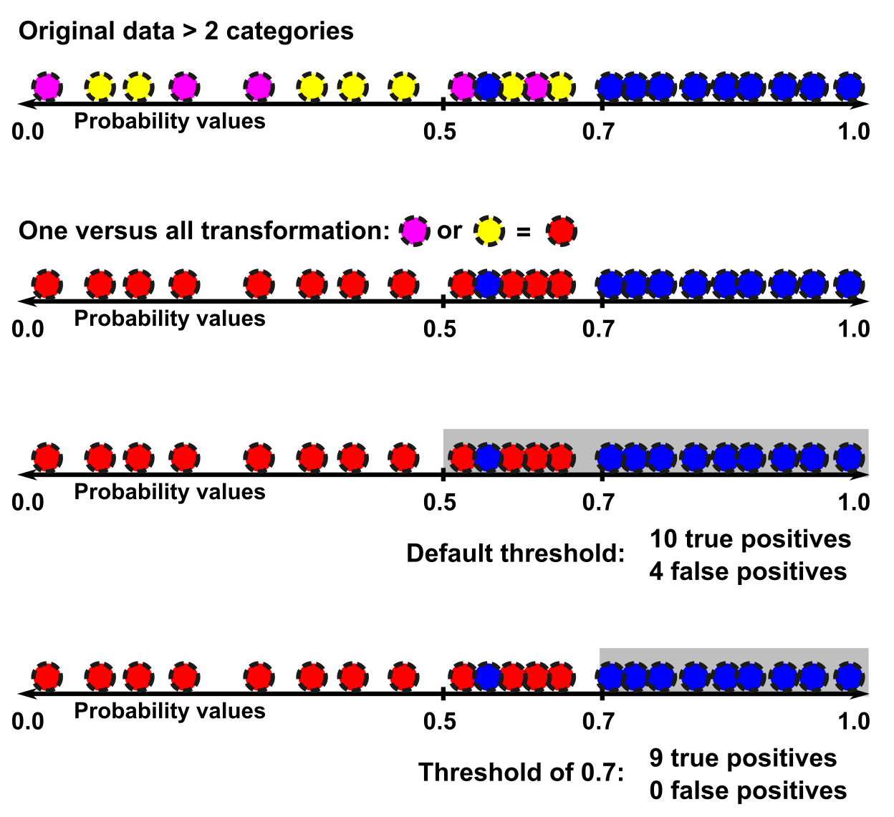
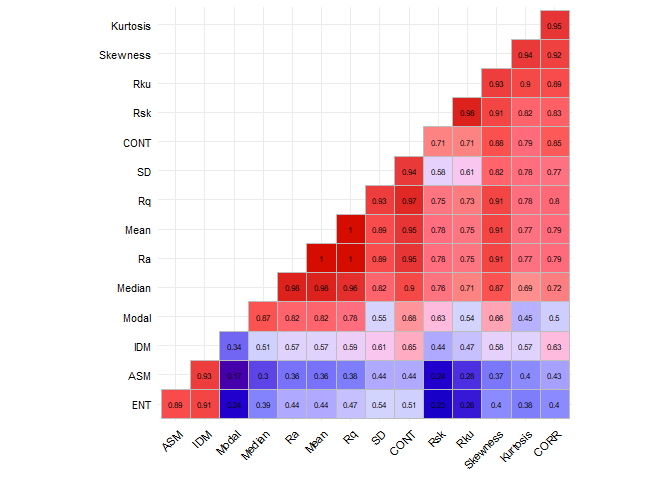
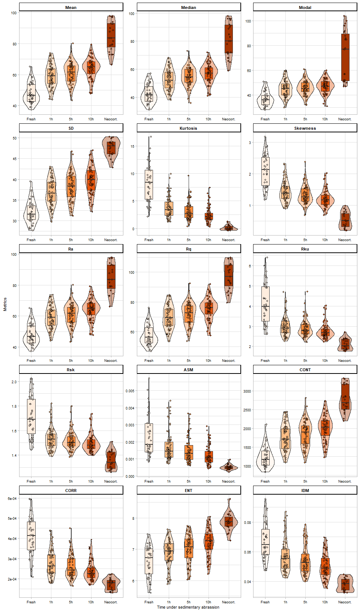
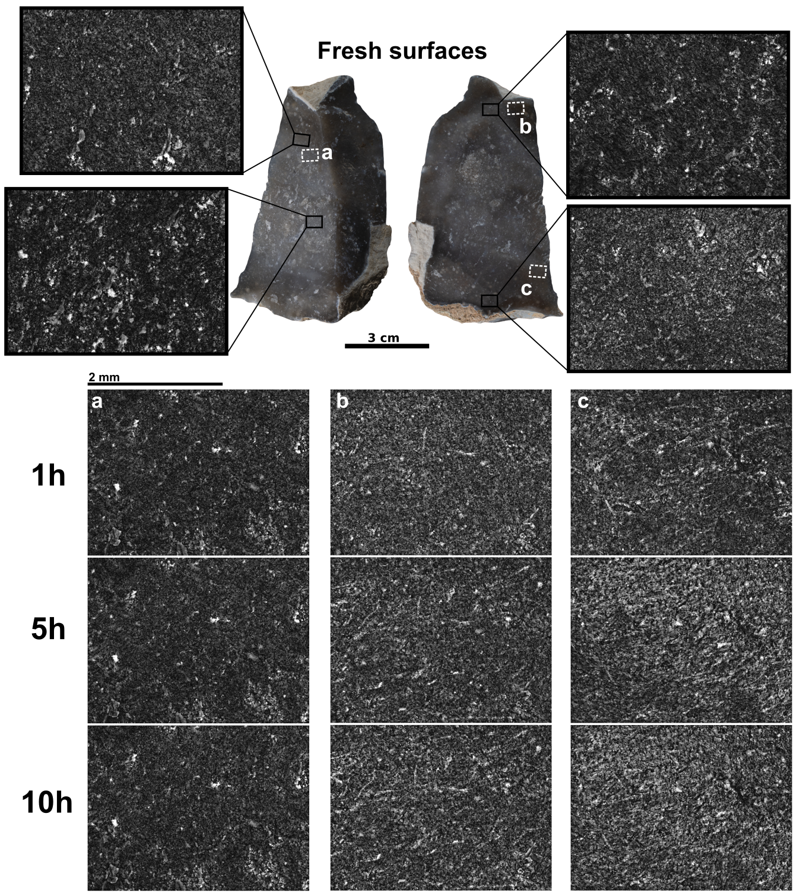
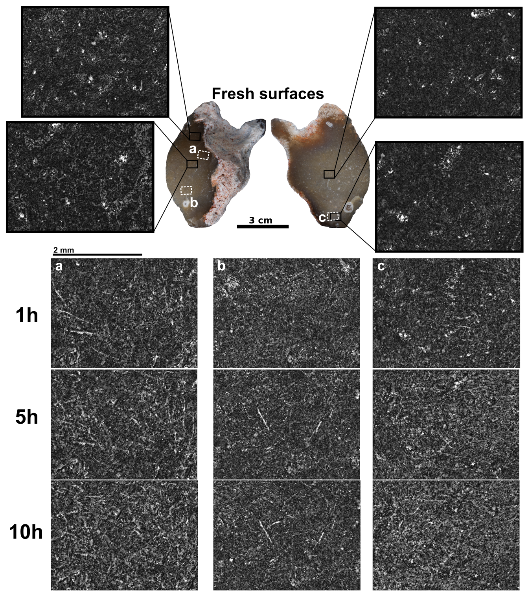
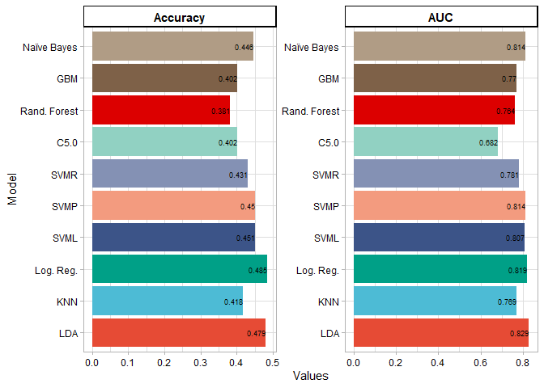
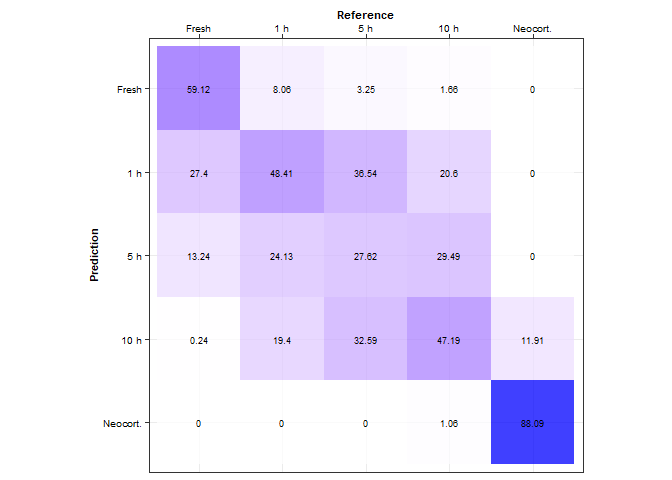
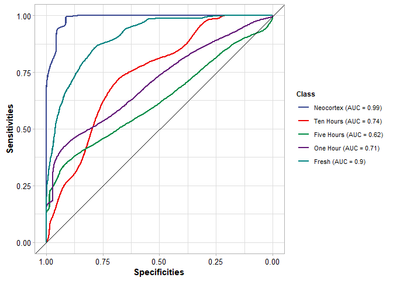
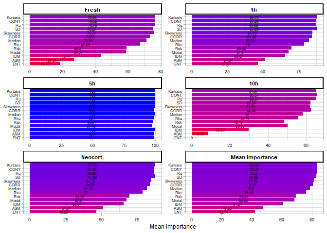
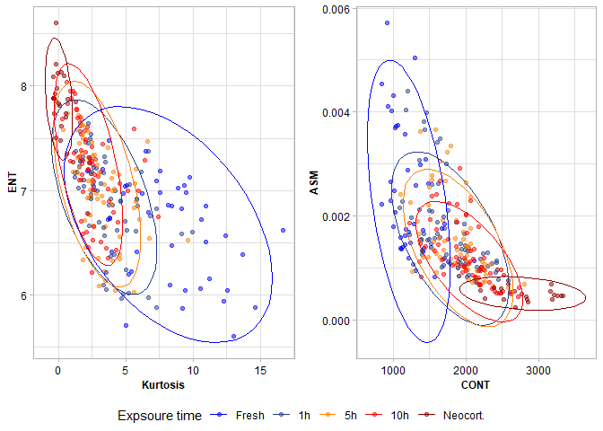

# Quantification of surface abrasion on flint stone tools

Guillermo Bustos-Pérez $^{1,2,3}$  
Andreu Ollé $^{2,3}$

$^1$ Universidad Autónoma de Madrid. Departamento de Prehistoria y
Arqueología, Campus de Cantoblanco, 28049 Madrid, Spain.  
$^2$ Institut Català de Paleoecologia Humana i Evolució Social (IPHES),
Zona Educacional 4, Campus Sescelades URV (Edifici W3), 43007 Tarragona,
Spain.  
$^3$ Àrea de Prehistoria, Universitat Rovira i Virgili (URV), Avinguda
de Catalunya 35, 43002 Tarragona, Spain.

 

<div align="justify">

**Abstract**

Lithic artifacts are some of the most common and numerous remains from
paleolithic archaeological sites. However, after their introduction into
the archaeological record they can undergo multiple post-depositional
alterations. Because the numerous amounts of lithic remains, a quick,
flexible, and effective method for identifying degrees of alteration in
the surface of lithic implements is highly desirable. The present study
examines the use gray scale level images to obtain quantitative measures
from the surface of flint artifacts and determine if they capture
changes due to post-depositional alterations. An experimental collection
of flints was subjected to sequential episodes of rounding in a tumbling
machine. After each episode, photographs with a microscope were taken,
allowing to obtain quantitative values of surface using gray scale level
values. The surface quantitative values were employed as variables in
machine learning models to determine time of exposure and the most
important variables for discrimination. Results indicate that the
extraction of metrics from gray scale level images successfully capture
changes in the surface of flint artifacts caused by post-depositional
alterations. Additional results provide insights into which areas to
sample in search for post-depositional alterations and underline the
importance of particle size causing alterations.

**Key words**: lithic taphonomy; experimental archaeology; machine
learning

 

## **1. Introduction**

  Lithic artifacts constitute one of the most common remains from
paleolithic archaeological sites. When analyzing lithic assemblages, a
key factor to consider is the degree of post-depositional alterations
undergone by an assemblage, since eco-cultural inferences are drawn from
them. Methods for determining assemblage integrity usually focus on the
assemblage as a hole. These methods often include spatial analysis of
artifacts and analysis of fabrics to determine if water flow has
resulted in a reorganization of the spatial distribution and
orientations
\[[1](#ref-lenoble_fabric_2004)–[5](#ref-schick_experimentally-derived_1987)\].
Also, lithic size distribution analysis are realized to determine if
post-depositional processes have resulted in sorting of the materials
\[[6](#ref-bertran_particle_2012),[7](#ref-maillo_fernandez_proporciones_1998)\].
Another option is to focus directly on individual lithic artifacts to
determine the degree of alteration that they have undergone
\[[8](#ref-chu_micro-abrasion_2015),[9](#ref-levi_sala_use_1986)\].
Although being more time consuming, this type of analysis allows to
individually establish a graduation in the degree of post-depositional
alterations. Furthermore, it can be combined with spatial analysis,
possible dissection of archaeological episodes, or to detect several
episodes of recycling. Individual determination of degree of alteration
undergone by a lithic artifact uses microscopic analysis to measure
ridge width, visually analyze the surface to determine the existence and
intensity of abrasion, and examine the edges to determine the presence
of detachments coming from particle impact or dulling of the edges in
more extreme cases
\[[10](#ref-bustos-perez_experimental_2019)–[12](#ref-shackley_stream_1974)\].

Post-depositional alterations can affect and interact with stone tools
in two broad ways. First, the type of fluvial sedimentary processes
which can affect lithic artifacts. Fluvial sedimentary processes are
characterized by particle transport. Lithic artifacts can form part of
these process as another particle, or remain static and be affected by
particles being transported. Commonly, three modes of particle transport
are described in fluvial sedimentary contexts: rolling, sliding and
saltation \[[13](#ref-alhusban_assessing_2021)\], although the last one
is not a common form of alteration in the case of stone tools
\[[4](#ref-petraglia_water_1994)\]. Additional to alterations coming
from fluvial contexts, stone artifacts might also be affected by aeolian
particle transport, usually resulting in wind abrasion
\[[14](#ref-stapert_natural_1976)\]. The second factor of variability
affecting post-depositional alterations of stone tools is the degree of
exposure and speed on which a stone tool enters the archaeological
record
\[[4](#ref-petraglia_water_1994),[5](#ref-schick_experimentally-derived_1987),[15](#ref-schiffer_archaeological_1972)\].
For example, it is expected that partially buried artifacts with water
and sediment flowing above them will present modifications in the
exposed surface, while the edges and the burred surface will remain
semi-intact \[[4](#ref-petraglia_water_1994)\]. AHowever, if artifacts
are transported by rolling in coarse sediments, it will result in
abrasion of all surfaces, dulling of the edges, but the impact from
coarse particles might result in freshly detached surfaces and edges
which undergo new modifications until the artifact enters the
archaeological record
\[[4](#ref-petraglia_water_1994),[16](#ref-sieveking_transport_1987)\].
Finally, a same homogeneous lithic assemblage might be affected
differentially by stream abrasion. This differential alteration is
consequence of the complex structure of water streams, were the overall
slope of the terrain, energy and charge of the flow, morphology of the
channel (which also affects the lateral deposition of sediments) and
several other factors result in complex and uneven structures
\[[17](#ref-rust_structure_1972)–[19](#ref-montgomery_channel-reach_1997)\].

Use-wear studies have shown that quantification of the surface can offer
a higher resolution of analysis
\[[20](#ref-stemp_quantification_2009)–[26](#ref-evans_laser_2008)\].
Obtaining quantitative data of surface modifications due to
post-depositional alterations can also increment the resolution of these
analysis and complement other features of post-depositional analysis.
However, as previously mentioned, stone artifacts are some of the most
common remains from Paleolithic archaeological sites. Thus, a versatile,
fast and light time-consuming method is highly desirable since it would
enable to analyze large quantities of lithic materials. Previous
approaches in the study of use-wear have used grayscale level values for
surface analysis of different worked materials
\[[27](#ref-adan_spatial_2003)–[32](#ref-grace_quantification_1985)\].
The present research seeks to determine if changes in flint surface
caused by sedimentary abrasion can be captured and quantified from
grayscale images.

## **2. Methods**

### **2.1 Experimental sample and setting**

Two blocks of flint representing two different types (Type I and Type
II) were experimentally knapped. The two types correspond to the South
Madrid Miocene Flint
\[[33](#ref-bustillo_caracterizacion_2012),[34](#ref-bustillo_caracteristicas_2005)\]
although from two different locations. South Madrid Miocene flints were
formed by the replacement of sedimentary rocks which had filled the
original basin. This replacement of the sedimentary rocks is considered
to have taken place under continental conditions such as alluvial plain
deposits, shallow lacustrine waters, and marshes
\[[33](#ref-bustillo_caracterizacion_2012)\]. Macroscopic analysis of
the flints shows that they present a fine opaque homogeneous surface,
with colors being blue/grey and reddish/ocher. There is also a relative
absence of opal, although geodes and pseudo-morphs can be observed. From
these two blocks three flakes were selected from Type 1, and four flakes
were selected from Type 2.  


In order to simulate sedimentary abrasion, the flakes were introduced by
pairs into a tumbler machine (KT-3010 SUPER-TUMBLER) along with a mix of
sand and water (30/40% of water with a total weight of 5 kg). Sediment
was obtained from the quaternary levels of the Madrid basin and it is
composed of fine sands with silt and partial carbonation. Sediment was
obtained from the quaternary levels of the Madrid basin and it is
composed of fine sands with silt and partial carbonation. The tumbler
machine was set at continuous direction at 83 rpm.

All flakes were submitted to three cumulative cycles of tumbling with
times set to 1h, 5h and 10h. Prior to their introduction into the
tumbling machine, 6 photographs (3 per each side) of the surface of each
flake were taken in order to have references of texture metrics from
flint flakes. Previous research
\[[8](#ref-chu_micro-abrasion_2015),[10](#ref-bustos-perez_experimental_2019)\]
suggests that, for the development of post depositional alterations, a
decrease in particle size increases the heterogeneity in the speed,
intensity and location of their development. Thus, after the first cycle
of rounding (1h), each flint flake was screened using the Dino-Lite Edge
3.0 AM73915MZT USB microscope in order to determine and photograph areas
which had developed sedimentary abrasion. These areas were photographed
in the subsequent rounding cycles, allowing to obtain sequential images
and data of surface change for cumulative times of 1h, 5h and 10h. The
dataset of images was supplemented by the inclusion of sample
photographs of macroscopically recognizable geological neocortex of
flints from the same formation, providing a total of 269 photographs.

``` r
# Load and inspect the data
load("Data/Sequential Data v1.01.RData")
kableExtra::kable(head(Sequential.Data))
```

    ## Warning in !is.null(rmarkdown::metadata$output) && rmarkdown::metadata$output
    ## %in% : 'length(x) = 4 > 1' in coercion to 'logical(1)'

<table>
<thead>
<tr>
<th style="text-align:left;">
ID
</th>
<th style="text-align:right;">
Mean
</th>
<th style="text-align:right;">
SD
</th>
<th style="text-align:right;">
Modal
</th>
<th style="text-align:right;">
Median
</th>
<th style="text-align:right;">
Kurtosis
</th>
<th style="text-align:right;">
Skewness
</th>
<th style="text-align:right;">
Rq
</th>
<th style="text-align:right;">
Ra
</th>
<th style="text-align:right;">
Rsk
</th>
<th style="text-align:right;">
Rku
</th>
<th style="text-align:right;">
ASM
</th>
<th style="text-align:right;">
CONT
</th>
<th style="text-align:right;">
CORR
</th>
<th style="text-align:right;">
IDM
</th>
<th style="text-align:right;">
ENT
</th>
<th style="text-align:left;">
Flake.ID
</th>
<th style="text-align:left;">
Flake.Time
</th>
<th style="text-align:left;">
Dorsal.Ventral
</th>
<th style="text-align:left;">
No.Photo
</th>
<th style="text-align:left;">
Photo.Type
</th>
<th style="text-align:left;">
Flake.Number
</th>
<th style="text-align:left;">
Flint.Type
</th>
</tr>
</thead>
<tbody>
<tr>
<td style="text-align:left;">
HDisc_01_11 Neocortex 01c.tif
</td>
<td style="text-align:right;">
78.8051
</td>
<td style="text-align:right;">
48.0084
</td>
<td style="text-align:right;">
52
</td>
<td style="text-align:right;">
72
</td>
<td style="text-align:right;">
0.192800
</td>
<td style="text-align:right;">
0.6877
</td>
<td style="text-align:right;">
92.238
</td>
<td style="text-align:right;">
78.962
</td>
<td style="text-align:right;">
1.404
</td>
<td style="text-align:right;">
2.265
</td>
<td style="text-align:right;">
0.0007549
</td>
<td style="text-align:right;">
2590.374
</td>
<td style="text-align:right;">
0.0001907
</td>
<td style="text-align:right;">
0.0439237
</td>
<td style="text-align:right;">
7.478644
</td>
<td style="text-align:left;">
HDisc_01_11
</td>
<td style="text-align:left;">
Neocortex
</td>
<td style="text-align:left;">
01
</td>
<td style="text-align:left;">
1
</td>
<td style="text-align:left;">
Screened
</td>
<td style="text-align:left;">
11
</td>
<td style="text-align:left;">
GeoSample
</td>
</tr>
<tr>
<td style="text-align:left;">
HDisc_01_11 Neocortex 2c.tif
</td>
<td style="text-align:right;">
79.4588
</td>
<td style="text-align:right;">
49.0694
</td>
<td style="text-align:right;">
57
</td>
<td style="text-align:right;">
72
</td>
<td style="text-align:right;">
0.220100
</td>
<td style="text-align:right;">
0.7342
</td>
<td style="text-align:right;">
93.279
</td>
<td style="text-align:right;">
79.431
</td>
<td style="text-align:right;">
1.425
</td>
<td style="text-align:right;">
2.324
</td>
<td style="text-align:right;">
0.0006760
</td>
<td style="text-align:right;">
2580.717
</td>
<td style="text-align:right;">
0.0001932
</td>
<td style="text-align:right;">
0.0435694
</td>
<td style="text-align:right;">
7.616038
</td>
<td style="text-align:left;">
HDisc_01_11
</td>
<td style="text-align:left;">
Neocortex
</td>
<td style="text-align:left;">
01
</td>
<td style="text-align:left;">
2
</td>
<td style="text-align:left;">
Screened
</td>
<td style="text-align:left;">
11
</td>
<td style="text-align:left;">
GeoSample
</td>
</tr>
<tr>
<td style="text-align:left;">
HDisc_01_11 Neocortex 3c.tif
</td>
<td style="text-align:right;">
79.2460
</td>
<td style="text-align:right;">
48.6480
</td>
<td style="text-align:right;">
48
</td>
<td style="text-align:right;">
72
</td>
<td style="text-align:right;">
0.096450
</td>
<td style="text-align:right;">
0.6573
</td>
<td style="text-align:right;">
92.902
</td>
<td style="text-align:right;">
79.279
</td>
<td style="text-align:right;">
1.412
</td>
<td style="text-align:right;">
2.268
</td>
<td style="text-align:right;">
0.0005305
</td>
<td style="text-align:right;">
2622.327
</td>
<td style="text-align:right;">
0.0001890
</td>
<td style="text-align:right;">
0.0397000
</td>
<td style="text-align:right;">
7.818300
</td>
<td style="text-align:left;">
HDisc_01_11
</td>
<td style="text-align:left;">
Neocortex
</td>
<td style="text-align:left;">
01
</td>
<td style="text-align:left;">
3
</td>
<td style="text-align:left;">
Screened
</td>
<td style="text-align:left;">
11
</td>
<td style="text-align:left;">
GeoSample
</td>
</tr>
<tr>
<td style="text-align:left;">
HDisc_01_11 Neocortex 4c.tif
</td>
<td style="text-align:right;">
83.6360
</td>
<td style="text-align:right;">
49.8806
</td>
<td style="text-align:right;">
52
</td>
<td style="text-align:right;">
80
</td>
<td style="text-align:right;">
-0.184100
</td>
<td style="text-align:right;">
0.5215
</td>
<td style="text-align:right;">
97.097
</td>
<td style="text-align:right;">
83.571
</td>
<td style="text-align:right;">
1.384
</td>
<td style="text-align:right;">
2.157
</td>
<td style="text-align:right;">
0.0004967
</td>
<td style="text-align:right;">
2769.124
</td>
<td style="text-align:right;">
0.0001789
</td>
<td style="text-align:right;">
0.0393344
</td>
<td style="text-align:right;">
7.856781
</td>
<td style="text-align:left;">
HDisc_01_11
</td>
<td style="text-align:left;">
Neocortex
</td>
<td style="text-align:left;">
01
</td>
<td style="text-align:left;">
4
</td>
<td style="text-align:left;">
Screened
</td>
<td style="text-align:left;">
11
</td>
<td style="text-align:left;">
GeoSample
</td>
</tr>
<tr>
<td style="text-align:left;">
HDisc_01_11 Neocortex 5c.tif
</td>
<td style="text-align:right;">
72.9310
</td>
<td style="text-align:right;">
42.9089
</td>
<td style="text-align:right;">
57
</td>
<td style="text-align:right;">
65
</td>
<td style="text-align:right;">
1.112800
</td>
<td style="text-align:right;">
0.9028
</td>
<td style="text-align:right;">
84.399
</td>
<td style="text-align:right;">
73.105
</td>
<td style="text-align:right;">
1.428
</td>
<td style="text-align:right;">
2.390
</td>
<td style="text-align:right;">
0.0009690
</td>
<td style="text-align:right;">
2430.545
</td>
<td style="text-align:right;">
0.0001860
</td>
<td style="text-align:right;">
0.0449431
</td>
<td style="text-align:right;">
7.275731
</td>
<td style="text-align:left;">
HDisc_01_11
</td>
<td style="text-align:left;">
Neocortex
</td>
<td style="text-align:left;">
01
</td>
<td style="text-align:left;">
5
</td>
<td style="text-align:left;">
Screened
</td>
<td style="text-align:left;">
11
</td>
<td style="text-align:left;">
GeoSample
</td>
</tr>
<tr>
<td style="text-align:left;">
Hdisc_01_12 Neocortex 01c.tif
</td>
<td style="text-align:right;">
81.6403
</td>
<td style="text-align:right;">
47.6198
</td>
<td style="text-align:right;">
78
</td>
<td style="text-align:right;">
78
</td>
<td style="text-align:right;">
0.006416
</td>
<td style="text-align:right;">
0.5100
</td>
<td style="text-align:right;">
94.272
</td>
<td style="text-align:right;">
81.652
</td>
<td style="text-align:right;">
1.365
</td>
<td style="text-align:right;">
2.125
</td>
<td style="text-align:right;">
0.0005129
</td>
<td style="text-align:right;">
2489.187
</td>
<td style="text-align:right;">
0.0001996
</td>
<td style="text-align:right;">
0.0412394
</td>
<td style="text-align:right;">
7.828831
</td>
<td style="text-align:left;">
Hdisc_01_12
</td>
<td style="text-align:left;">
Neocortex
</td>
<td style="text-align:left;">
01
</td>
<td style="text-align:left;">
1
</td>
<td style="text-align:left;">
Screened
</td>
<td style="text-align:left;">
12
</td>
<td style="text-align:left;">
GeoSample
</td>
</tr>
</tbody>
</table>

``` r
#load packages
library(tidyverse); library(caret); library(pROC)
```

``` r
# Counts of number of images per time of exposure
# (sequential images taken after the first episode of abrasion are not included)
kableExtra::kable(Sequential.Data %>% 
  filter(Photo.Type != "Sequential" | Flake.Time ==  "Fresh" ) %>% 
  group_by(Flake.Time) %>% 
  summarise(
    N.by.Flakes = n()))
```

<table>
<thead>
<tr>
<th style="text-align:left;">
Flake.Time
</th>
<th style="text-align:right;">
N.by.Flakes
</th>
</tr>
</thead>
<tbody>
<tr>
<td style="text-align:left;">
Fresh
</td>
<td style="text-align:right;">
42
</td>
</tr>
<tr>
<td style="text-align:left;">
One.Hour
</td>
<td style="text-align:right;">
68
</td>
</tr>
<tr>
<td style="text-align:left;">
Five.Hours
</td>
<td style="text-align:right;">
68
</td>
</tr>
<tr>
<td style="text-align:left;">
Ten.Hours
</td>
<td style="text-align:right;">
68
</td>
</tr>
<tr>
<td style="text-align:left;">
Neocortex
</td>
<td style="text-align:right;">
23
</td>
</tr>
</tbody>
</table>

### **2.2 Cleaning protocol, image acquisition and processing**

Workflow developed in the present study includes a series of steps prior
to extracting quantitative data from the images. These steps are:
cleaning protocol to remove contaminants from the stone tool surface,
image capture, and image enhancement.

Multiple works emphasize the need of cleaning protocols to remove modern
contaminants prior to analysis
\[[35](#ref-pedergnana_modern_2016)–[38](#ref-fernandez-marchena_microscopic_2016)\].
A multi-step procedure based on previous studies was adopted
\[[35](#ref-pedergnana_modern_2016)\] in order to retrieve possible
contaminants. This multi-step procedure included a sonic bath in 2%
neutral soap (Derquim) solution during 10 to 15 minutes, followed by a
second sonic bath in pure acetone during another 10 to 15 minutes. After
each step the lithic artefacts were introduced in a water bath and
finally dried using pressure air. During the cleaning protocol and
microscopic analysis all artefacts were manipulated using surgical
gloves.


All surface photographs were taken using a Dino-Lite Edge 3.0 AM73915MZT
USB microscope at 120 magnifications with a field of view (FOV) of 3.28
x 2.46 mm and a pixel ratio of 2548 x 1918. The USB microscope was
mounted in a Dino-Lite RK-06-AE stand in order to ensure verticality,
and a N3C-D2 diffuser cap was used to ensure homogeneous distribution of
light. During the realization of each photograph, the region of interest
of the flint was manually positioned as horizontal as possible
\[[39](#ref-calandra_workflow_2022)\]. To avoid problems due to focus
variation, each surface was photographed several times at different
heights, and the obtained sequences were mounted using Helicon Focus
7.7.2.

A common problem of images obtained from USB microscopes is the lack of
detail due to saturation in one of the grey level values and the effects
of different lightning or surface color. This saturation is often
observed as a general glaze in one of the grey level values and results
in a low-quality image with poor detail. To increase detail and quality
prior to the analysis, all images were subjected to a two-step process.
First, the Fiji \[[40](#ref-schindelin_fiji_2012)\] plugging “Subtract
background” was employed to minimize effects of different lightning and
changes in flint color. Second, the function “Enhance contrast” was
employed to desaturate the images by normalizing their histograms. This
process provides a gray-scale level image employed as input for the
statistical analysis.


### **2.3 Statistical analysis**

The present work uses three sets of statistical metrics to analyze
obtained images. The first set of statistical metrics correspond to
descriptive statistics (mean, standard deviation, mode, median skewness,
and kurtosis). The second set of statistical measures corresponds to
measures of roughness. Surface parameters using the “R” prefix use
profiles as input. The present work uses a Fiji/ImageJ plugging were
R-values are obtained on the hole surface following the ISO 4287/2000
standard
\[[41](#ref-chinga_roughness_2002),[42](#ref-chinga_quantification_2007)\].
These measures are:

- **Root mean square deviation/roughness (Rq):** indicator of surface
  roughness.  
- **Arithmetical mean deviation (Ra):** which indicates the deviation of
  a surface from a mean height.  
- **Skewness of the assessed profile (Rsk):** indicator of the departure
  from surface symmetry. Negative values indicate a surface made of deep
  valleys, and positive values indicates peaks and asperities.  
- **Kurtosis of the assessed profile (Rku):** which indicates the
  sharpness of the peaks. Low values indicate blunt peaks, while high
  values indicate sharp peaks.

Analysis of intensity values through the Gray Level Co-occurrence Matrix
(GLCM; \[[43](#ref-haralick_textural_1973)\]) takes into consideration
the spatial distribution of intensity values. The GLCM works in two
steps \[[43](#ref-haralick_textural_1973)\]. First, using a given
distance and direction it builds a matrix which captures the
relationship of intensity between pairs of pixels (reference and
neighbor). Second, for every x and y it considers the co-occurrence of
values, forming a new matrix. From this new matrix, a series of
statistical descriptors are derived
\[[43](#ref-haralick_textural_1973)\].

- **Angular Second Moment (ASM)** is measure of homogeneity in the
  image. Homogeneous images (with low gray-tone transitions) will have
  fewer entries of large magnitude. Thus, homogeneous images will have
  high ASM values, while the opposite will be true for non-homogeneous
  images.  
- **Contrast (CONT)** is a value of the amount of local variations. High
  values are indicating a lot of local variation and low values indicate
  few local variations.  
- **Correlation (CORR)** which measures gray-tone linear-dependencies in
  the image. It indicates how a reference pixel is related to its
  neighbor. A 0 value indicates it is uncorrelated, and 1 indicates a
  perfect correlation.  
- **Inverse Different Moment (IDM)** also referred as homogeneity. It
  obtains the measures of the closeness of the distribution of the GLCM
  elements to the GLCM diagonal.  
- **Entropy (ENT)** is a measure of the amount of irremediable chaos or
  disorder in an image. High values of entropy indicate values of
  similar magnitude, while low values indicate unequal entries.

As previously mentioned, use of the GLCM requires selecting pixel
distance between reference and neighbor, and direction on which to
establish the distance \[[43](#ref-haralick_textural_1973)\]. For this,
it is common to test for different combinations of distances and
directions since images at different magnifications, different field of
view and different resolution might require variation in pixel distance
and directions
\[[29](#ref-bietti_image_1996),[32](#ref-grace_quantification_1985)\].
For the present study, a preliminary test indicated that using four
distances at 5, 10, 15 and 20 pixels in the four possible directions
(north, east, south and west) to set the GLCM presented the best results
for discrimination.

Calculation of all metrics was done using the free software Fiji
\[[40](#ref-schindelin_fiji_2012)\]. Roughness metrics calculation was
implemented through the “Roughness calculation” plugin
\[[41](#ref-chinga_roughness_2002)\]. GLCM and texture metrics were
calculated using the “GLCM Texture” plugging
\[[44](#ref-cabrera_texture_2006)\].

### **2.4 Machine Learning models and evaluation**

Data from descriptive statistics, roughness and texture were employed as
variable for the training of Machine Learning models in order to predict
the time of exposure to sedimentary abrasion. The ten models tested
were:

- **Linear discriminant analysis (LDA):** reduces dimensionality for the
  purpose of maximizing the separation between classes while decision
  boundaries divide the predictor range into regions
  \[[45](#ref-fisher_use_1936),[46](#ref-james_introduction_2013)\].  
- **K-nearest neighbor (KNN):** classifies cases by assigning the class
  of similar known cases. The ‘k’ in KNN refers to the number of cases
  (neighbors) to consider when assigning a class, which must be found by
  testing different values. Given that KNN uses distance metrics to
  compute nearest neighbors and that each variable is in different
  scales, the data must be scaled and centered prior to fitting the
  model
  \[[47](#ref-cover_nearest_1967),[48](#ref-lantz_machine_2019)\].  
- **Logistic regression:** essentially adapts continuous regression
  predictions to categorical outcomes
  \[[49](#ref-cramer_early_2004),[50](#ref-walker_estimation_1967)\].  
- **Decision tree with C5.0 algorithm:** an improvement on decision
  trees for classification
  \[[51](#ref-quinlan_improved_1996),[52](#ref-quinlan_c4_2014)\].  
- **Random forest:** made of decision trees. Each tree is grown from a
  random sample of the data and variables, allowing for each tree to
  grow differently and to better reflect the complexity of the data
  \[[53](#ref-breiman_random_2001)\].  
- **Generalized boosted model
  \[[54](#ref-greenwell_package_2019),[55](#ref-ridgeway_generalized_2007)\]:**
  implements the gradient boosted machine
  \[[56](#ref-friedman_greedy_2001),[57](#ref-friedman_stochastic_2002)\]
  making it possible to detect learning deficiencies and increase model
  accuracy for a set of random forests.  
- **Supported vector machines (SVM):** fit hyperplanes into a
  multidimensional space with the objective of creating homogeneous
  partitions
  \[[58](#ref-cortes_support-vector_1995),[59](#ref-frey_letter_1991)\].
  The present study tests SVM with linear, radial and polynomial
  kernels.  
- **Naïve Bayes classifier:** computes class probabilities using Bayes’
  rule \[[60](#ref-weihs_klar_2005)\].

<figure>

<figcaption aria-hidden="true">Example of the “one versus all” approach
in order to obtain ROC curves and AUC values in the case of multiclass
problems</figcaption>
</figure>

All models are evaluated using 10×100 k-fold cross validation (10 folds
and 100 cycles), providing measures of accuracy. Using a 10-fold
division, each fold will have 43 data points. Each fold serves
subsequently as test set for a trained model. Although computationally
more expensive, this guarantees that all data points will serve as test
sets. The 100 cycles provide a random shuffling of the dataset prior to
fold division, thus ensuring that the composition of the folds varies in
each cycle and it does not play a significant role in the evaluation of
the models.

Machine Learning models commonly use a 0.5 classification threshold to
assign categories. However, classification thresholds can be modified to
balance the ability of model to detect true positives and avoid false
positives which are respectively referred as sensitivity and
specificity. The receiver operating characteristic (ROC) curve is
employed to systematically evaluate the ratio of detected true positives
while avoiding false positives
\[[61](#ref-bradley_use_1997),[62](#ref-spackman_signal_1989)\]. The ROC
curve allows visually analyzing model performance and calculating the
AUC, which ranges from 1 (perfect classifier) to 0.5 (random
classifier). The AUC is a measure of performance derived from the
receiver operating characteristic (ROC) curve. The ROC curve is used to
evaluate the ratio of detected true positives while avoiding false
positives
\[[61](#ref-bradley_use_1997),[62](#ref-spackman_signal_1989)\]. The ROC
curve makes it possible to visually analyze model performance and
calculate the AUC, which ranges from 1 (perfect classifier) to 0.5
(random classifier). The ROC and AUC are commonly applied in two-class
problems and their extension to multiclass problems is usually done
through pairwise analysis.

In the case of multiclass problems, the AUC provides two groups of
values: first, each class obtains an AUC value using a “one vs all”
approach; second, a general AUC value of model performance is obtained
from the average of each class AUC
\[[63](#ref-robin_proc_2011),[**hand_simple_200?**](#ref-hand_simple_200)\].
In the case of the ROC curve, individual curves of each class are
plotted using the previously mentioned “one vs all” approach. The
present study tested 10 different models with a three-class
classification problem which would involve a total of 30 different ROC
curves (three curves per 10 models). In this paper, we have provided
only the three ROC curves of the best model. When analyzing lithic
materials, the use of thresholds to guarantee true positives and avoid
false positives is of special interest. The use of thresholds better
indicates the accuracy of a model considering these probability values.
In the present study we have slightly variated the interpretation of the
AUC values \[[48](#ref-lantz_machine_2019)\] with intervals interpreted
as follows:

- 0.9 to 1: outstanding  
- 0.85 to 0.9: excellent  
- 0.8 to 0.85: good  
- 0.75 to 0.8: acceptable  
- 0.7 to 0.75: fair  
- 0.6 to 0.7: poor  
- 0.5 to 0.6: no discrimination

Strong levels of correlation are present between the variables of the
present study. The issue of multicollinearity in classification remains
a matter of debate. It is commonly pointed that for multiple linear
regressions, collinearity affects the interpretation of coefficients
(variables), but does not affect the quality of the predictions
\[[46](#ref-james_introduction_2013),[64](#ref-alin_multicollinearity_2010),[65](#ref-chan_mitigating_2022)\].
Additional arguments indicate that if the collinearity between variables
of the training set is also present in the test set, it should not be
considered a problem. In the present study variables presenting perfect
levels of collinearity (mean and Ra) are excluded from the training of
machine learning models, and feature importance is explored among
non-correlated features. After evaluating and determining the best
model, an additional model on PCA values was trained in order to
determine possible overfitting.

``` r
# Check for collinearity of the data
r <- cor(Sequential.Data[,2:16], 
         use = "complete.obs")^2

ggcorrplot::ggcorrplot(r, 
           hc.order = TRUE, 
           type = "lower",
           lab_size = 2,
           tl.cex = 8,
           lab = TRUE) +
  ggsci::scale_fill_gsea(reverse = FALSE) +
  theme(legend.position = "none",
        axis.text = element_text(color = "black"))
```

<!-- -->

This study was conducted using an R version 4.2.2 in IDE RStudio version
2022.12 \[67,68\]. The data and graphs were managed using the tidyverse
v.1.3.2 package \[69\]. The LDA and KNN were trained with the MASS
(Modern Applied Statistics with S) v.7.3.58.1 package \[70\]. The C5.0
tree was trained using the C50 v.0.1.7 package \[51,52\]. The random
forest was trained using the ranger v.0.14.1 package \[71\]. The
Generalized Boosted Model was trained using package gbm v.2.1.8.1
\[54,55\]. The SVM was trained using the e1071 v.1.7.12 package
\[72,73\]. The Naïve Bayes model was trained using package klaR v.1.7.1
\[60\]. The k-fold cross validation of all models, precision metrics,
and confusion matrix were obtained using the caret v.6.0.93 package
\[74\]. Machine learning models also provide insights into variable
importance for classification. The caret package was used to extract
variable importance after each k-fold cross validation. ROC curves and
AUC values are obtained using the package pROC v.1.18.0 \[64\].

### **2.5 Training of Machine Learning models**

The following code was set to evaluate and train the machine learning
models described in the methods section. All resultant models are
available in the *Data* section.

``` r
#### Train the models ####
# Validation
library(caret)
trControl <- trainControl(method  = "repeatedcv",
                          verboseIter = TRUE,
                          number  = 10,
                          repeats = 100,
                          savePredictions = "final",
                          classProbs = TRUE)

Data <- Sequential.Data %>% select(-c(Mean, Ra))

frmla <- as.formula(
  paste("Flake.Time", paste(colnames(Data[,2:14]), collapse = " + "), sep = " ~ "))

# LDA model
set.seed(123)
LDA.model <- train(frmla, 
                   Data,
                   method = "lda",
                   preProc = c("center", "scale"),
                   trControl = trControl)

# Logistic regression model
set.seed(123)
logmod <- train(
  frmla, 
  Data, 
  method = "glmnet",                 
  family = 'multinom',
  trControl = trControl)

# KNN model
set.seed(123)
KNN.model <- train(
  frmla,
  Data2,
  method = "knn",
  preProc = c("center", "scale"), 
  trControl = trControl,
  tuneGrid = expand.grid(k = seq(1, 15, 1)))

# C5.0 Tree 
set.seed(123)
C50_Mod <- train(frmla, 
                 Data,
                 method = "C5.0",
                 trControl = trControl,
                 preProc = c("center", "scale"), 
                 metric = "Accuracy",
                 importance = 'impurity')

# Random Forest
set.seed(123)
RF.model <- train(frmla, 
                  Data,
                  method = "ranger",
                  trControl = trControl,
                  preProc = c("center", "scale"), 
                  metric = "Accuracy",
                  importance = 'impurity')

# GBM model 
set.seed(123)
GBM.model <- train(frmla, 
                   Data,
                   method = "gbm",
                   preProc = c("center", "scale"), 
                   trControl = trControl,
                   metric = "Accuracy")

# SVMs
set.seed(123)
SVML.model <- train(frmla, 
                    Data,
                    method = "svmLinear",
                    trControl = trControl,
                    preProc =  c('center', 'scale'),
                    metric = "Accuracy",
                    importance = 'impurity')

set.seed(123)
SVMR.model <- train(frmla, 
                    Data,
                    method = "svmRadial",
                    preProc =  c('center', 'scale'),
                    trControl = trControl,
                    metric = "Accuracy",
                    importance = 'impurity')

set.seed(123)
SVMP.model <- train(frmla, 
                    Data,
                    method = "svmPoly",
                    preProc =  c('center', 'scale'),
                    trControl = trControl,
                    metric = "Accuracy",
                    importance = 'impurity')

# Naïve Bayes
set.seed(123)
NB.model <- train(frmla, 
                  Data,
                  preProc = c("center", "scale"), 
                  method = "nb",
                  trControl = trControl,
                  metric = "Accuracy")
```

This study was conducted using an R version 4.2.2 in IDE RStudio version
2022.12
\[[66](#ref-r_core_team_r_2019),[67](#ref-rstudio_team_rstudio_2019)\].
The data and graphs were managed using the tidyverse v.1.3.2 package
\[[68](#ref-wickham_welcome_2019)\]. The LDA and KNN were trained with
the MASS (Modern Applied Statistics with S) v.7.3.58.1 package
\[[69](#ref-venables_modern_2002)\]. The C5.0 tree was trained using the
C50 v.0.1.7 package
\[[51](#ref-quinlan_improved_1996),[52](#ref-quinlan_c4_2014)\]. The
random forest was trained using the ranger v.0.14.1 package
\[[70](#ref-wright_ranger_2017)\]. The Generalized Boosted Model was
trained using package gbm v.2.1.8.1
\[[54](#ref-greenwell_package_2019),[55](#ref-ridgeway_generalized_2007)\].
The SVM was trained using the e1071 v.1.7.12 package
\[[71](#ref-karatzoglou_support_2006),[72](#ref-karatzoglou_kernlab_2004)\].
The Naïve Bayes model was trained using package klaR v.1.7.1
\[[60](#ref-weihs_klar_2005)\]. The k-fold cross validation of all
models, precision metrics, and confusion matrix were obtained using the
caret v.6.0.93 package \[[73](#ref-kuhn_building_2008)\]. Machine
learning models also provide insights into variable importance for
classification. The caret package was used to extract variable
importance after each k-fold cross validation. ROC curves and AUC values
are obtained using the package pROC v.1.18.0
\[[63](#ref-robin_proc_2011)\].

## **3. Results**

### **3.1 Texture metrics**

A general MANOVA considering all groups and variables shows marked
statistically significant differences between groups.

``` r
# MANOVA on data
res.man <- manova(cbind(Mean, Median, Modal, SD, Kurtosis, Skewness, 
                        Rq, Ra, Rsk, Rku,
                        ASM, CONT, CORR, IDM, ENT) ~ Flake.Time, 
                  data = Sequential.Data)
summary(res.man)
```

    ##             Df Pillai approx F num Df den Df    Pr(>F)    
    ## Flake.Time   4 1.3864    8.947     60   1012 < 2.2e-16 ***
    ## Residuals  264                                            
    ## ---
    ## Signif. codes:  0 '***' 0.001 '**' 0.01 '*' 0.05 '.' 0.1 ' ' 1

MANOVA analysis comparing a category with its subsequent time of
exposure shows marked statistical differences between fresh materials
and one hour of rounding

``` r
# Set different groups
x <- Sequential.Data %>% filter(Flake.Time == "Fresh" | Flake.Time == "One.Hour")
y <- Sequential.Data %>% filter(Flake.Time == "Five.Hours" | Flake.Time == "One.Hour")
z <- Sequential.Data %>% filter(Flake.Time == "Five.Hours" | Flake.Time == "Ten.Hours")
t <- Sequential.Data %>% filter(Flake.Time == "Neocortex" | Flake.Time == "Ten.Hours")

# MANOVA fresh vs one hour
res.man <- manova(cbind(Mean, Median, Modal, SD, Kurtosis, Skewness, 
                        Rq, Ra, Rsk, Rku,
                        ASM, CONT, CORR, IDM, ENT) ~ Flake.Time, data = x)
summary(res.man)
```

    ##             Df  Pillai approx F num Df den Df    Pr(>F)    
    ## Flake.Time   1 0.48852   5.9854     15     94 1.474e-08 ***
    ## Residuals  108                                             
    ## ---
    ## Signif. codes:  0 '***' 0.001 '**' 0.01 '*' 0.05 '.' 0.1 ' ' 1

``` r
# MANOVA one hour vs five hours
res.man <- manova(cbind(Mean, Median, Modal, SD, Kurtosis, Skewness, 
                        Rq, Ra, Rsk, Rku,
                        ASM, CONT, CORR, IDM, ENT) ~ Flake.Time, data = y)
summary(res.man)
```

    ##             Df  Pillai approx F num Df den Df   Pr(>F)   
    ## Flake.Time   1 0.25657    2.761     15    120 0.001092 **
    ## Residuals  134                                           
    ## ---
    ## Signif. codes:  0 '***' 0.001 '**' 0.01 '*' 0.05 '.' 0.1 ' ' 1

``` r
# MANOVA five hours vs Ten hours
res.man <- manova(cbind(Mean, Median, Modal, SD, Kurtosis, Skewness, 
                        Rq, Ra, Rsk, Rku,
                        ASM, CONT, CORR, IDM, ENT) ~ Flake.Time, data = z)
summary(res.man)
```

    ##             Df  Pillai approx F num Df den Df  Pr(>F)  
    ## Flake.Time   1 0.16226   1.5494     15    120 0.09856 .
    ## Residuals  134                                         
    ## ---
    ## Signif. codes:  0 '***' 0.001 '**' 0.01 '*' 0.05 '.' 0.1 ' ' 1

``` r
# MANOVA Ten hours vs Neocortex
res.man <- manova(cbind(Mean, Median, Modal, SD, Kurtosis, Skewness, 
                        Rq, Ra, Rsk, Rku,
                        ASM, CONT, CORR, IDM, ENT) ~ Flake.Time, data = t)
summary(res.man)
```

    ##            Df  Pillai approx F num Df den Df    Pr(>F)    
    ## Flake.Time  1 0.79838   19.799     15     75 < 2.2e-16 ***
    ## Residuals  89                                             
    ## ---
    ## Signif. codes:  0 '***' 0.001 '**' 0.01 '*' 0.05 '.' 0.1 ' ' 1

When considering all variables, no statistical differences were found
between images exposed to five and ten hours rounding. However,
statistical difference between these two categories are present in the
mean, median, standard deviation, kurtosis, skewness, Rq, Ra, Rku, ASM,
contrast, correlation, IDM and entropy.

``` r
# MANOVA five hours vs Ten hours
res.man <- manova(cbind(Mean, Median, Modal, SD, Kurtosis, Skewness, 
                        Rq, Ra, Rsk, Rku,
                        ASM, CONT, CORR, IDM, ENT) ~ Flake.Time, data = z)
summary(res.man)
```

    ##             Df  Pillai approx F num Df den Df  Pr(>F)  
    ## Flake.Time   1 0.16226   1.5494     15    120 0.09856 .
    ## Residuals  134                                         
    ## ---
    ## Signif. codes:  0 '***' 0.001 '**' 0.01 '*' 0.05 '.' 0.1 ' ' 1

``` r
summary.aov(res.man)
```

    ##  Response Mean :
    ##              Df Sum Sq Mean Sq F value  Pr(>F)  
    ## Flake.Time    1  288.7 288.719  6.3964 0.01259 *
    ## Residuals   134 6048.5  45.138                  
    ## ---
    ## Signif. codes:  0 '***' 0.001 '**' 0.01 '*' 0.05 '.' 0.1 ' ' 1
    ## 
    ##  Response Median :
    ##              Df Sum Sq Mean Sq F value  Pr(>F)  
    ## Flake.Time    1  215.0 215.007  4.9456 0.02783 *
    ## Residuals   134 5825.6  43.475                  
    ## ---
    ## Signif. codes:  0 '***' 0.001 '**' 0.01 '*' 0.05 '.' 0.1 ' ' 1
    ## 
    ##  Response Modal :
    ##              Df Sum Sq Mean Sq F value Pr(>F)
    ## Flake.Time    1   69.2  69.184   2.096   0.15
    ## Residuals   134 4422.9  33.007               
    ## 
    ##  Response SD :
    ##              Df  Sum Sq Mean Sq F value   Pr(>F)   
    ## Flake.Time    1   82.22  82.218  7.3472 0.007596 **
    ## Residuals   134 1499.51  11.190                    
    ## ---
    ## Signif. codes:  0 '***' 0.001 '**' 0.01 '*' 0.05 '.' 0.1 ' ' 1
    ## 
    ##  Response Kurtosis :
    ##              Df  Sum Sq Mean Sq F value  Pr(>F)  
    ## Flake.Time    1  15.414 15.4143  6.5362 0.01168 *
    ## Residuals   134 316.013  2.3583                  
    ## ---
    ## Signif. codes:  0 '***' 0.001 '**' 0.01 '*' 0.05 '.' 0.1 ' ' 1
    ## 
    ##  Response Skewness :
    ##              Df  Sum Sq Mean Sq F value  Pr(>F)  
    ## Flake.Time    1  0.4839 0.48387   6.287 0.01336 *
    ## Residuals   134 10.3130 0.07696                  
    ## ---
    ## Signif. codes:  0 '***' 0.001 '**' 0.01 '*' 0.05 '.' 0.1 ' ' 1
    ## 
    ##  Response Rq :
    ##              Df Sum Sq Mean Sq F value   Pr(>F)   
    ## Flake.Time    1  375.4  375.38  6.9588 0.009328 **
    ## Residuals   134 7228.4   53.94                    
    ## ---
    ## Signif. codes:  0 '***' 0.001 '**' 0.01 '*' 0.05 '.' 0.1 ' ' 1
    ## 
    ##  Response Ra :
    ##              Df Sum Sq Mean Sq F value  Pr(>F)  
    ## Flake.Time    1  300.4 300.389  6.6547 0.01097 *
    ## Residuals   134 6048.7  45.139                  
    ## ---
    ## Signif. codes:  0 '***' 0.001 '**' 0.01 '*' 0.05 '.' 0.1 ' ' 1
    ## 
    ##  Response Rsk :
    ##              Df  Sum Sq   Mean Sq F value  Pr(>F)  
    ## Flake.Time    1 0.01760 0.0175971  3.4061 0.06716 .
    ## Residuals   134 0.69228 0.0051663                  
    ## ---
    ## Signif. codes:  0 '***' 0.001 '**' 0.01 '*' 0.05 '.' 0.1 ' ' 1
    ## 
    ##  Response Rku :
    ##              Df Sum Sq Mean Sq F value  Pr(>F)  
    ## Flake.Time    1  0.671 0.67103  4.3706 0.03845 *
    ## Residuals   134 20.573 0.15353                  
    ## ---
    ## Signif. codes:  0 '***' 0.001 '**' 0.01 '*' 0.05 '.' 0.1 ' ' 1
    ## 
    ##  Response ASM :
    ##              Df     Sum Sq    Mean Sq F value  Pr(>F)  
    ## Flake.Time    1 3.0660e-06 3.0656e-06  6.6698 0.01088 *
    ## Residuals   134 6.1589e-05 4.5962e-07                  
    ## ---
    ## Signif. codes:  0 '***' 0.001 '**' 0.01 '*' 0.05 '.' 0.1 ' ' 1
    ## 
    ##  Response CONT :
    ##              Df   Sum Sq Mean Sq F value   Pr(>F)   
    ## Flake.Time    1   798851  798851   6.851 0.009878 **
    ## Residuals   134 15624866  116603                    
    ## ---
    ## Signif. codes:  0 '***' 0.001 '**' 0.01 '*' 0.05 '.' 0.1 ' ' 1
    ## 
    ##  Response CORR :
    ##              Df     Sum Sq    Mean Sq F value  Pr(>F)  
    ## Flake.Time    1 1.5280e-08 1.5279e-08  5.5914 0.01948 *
    ## Residuals   134 3.6616e-07 2.7326e-09                  
    ## ---
    ## Signif. codes:  0 '***' 0.001 '**' 0.01 '*' 0.05 '.' 0.1 ' ' 1
    ## 
    ##  Response IDM :
    ##              Df    Sum Sq    Mean Sq F value  Pr(>F)   
    ## Flake.Time    1 0.0005599 0.00055986  6.8698 0.00978 **
    ## Residuals   134 0.0109206 0.00008150                   
    ## ---
    ## Signif. codes:  0 '***' 0.001 '**' 0.01 '*' 0.05 '.' 0.1 ' ' 1
    ## 
    ##  Response ENT :
    ##              Df  Sum Sq Mean Sq F value  Pr(>F)  
    ## Flake.Time    1  1.3302  1.3302  6.8043 0.01013 *
    ## Residuals   134 26.1966  0.1955                  
    ## ---
    ## Signif. codes:  0 '***' 0.001 '**' 0.01 '*' 0.05 '.' 0.1 ' ' 1

Exploratory visual analysis shows a series of clear tendencies for the
three groups of statistics employed. On general terms, as sedimentary
abrasion increases, images will present increasing values of mean,
median, standard deviation, Ra, Rq, contrast (CONT) and entropy (ENT).
By the contrary, as sedimentary abrasion increases, images will present
decreasing values of kurtosis, skewness, Rku, Rsk, angular second moment
(ASM), correlation between pixels (CORR) and inverse different moment
(IDM). Measures of central tendency (mean, median and modal) are the
less reliable, since the three times of cumulative abrasion show
important overlapping values for these statistic variables. Effects of
sedimentary abrasion are especially observable in variables of data
dispersion (kurtosis, skewness and standard deviation), and in the five
textural features (angular second moment: ASM; contrast: CONT;
correlation: CORR; entropy: ENT and inverse different moment: IDM). As
sedimentary abrasion increases, images will become less homogeneous,
with increasing amounts of local changes which can be related with an
increasing roughness.

``` r
Sequential.Data  %>%
    pivot_longer(
    Mean:ENT,
    names_to = "Variables",
    values_to = "values") %>% 
  mutate(Flake.Time = factor(Flake.Time, labels = c("Fresh", "1h", "5h",
                                                    "10h", "Neocort.")),
         Variables = factor(Variables, levels = c("Mean", "Median", "Modal", "SD",
                                                      "Kurtosis", "Skewness",
                                                    "Ra", "Rq", "Rku", "Rsk",
                                                    "ASM", "CONT", "CORR", "ENT",
                                                    "IDM"
                                                      ))) %>% 
  
  ggplot(aes(Flake.Time, values, fill = Flake.Time)) +
  geom_violin(alpha = 0.4) +
  geom_boxplot(outlier.shape = NA,  width = 0.4) +
  geom_jitter(width = 0.1, shape = 23, size = 0.75, aes(fill = Flake.Time)) +
  scale_fill_brewer(palette = "Oranges") +
  ylab("Metrics") +
  xlab("Time under sedimentary abrassion") +
  facet_wrap(~ Variables, scales = "free", ncol = 3) +
  theme_light() +
  theme(
    legend.position = "none",
    strip.text = element_text(color = "black", face = "bold", size = 8),
    strip.background = element_rect(fill = "white", colour = "black", linewidth = 1),
    axis.title = element_text(color = "black", size = 8),
    axis.text.x = element_text(color = "black", size = 6.5),
    axis.text.y = element_text(color = "black", size = 7)
  )
```

<!-- -->

Although trends in surface change by sedimentary abrasion are clear, the
exploratory visual analysis also indicates important overlapping between
exposure time categories. A visual evaluation of images shows that,
within lithic artifacts, the development of sedimentary abrasion is
heterogeneous. Convex surfaces and areas close to the ridges and edges
developed abrasion more quickly and intensely than other areas.




### **3.2 Machine Learning models results**

presents the performance metrics (general precision and AUC) for each of
the tested machine learning models after the 100x10 fold cross
validation. Although all models presented general precision values below
0.5, these values were in all cases substantially higher than the
“no-information rate” (0.296). Of the ten tested models, the logistic
regression presented the highest general precision value (0.485), with
the linear discriminant analysis (LDA) presenting a very similar value
(0.479). Random Forest and decision tree with C5.0 presented the lowest
general precision with respective values of 0.381 and 0.402. Use of the
ROC curves for model evaluation indicates that all models presented good
or acceptable general AUC values with the exception of the SVM with
polynomial kernel which presented a poor general AUC (0.68). The linear
discriminant analysis (LDA) presented the highest AUC value (0.83), and
substantially higher than the logistic regression (0.819). Thus, it can
be considered that the LDA model performed the best when differentiating
degree of sedimentary abrasion.

``` r
# Get Precision and AUC of each model
data.frame(
  "Model" = c("LDA", "KNN", "Log. Reg.", "SVML", "SVMP", "SVMR",
              "C5.0", "Rand. Forest", "GBM", "Naïve Bayes"),
  "Accuracy" =
    rbind(
      round(confusionMatrix(LDA.model$pred$pred, LDA.model$pred$obs)[[3]][c(1)],3),
      round(confusionMatrix(KNN.model$pred$pred, KNN.model$pred$obs)[[3]][c(1)],3),
      round(confusionMatrix(logmod$pred$pred, logmod$pred$obs)[[3]][c(1)],3),
      round(confusionMatrix(SVML.model$pred$pred, SVML.model$pred$obs)[[3]][c(1)],3),
      round(confusionMatrix(SVMP.model$pred$pred, SVMP.model$pred$obs)[[3]][c(1)],3),
      round(confusionMatrix(SVMR.model$pred$pred, SVMR.model$pred$obs)[[3]][c(1)],3),
      round(confusionMatrix(C50_Mod$pred$pred, C50_Mod$pred$obs)[[3]][c(1)],3),
      round(confusionMatrix(RF.model$pred$pred, RF.model$pred$obs)[[3]][c(1)],3),
      round(confusionMatrix(GBM.model$pred$pred, GBM.model$pred$obs)[[3]][c(1)],3),
      round(confusionMatrix(NB.model$pred$obs, NB.model$pred$pred)[[3]][c(1)],3)),
  "AUC" =
    rbind(
      round(pROC::multiclass.roc(LDA.model$pred$obs, LDA.model$pred[,4:8])$auc[[1]],3),
      round(pROC::multiclass.roc(KNN.model$pred$obs, KNN.model$pred[,4:8])$auc[[1]], 3),
      round(pROC::multiclass.roc(logmod$pred$obs, logmod$pred[,6:10])$auc[[1]], 3),
      round(pROC::multiclass.roc(SVML.model$pred$obs, SVML.model$pred[,4:8])$auc[[1]], 3),
      round(pROC::multiclass.roc(SVMP.model$pred$obs, SVMP.model$pred[,6:10])$auc[[1]], 3),
      round(pROC::multiclass.roc(SVMR.model$pred$obs, SVMR.model$pred[,5:9])$auc[[1]], 3),
      round(pROC::multiclass.roc(C50_Mod$pred$obs, C50_Mod$pred[,7:11])$auc[[1]], 3),
      round(pROC::multiclass.roc(RF.model$pred$obs, RF.model$pred[,6:10])$auc[[1]], 3),
      round(pROC::multiclass.roc(GBM.model$pred$obs, GBM.model$pred[,8:12])$auc[[1]], 3),
      round(pROC::multiclass.roc(NB.model$pred$obs, NB.model$pred[,6:10])$auc[[1]], 3))) %>% 
  mutate(Model = factor(Model, levels = c("LDA", "KNN", "Log. Reg.", "SVML", "SVMP", "SVMR",
                                          "C5.0", "Rand. Forest", "GBM", "Naïve Bayes"))) %>% 
  
  pivot_longer(
    cols = c(Accuracy, AUC),
    values_to = "values",
    names_to = "Variables") %>% 
  
  ggplot(aes(values, Model, fill = Model)) +
  geom_col() +
  facet_wrap(~ Variables, scales = "free") +
  ggsci::scale_fill_npg() +
  geom_text(aes(label = (values)), hjust = "top", size = 2.5) +
  theme_light() +
  xlab("Values") +
  theme(
    legend.position = "none",
    strip.text = element_text(color = "black", face = "bold", size = 11),
    strip.background = element_rect(fill = "white", colour = "black", linewidth = 0.75),
    axis.text = element_text(color = "black")
  )
```

<!-- -->

The following code presents the ROC curves and AUC’s obtained for each
category of sedimentary abrasion using the LDA model. Individual AUC
values of fresh surfaces and neocortex were outstanding (respective
values of 0.9 and 0.98). Individual AUC values of the different times of
exposure varied from being fair in the case of one (0.71) and ten (0.74)
hours of exposure, to being poor in the case of five hours (0.62) of
exposure.

``` r
#### Confusion matrix ####
# Obtain from caret and reshape
Cnf.Matr <- confusionMatrix(LDA.model)$table
Cnf.Matr <- reshape2::melt(Cnf.Matr)

# Normalize the data
Cnf.Matr %>% mutate(
  value = case_when(
    Reference == "Fresh" ~ (value/sum(confusionMatrix(LDA.model)$table[1:5]))*100,
    Reference == "One.Hour" ~ (value/sum(confusionMatrix(LDA.model)$table[6:10]))*100,
    Reference == "Five.Hours" ~ (value/sum(confusionMatrix(LDA.model)$table[11:15]))*100,
    Reference == "Ten.Hours" ~ (value/sum(confusionMatrix(LDA.model)$table[16:20]))*100,
    Reference == "Neocortex" ~ (value/sum(confusionMatrix(LDA.model)$table[21:25]))*100,
  )) %>% 
  mutate(
    Prediction = factor(Prediction, 
                        levels = c("Neocortex", "Ten.Hours", "Five.Hours",
                                   "One.Hour", "Fresh"),
                        labels = c("Neocort.", "10 h", "5 h", "1 h", "Fresh")),
    Reference = factor(Reference,
                       levels = c("Fresh", "One.Hour", "Five.Hours", 
                                  "Ten.Hours", "Neocortex"),
                       labels = c("Fresh", "1 h", "5 h", 
                                  "10 h", "Neocort."))) %>% 
  
  # And plot cnfusion matrix
  ggplot(aes(Reference, Prediction, fill = value)) + 
  geom_tile(alpha = 0.75) +
  geom_text(aes(label = round(value, 2)), size = 2.5) +
  scale_fill_gradient(low = "white", high = "blue")  +
  scale_x_discrete(position = "top") +
  theme_bw() +
  coord_fixed() +
  theme(legend.position = "none",
        axis.title = element_text(size = 8, color = "black", face = "bold"),
        axis.text = element_text(size = 7.5, color = "black"),
        title = element_text(size = 8, color = "black", face = "bold"))
```

<!-- -->

``` r
#### Final ROC curve and AUC ####
MC.ROC <- LDA.model$pred %>% 
  select(pred, obs, Fresh, One.Hour, Five.Hours, Ten.Hours, Neocortex) %>% 
  mutate(
    FreshvsAll = case_when(
      obs == "Neocortex" ~ "Rest",
      obs == "Ten.Hours" ~ "Rest", 
      obs == "Five.Hours" ~ "Rest", 
      obs == "One.Hour" ~ "Rest", 
      obs == "Fresh" ~ "Fresh"),
    
    OnehvsAll = case_when(
      obs == "Neocortex" ~ "Rest",
      obs == "Ten.Hours" ~ "Rest", 
      obs == "Five.Hours" ~ "Rest", 
      obs == "One.Hour" ~ "One.Hour", 
      obs == "Fresh" ~ "Rest"),
    
    FivevsAll = case_when(
      obs == "Neocortex" ~ "Rest",
      obs == "Ten.Hours" ~ "Rest", 
      obs == "Five.Hours" ~ "Five.Hours", 
      obs == "One.Hour" ~ "Rest", 
      obs == "Fresh" ~ "Rest"),
    
    TenvsAll = case_when(
      obs == "Neocortex" ~ "Rest",
      obs == "Ten.Hours" ~ "Ten.Hours", 
      obs == "Five.Hours" ~ "Rest", 
      obs == "One.Hour" ~ "Rest", 
      obs == "Fresh" ~ "Rest"),
    
    NeovsAll = case_when(
      obs == "Neocortex" ~ "Neocortex",
      obs == "Ten.Hours" ~ "Rest", 
      obs == "Five.Hours" ~ "Rest", 
      obs == "One.Hour" ~ "Rest", 
      obs == "Fresh" ~ "Rest"))

library(pROC)
x <- roc(MC.ROC$FreshvsAll, MC.ROC$Fresh)
```

    ## Setting levels: control = Fresh, case = Rest

    ## Setting direction: controls > cases

``` r
RF.ROCs <- data.frame(
  Sensi = x$sensitivities,
  Speci = x$specificities,
  Class = "Fresh")

x <- roc(MC.ROC$OnehvsAll, MC.ROC$One.Hour)
```

    ## Setting levels: control = One.Hour, case = Rest
    ## Setting direction: controls > cases

``` r
temp <- data.frame(
  Sensi = x$sensitivities,
  Speci = x$specificities,
  Class = "One.Hour")
RF.ROCs <- rbind(RF.ROCs, temp)

x <- roc(MC.ROC$FivevsAll, MC.ROC$Five.Hours)
```

    ## Setting levels: control = Five.Hours, case = Rest
    ## Setting direction: controls > cases

``` r
temp <- data.frame(
  Sensi = x$sensitivities,
  Speci = x$specificities,
  Class = "Five.Hours")
RF.ROCs <- rbind(RF.ROCs, temp)

x <- roc(MC.ROC$TenvsAll, MC.ROC$Ten.Hours)
```

    ## Setting levels: control = Rest, case = Ten.Hours

    ## Setting direction: controls < cases

``` r
temp <- data.frame(
  Sensi = x$sensitivities,
  Speci = x$specificities,
  Class = "Ten.Hours")
RF.ROCs <- rbind(RF.ROCs, temp)

x <- roc(MC.ROC$NeovsAll, MC.ROC$Neocortex)
```

    ## Setting levels: control = Neocortex, case = Rest

    ## Setting direction: controls > cases

``` r
temp <- data.frame(
  Sensi = x$sensitivities,
  Speci = x$specificities,
  Class = "Neocortex")
RF.ROCs <- rbind(RF.ROCs, temp)

#Set factors (otherwise legend will not correspond)
RF.ROCs$Class <- factor(RF.ROCs$Class, 
                        levels = c(
                          "Neocortex",
                          "Ten.Hours",
                          "Five.Hours", 
                          "One.Hour",
                          "Fresh" 
                        ))

# Plot the three ROC's and AUC's in legend
RF.ROCs %>% 
  ggplot(aes(Speci, Sensi, color = Class)) +
  geom_line(linewidth = 1.01) +
  scale_x_continuous(trans = "reverse") +
  ggsci::scale_color_aaas(
    labels = c(paste0("Neocortex ", "(AUC = ", round(auc(MC.ROC$NeovsAll, MC.ROC$Neocortex)[[1]],2), ")"),
               paste0("Ten Hours ", "(AUC = ", round(auc(MC.ROC$TenvsAll, MC.ROC$Ten.Hours)[[1]],2), ")"),
               paste0("Five Hours ", "(AUC = ", round(auc(MC.ROC$FivevsAll, MC.ROC$Five.Hours)[[1]], 2), ")"),
               paste0("One Hour ", "(AUC = ", round(auc(MC.ROC$OnehvsAll, MC.ROC$One.Hour)[[1]], 2), ")"),
               paste0("Fresh ", "(AUC = ", round(auc(MC.ROC$FreshvsAll, MC.ROC$Fresh)[[1]], 2), ")"))) +
  coord_fixed() +
  theme_light() +
  xlab("Specificities") +
  ylab("Sensitivities") +
  geom_abline(intercept = 1, slope = 1) +
  theme(
    legend.title = element_text(color = "black", face = "bold", size = 9),
    legend.text = element_text(color = "black", size = 8),  
    axis.text = element_text(color = "black", size = 10),
    axis.title = element_text(color = "black", size = 11, face = "bold"))
```

    ## Setting levels: control = Neocortex, case = Rest
    ## Setting direction: controls > cases

    ## Setting levels: control = Rest, case = Ten.Hours

    ## Setting direction: controls < cases

    ## Setting levels: control = Five.Hours, case = Rest

    ## Setting direction: controls > cases

    ## Setting levels: control = One.Hour, case = Rest

    ## Setting direction: controls > cases

    ## Setting levels: control = Fresh, case = Rest

    ## Setting direction: controls > cases

<!-- -->

The confusion matrix provides insights into the sources and
directionality of the confusions. As time of exposure increased, the
number of photographs being identified as fresh diminished, with a
minimum portion (1.66) being identified as fresh after ten hours of
rounding. In the same way, after ten hours of rounding a small portion
of photographs were starting to resemble neocortex (11.91). The
confusion matrix reinforces previous observations through exploratory
visual analysis and direct examination of photographs that sedimentary
abrasion is not being developed in a homogeneous way, with some surfaces
from the same flake developing abrasion faster than others. Despite
this, a clear directionality (as sedimentary abrasion increases, the
number of photographs identified as fresh diminishes) is observed.
Additional training of an LDA model on values from the first five PC
(99% of the variance) showed little changes in general precision (0.464)
or general AUC (0.817) regarding the LDA model trained with all
non-perfectly collinear variables.

### **3.3. Feature importance**

The following figure presents feature importance according to exposure
time to time of rounding and average importance.

``` r
#### Extract variable importance from LDA model ####
Var.Importance <- data.frame(varImp(LDA.model)$importance) 

Var.Importance %>% 
  mutate(Mean.Importance = rowMeans(Var.Importance),
         Feature = rownames(Var.Importance)) %>% 
  arrange(-Mean.Importance) %>% 
  
  pivot_longer(
    Fresh:Mean.Importance,
    names_to = "Time",
    values_to = "Values") %>% 
  
  mutate(
    Time = factor(Time, 
                  levels = c(
                    "Fresh", "One.Hour","Five.Hours", 
                    "Ten.Hours", "Neocortex", "Mean.Importance"),
                  labels = c(
                    "Fresh", "1h","5h", "10h", "Neocort.",
                    "Mean Importance"))) %>% 
  
  ggplot(aes(Values, reorder(Feature, Values), fill = Values)) +
  facet_wrap(~ Time, scales = "free", ncol = 2) +
  geom_bar(stat= "identity", position = "dodge") +
  geom_text(aes(label = round(Values, 2)), 
            position = position_stack(vjust = 0.5), size = 2) +
  scale_fill_gradient(low = "red", high = "blue") +
  guides(fill = "none") +
  ylab(NULL) +
  xlab("Mean importance") +
  theme_light() +
  theme(
    strip.text = element_text(color = "black", face = "bold", size = 8),
    strip.background = element_rect(fill = "white", colour = "black", linewidth = 1),
    axis.text.y = element_text(color = "black", size = 6),
    axis.text.x = element_text(color = "black", size = 7),
    axis.title.x = element_text(color = "black", size = 9),
    axis.title.y = element_text(color = "black", size = 9))
```

<!-- -->

On general terms the LDA does not favor any group of statistics over
other. The three most important features considered by the LDA model
relate to the distribution of values (kurtosis), texture (contrast) and
roughness (Rq). Although the rest of variables present similar values of
importance, it is important to consider the high levels of collinearity
previously observed between features which are probably affecting the
interpretation of the rest of the features. Entropy (ENT) and angular
second moment (ASM) presented clear trends in the visual exploratory
analysis. However, the LDA model considers them of less important,
probably due to intense overlapping of values from different exposure
time.

The following figure best illustrates the effects of sedimentary
abrasion on non-collinear variables. Both plots present the relationship
between the two most important variables considered by the LDA model
(kurtosis and contrast), and their respective most uncorrelated
features. In both cases fresh flints presented highest ranges of
dispersion, and as exposure to sedimentary abrasion increased, the range
of dispersion progressively decreased. In the case of kurtosis and
entropy, increasing time of exposure resulted in decreasing values of
kurtosis and increasing values of entropy. In the case of contrast
(CONT) and angular second moment (ASM), increasing sedimentary abrasion
resulted in increasing values of the first and decreasing values of the
later.

``` r
ggpubr::ggarrange(
  (Sequential.Data %>% ggplot(aes(Kurtosis, ENT, color = Flake.Time)) +
     geom_point(alpha = 0.5) +
     stat_ellipse(aes(color = Flake.Time)) +
     scale_color_manual(
       name = "Expsoure time",
       values = c("blue", "royalblue4", "darkorange1", "red", "darkred"),
       labels = c("Fresh", "1h","5h", "10h", "Neocort.")) +
     theme_light() +
     theme(
       axis.text = element_text(size = 9, color = "black"),
       axis.title = element_text(size = 9.25, color = "black", face = "bold"))
  ),
  
  (
    Sequential.Data %>% ggplot(aes(CONT, ASM, color = Flake.Time)) +
      geom_point(alpha = 0.5) +
      stat_ellipse(aes(color = Flake.Time)) +
      scale_color_manual(
        name = "Expsoure time",
        values = c("blue", "royalblue4", "darkorange1", "red", "darkred"),
        labels = c("Fresh", "1h","5h", "10h", "Neocort.")) +
      theme_light() +
      theme(
        axis.text = element_text(size = 9, color = "black"),
        axis.title = element_text(size = 9.25, color = "black", face = "bold"))
  ),
  ncol = 2,
  legend = "bottom",
  common.legend = TRUE
)
```

<!-- -->

## **4. Discussion**

The present work shows that grayscale level images obtained from a
Dino-Lite Edge 3.0 AM73915MZT USB microscope can effectively be used to
obtain quantitative values of changes in the surface of flint artefacts
due to post-depositional alterations. The range of metrics employed to
analyze the gray scale level images successfully capture surface changes
and their directionality, effectively serving as discriminatory
variables to differentiate between time of exposure. Additional to
showing the effectiveness of the use of gray scale level images, results
also provide insights into the differential development of sedimentary
abrasion due to post-depositional processes. The present work indicates
that convex surfaces (bulb, parts of the dorsal surface, or hinge
terminations) and surfaces close to the ridge or edges will develop
post-depositional alterations faster and more intensely.

The general low values of precision from the machine learning models
were expected given the heterogeneous development of sedimentary
abrasion. After ten hours of rounding some surfaces did not develop
abrasion (or it was very lightly developed), resulting in minimal
changes of the texture metrics, and thus hardly distinguishable from
fresh surfaces or surfaces undergone less exposure time under rounding.
The general confusion in the differentiation of sedimentary abrasion
were not caused by the analytical procedure (use of a Dino-Lite Edge 3.0
AM73915MZT USB and statistical analysis of grayscale level images), but
because of the heterogeneous development of sedimentary abrasion.

Previous studies \[[10](#ref-bustos-perez_experimental_2019)\] indicate
that as particle size of the sediment decreases, heterogeneity in the
development of post-depositional process increases. However, this
interaction remains unresolved. In the present study, particle size of
the sediment employed to induce sedimentary abrasion was small, and the
development of sedimentary abrasion was heterogeneous. This more
heterogeneous development falls in line with previous studies
\[[10](#ref-bustos-perez_experimental_2019)\], were more fine grained
sediments resulted in increasing variability of ridge width measurement.
Further research might contemplate subjecting lithic artifacts to
similar experimental conditions, but using sediments with larger
particle sizes. This might result in increasing information regarding
whether if abrasion is developed in a more homogeneous way, and whether
if the resulting surfaces present different quantifiable features. Use
wear analysis have shown that the model of polish development results in
quantifiable differences for different worked materials with time not
being a factor which blurs or overlaps differences
\[[20](#ref-stemp_quantification_2009),[21](#ref-ibanez_quantitative_2021),[29](#ref-bietti_image_1996)\].
For post-depositional processes it remains untested, weather if
different particle size, type of transport of particles (fluvial or
aeolian), or weathering induces quantifiable differentiable surfaces
that can be identified with the use of greyscale level values.

Results showing the heterogeneous development of abrasion on a same
flint artifact are indicative of the need for caution when attributing a
post-depositional condition. If it is desirable to obtain surface
metrics of a lithic artifact, several sampling options can be adopted,
such as only considering metrics from areas which will had potentially
develop faster, or averaging results from several areas of the same
artifact. The present work employed the complete photographs for the
analysis of post-depositional abrasion in lithic artefacts. However,
previous research has shown that sampling images on the most developed
areas \[[21](#ref-ibanez_quantitative_2021)\] can help improve the
analysis by focusing in the areas of interest, or avoiding noise
generated by irregularities such as fossils or geodes. Further research
in post-depositional studies in lithic artifacts might benefit from
applying these sampling procedures and reduce the degree of overlapping
values observed in the present study. However, the results presented
here outline the need to consider additional features of a lithic
artifact, such as the width of the ridges, or the presence of
alterations in the edges
\[[8](#ref-chu_micro-abrasion_2015),[10](#ref-bustos-perez_experimental_2019),[12](#ref-shackley_stream_1974),[74](#ref-panera_gallego_propuesta_1996),[75](#ref-burroni_surface_2002)\].

The present study has sampled only two types of flints which were
considered similar in their surface appearance. Despite the
heterogeneous development of abrasion within flakes, both flints reacted
in similar ways to subsequent episodes of rounding. However, caution is
advisable, since flints with strong imperfections in the form of geodes,
carbonates, opals or translucid areas might difficult the obtention of
reliable data. Digital microscopes using LED light, can reflect on the
imperfections of the surface. The reflection results in white pixels
which will be interpreted as having the maximum value (255), instead of
a value corresponding to their surface height.

## **5. Conclusions**

Determining the degree of post-depositional alteration undergone by
lithic materials is a key aspect when evaluating the integrity of
paleolithic archaeological assemblages.  
Under the presented workflow, grayscale level images can be used to
obtain quantitative values reflecting changes in surface due to
sedimentary abrasion. Further, the sequential experimentation shows that
these quantitative values are also capturing the directionality in
changes due to increasing sedimentary abrasion. However, under the
described conditions of this experimentation, not all the surfaces of an
artifact developed abrasion at the same rhythm. Convex surfaces and
areas close to the edges developed the alterations faster and more
intensely (indicating that these areas should be inspected and sampled
first when evaluating an artifact). Although studies focusing in
post-depositional alterations of lithic artifacts are not common, the
present work showcases the potential of using grayscale level images and
quantitative analysis of the surface of lithic artifacts.

## **6.Acknowledgments**

The following research has been possible thanks to the Program for the
Requalification of the University System Margarita Salas
(CA1/RSUE/2021-00743) financed through the Spanish “Recovery,
Transformation and Resilience Plan” and managed from the Ministry of
Universities (Ministerio de Universidades) and the Autonomous University
of Madrid (Universidad Autónoma de Madrid).  
This work has been carried out with the financial support of the
Generalitat de Catalunya, AGAUR agency (2017SGR1040 Research Group), the
Universitat Rovira i Virgili (2021PFR-URV-126), and the Spanish Ministry
of Science and Innovation (MICINN/FEDER project
PID2021-122355NB-C32).The Institut Català de Paleoecologia Humana i
Evolució Social (IPHES-CERCA) has received financial support from the
Spanish Ministry of Science and Innovation through the “María de Maeztu”
program for Units of Excellence (CEX2019-000945-M). The research
technical support of Maria Dolors Guillén was supported by the Spanish
Ministry of Science and Innovation through the “María de Maeztu”
excellence accreditation (CEX2019-000945-M).  
This article is the result of the research projects “Como, Quien Y
Donde?: Variabilidad De Comportamientos En La Captaci´on Y
Transformaci´on De Los Recursos Liticos Dentro De Grupos Neandertales 2”
(HAR2016-76760-C3-2-P) financed by Agencia Estatal de Investigaci´on
(AEI), Fondo Europeo de Desarrollo Regional (FEDER); and “En Los Limites
De La Diversidad: Comportamiento Neandertal En El Centro Y Sur De La
Penisula Iberica” (ID2019- 103987 GB-C33) financed by the Programa
Estatal de Generación de Conocimiento y Fortalecimiento Científico y
Tecnológico del Sistema de I + D + i y de I + D + i Orientada a los
Retos de la Sociedad, del Plan Estatal de Investigación Científica y
Técnica y de Innovación (2017–2020).

## **7.References**

</div>

<div id="refs" class="references csl-bib-body">

<div id="ref-lenoble_fabric_2004" class="csl-entry">

<span class="csl-left-margin">1. </span><span
class="csl-right-inline">Lenoble A, Bertran P. Fabric of Palaeolithic
levels: Methods and implications for site formation processes. Journal
of Archaeological Science. 2004;31: 457–469.
doi:[10.1016/j.jas.2003.09.013](https://doi.org/10.1016/j.jas.2003.09.013)</span>

</div>

<div id="ref-mcpherron_artifact_2005" class="csl-entry">

<span class="csl-left-margin">2. </span><span
class="csl-right-inline">McPherron SJP. Artifact orientations and site
formation processes from total station proveniences. Journal of
Archaeological Science. 2005;32: 1003–1014. </span>

</div>

<div id="ref-mcpherron_additional_2018" class="csl-entry">

<span class="csl-left-margin">3. </span><span
class="csl-right-inline">McPherron SP. Additional statistical and
graphical methods for analyzing site formation processes using artifact
orientations. Hart JP, editor. PLOS ONE. 2018;13: e0190195.
doi:[10.1371/journal.pone.0190195](https://doi.org/10.1371/journal.pone.0190195)</span>

</div>

<div id="ref-petraglia_water_1994" class="csl-entry">

<span class="csl-left-margin">4. </span><span
class="csl-right-inline">Petraglia MD, Potts R. Water Flow and the
Formation of Early Pleistocene Artifact Sites in Olduvai Gorge,
Tanzania. Journal of Anthropological Archaeology. 1994;13: 228–254.
doi:[10.1006/jaar.1994.1014](https://doi.org/10.1006/jaar.1994.1014)</span>

</div>

<div id="ref-schick_experimentally-derived_1987" class="csl-entry">

<span class="csl-left-margin">5. </span><span
class="csl-right-inline">Schick KD. Experimentally-derived criteria for
assessing hydrologic disturbance of archaeological sites. In: Nash DT,
Petraglia MD, editors. Natural Formation Processes and the
Archaeological Record. 1987. pp. 86–107. </span>

</div>

<div id="ref-bertran_particle_2012" class="csl-entry">

<span class="csl-left-margin">6. </span><span
class="csl-right-inline">Bertran P, Lenoble A, Todisco D, Desrosiers PM,
Sørensen M. Particle size distribution of lithic assemblages and
taphonomy of Palaeolithic sites. Journal of Archaeological Science.
2012;39: 3148–3166.
doi:[10.1016/j.jas.2012.04.055](https://doi.org/10.1016/j.jas.2012.04.055)</span>

</div>

<div id="ref-maillo_fernandez_proporciones_1998" class="csl-entry">

<span class="csl-left-margin">7. </span><span
class="csl-right-inline">Maíllo Fernández JM. Proporciones de debris en
réplicas de talla experimental. Espacio Tiempo y Forma Serie I,
Prehistoria y Arqueología. 1998 \[cited 20 Oct 2022\].
doi:[10.5944/etfi.11.1998.4665](https://doi.org/10.5944/etfi.11.1998.4665)</span>

</div>

<div id="ref-chu_micro-abrasion_2015" class="csl-entry">

<span class="csl-left-margin">8. </span><span
class="csl-right-inline">Chu W, Thompson C, Hosfield R. Micro-abrasion
of flint artifacts by mobile sediments: A taphonomic approach.
Archaeological and Anthropological Sciences. 2015;7: 3–11.
doi:[10.1007/s12520-013-0157-0](https://doi.org/10.1007/s12520-013-0157-0)</span>

</div>

<div id="ref-levi_sala_use_1986" class="csl-entry">

<span class="csl-left-margin">9. </span><span
class="csl-right-inline">Levi Sala I. Use Wear and Post-depositional
Surface Modification: A Word of Caution. Journal of Archaeological
Science. 1986;13: 229–244. </span>

</div>

<div id="ref-bustos-perez_experimental_2019" class="csl-entry">

<span class="csl-left-margin">10. </span><span
class="csl-right-inline">Bustos-Pérez G, Díaz S, Baena J. An
Experimental Approach to Degrees of Rounding Among Lithic Artifacts.
Journal of Archaeological Method and Theory. 2019;26: 1243–1275.
doi:[10.1007/s10816-018-9409-8](https://doi.org/10.1007/s10816-018-9409-8)</span>

</div>

<div id="ref-chambers_like_2003" class="csl-entry">

<span class="csl-left-margin">11. </span><span
class="csl-right-inline">Chambers JC. Like a rolling stone? The
identification of fluvial transportation damage signatures on secondary
context bifaces. Lithics. 2003;24: 66–77. </span>

</div>

<div id="ref-shackley_stream_1974" class="csl-entry">

<span class="csl-left-margin">12. </span><span
class="csl-right-inline">Shackley MS. Stream abrasion of flint
implements. Nature. 1974;248: 501–502. </span>

</div>

<div id="ref-alhusban_assessing_2021" class="csl-entry">

<span class="csl-left-margin">13. </span><span
class="csl-right-inline">Alhusban Z, Valyrakis M. Assessing and
Modelling the Interactions of Instrumented Particles with Bed Surface at
Low Transport Conditions. Applied Sciences. 2021;11: 7306.
doi:[10.3390/app11167306](https://doi.org/10.3390/app11167306)</span>

</div>

<div id="ref-stapert_natural_1976" class="csl-entry">

<span class="csl-left-margin">14. </span><span
class="csl-right-inline">Stapert D. Some natural surface modifications
on flint in the Netherlands. Paleohistoria. 1976;18: 9–41. </span>

</div>

<div id="ref-schiffer_archaeological_1972" class="csl-entry">

<span class="csl-left-margin">15. </span><span
class="csl-right-inline">Schiffer MB. Archaeological Context and
Systemic Context. American Antiquity. 1972;37: 156–165.
doi:[10.2307/278203](https://doi.org/10.2307/278203)</span>

</div>

<div id="ref-sieveking_transport_1987" class="csl-entry">

<span class="csl-left-margin">16. </span><span
class="csl-right-inline">Harding P, Gibbard PL, Lewin J, Macklin MG,
Moss EH. The transport and abrasion of flint handaxes in a gravel-bed
river. In: Sieveking G, Newcomer M, editors. The Human Uses of Flint and
Chert: Proceedings of the Fourth International Flint Symposium Held at
Brighton Polytechnic. Cambridge: Cambridge University Press; 1987. pp.
115–126. </span>

</div>

<div id="ref-rust_structure_1972" class="csl-entry">

<span class="csl-left-margin">17. </span><span
class="csl-right-inline">Rust BR. Structure and process in a braided
river. Sedimentology. 1972;18: 221–245. </span>

</div>

<div id="ref-jain_where_2008" class="csl-entry">

<span class="csl-left-margin">18. </span><span
class="csl-right-inline">Jain V, Fryirs K, Brierley G. Where do
floodplains begin? The role of total stream power and longitudinal
profile form on floodplain initiation processes. Geological Society of
America Bulletin. 2008;120: 127–141.
doi:[10.1130/B26092.1](https://doi.org/10.1130/B26092.1)</span>

</div>

<div id="ref-montgomery_channel-reach_1997" class="csl-entry">

<span class="csl-left-margin">19. </span><span
class="csl-right-inline">Montgomery DR, Buffington JM. Channel-reach
morphology in mountain drainage basins. Geological Society of America
Bulletin. 1997;109: 596–611.
doi:[10.1130/0016-7606(1997)109\<0596:CRMIMD\>2.3.CO;2](https://doi.org/10.1130/0016-7606(1997)109<0596:CRMIMD>2.3.CO;2)</span>

</div>

<div id="ref-stemp_quantification_2009" class="csl-entry">

<span class="csl-left-margin">20. </span><span
class="csl-right-inline">Stemp WJ, Childs BE, Vionnet S, Brown CA.
Quantification and discrimination of lithic use-wear: Surface profile
measurements and length-scale fractal analysis. Archaeometry. 2009;51:
366–382.
doi:[10.1111/j.1475-4754.2008.00404.x](https://doi.org/10.1111/j.1475-4754.2008.00404.x)</span>

</div>

<div id="ref-ibanez_quantitative_2021" class="csl-entry">

<span class="csl-left-margin">21. </span><span
class="csl-right-inline">Ibáñez JJ, Mazzucco N. Quantitative use-wear
analysis of stone tools: Measuring how the intensity of use affects the
identification of the worked material. Spinapolice EE, editor. PLOS ONE.
2021;16: e0257266.
doi:[10.1371/journal.pone.0257266](https://doi.org/10.1371/journal.pone.0257266)</span>

</div>

<div id="ref-ibanez_identifying_2019" class="csl-entry">

<span class="csl-left-margin">22. </span><span
class="csl-right-inline">Ibáñez JJ, Lazuen T, González-Urquijo J.
Identifying Experimental Tool Use Through Confocal Microscopy. Journal
of Archaeological Method and Theory. 2019;26: 1176–1215.
doi:[10.1007/s10816-018-9408-9](https://doi.org/10.1007/s10816-018-9408-9)</span>

</div>

<div id="ref-ibanez_cereal_2016" class="csl-entry">

<span class="csl-left-margin">23. </span><span
class="csl-right-inline">Ibáñez JJ, Anderson PC, González-Urquijo J,
Gibaja J. Cereal cultivation and domestication as shown by microtexture
analysis of sickle gloss through confocal microscopy. Journal of
Archaeological Science. 2016;73: 62–81.
doi:[10.1016/j.jas.2016.07.011](https://doi.org/10.1016/j.jas.2016.07.011)</span>

</div>

<div id="ref-bostrom_quantifying_2022" class="csl-entry">

<span class="csl-left-margin">24. </span><span
class="csl-right-inline">Boström S, Lundin J. Quantifying Use-Wear
Polish Through 3D Imaging Software. Lund Archaeological Review.
2022;26-27: 7–22. </span>

</div>

<div id="ref-pedergnana_polish_2020" class="csl-entry">

<span class="csl-left-margin">25. </span><span
class="csl-right-inline">Pedergnana A, Calandra I, Evans AA, Bob K,
Hildebrandt A, Ollé A. Polish is quantitatively different on quartzite
flakes used on different worked materials. Peresani M, editor. PLOS ONE.
2020;15: e0243295.
doi:[10.1371/journal.pone.0243295](https://doi.org/10.1371/journal.pone.0243295)</span>

</div>

<div id="ref-evans_laser_2008" class="csl-entry">

<span class="csl-left-margin">26. </span><span
class="csl-right-inline">Evans AA, Donahue RE. Laser scanning confocal
microscopy: A potential technique for the study of lithic microwear.
Journal of Archaeological Science. 2008;35: 2223–2230.
doi:[10.1016/j.jas.2008.02.006](https://doi.org/10.1016/j.jas.2008.02.006)</span>

</div>

<div id="ref-adan_spatial_2003" class="csl-entry">

<span class="csl-left-margin">27. </span><span
class="csl-right-inline">Adán M, Barceló JA, Pijoan-López J, Piqué R,
Toselli A. Spatial statistics in archaeological texture analysis. The
digital heritage of archaeology. 2003. </span>

</div>

<div id="ref-barcelo_image_2001" class="csl-entry">

<span class="csl-left-margin">28. </span><span
class="csl-right-inline">Barceló JA, Pijoan J, Vicente O. Image
Quantification as Archaeological Description. In: Stancic Z, Veljanovski
T, editors. Computing Archaeology for Understanding the Past. Oxford:
Oxford: Archaeopress; 2001. pp. 69–78. </span>

</div>

<div id="ref-bietti_image_1996" class="csl-entry">

<span class="csl-left-margin">29. </span><span
class="csl-right-inline">Bietti A. Image processing in microwear studies
of flint artifacts. Archeologi e Calcolatori. 1996;7: 387–396. </span>

</div>

<div id="ref-pijoan-lopez_variabilidad_2002" class="csl-entry">

<span class="csl-left-margin">30. </span><span
class="csl-right-inline">Pijoan-López J, Barceló-Álvarez JA,
Clemente-Conte I, Vila-Mitjà A. Variabilidad estadística en imágenes
digitalizadas de rastros de uso: Resultados preliminares. In: Clemente
Conte I, Risch R, Gibaja Bao JF, editors. Análisis funcional: Su
aplicación al estudio de sociedades prehistóricas. Archaeopress; 2002.
pp. 55–64. Available:
<https://digital.csic.es/handle/10261/10418></span>

</div>

<div id="ref-vila_caracterizacion_1993" class="csl-entry">

<span class="csl-left-margin">31. </span><span
class="csl-right-inline">Vila A, Gallart F. Caracterización de los
micropulidos de uso: Ejemplo de aplicación del análisis de imágenes
digitalizadas. In: Anderson PC, Beyries S, Otte M, Plisson H, editors.
Traces et fonction: Les gestes retrouvés. Liège: Service de Préhistoire,
Université de Liège; 1993. pp. 459–466. </span>

</div>

<div id="ref-grace_quantification_1985" class="csl-entry">

<span class="csl-left-margin">32. </span><span
class="csl-right-inline">Grace R, Graham IDG, Newcomer MH. The
Quantification of Microwear Polishes. World Archaeology. 1985;17:
112–120. Available: <http://www.jstor.org/stable/124679></span>

</div>

<div id="ref-bustillo_caracterizacion_2012" class="csl-entry">

<span class="csl-left-margin">33. </span><span
class="csl-right-inline">Bustillo MÁ, Pérez-Jiménez JL, Bustillo M.
Caracterización geoquímica de rocas sedimentarias formadas por
silicificación como fuentes de suministro de utensilios líticos
(Mioceno, cuenca de Madrid). Revista Mexicana de Ciencias Geológicas.
2012;29: 233–247. </span>

</div>

<div id="ref-bustillo_caracteristicas_2005" class="csl-entry">

<span class="csl-left-margin">34. </span><span
class="csl-right-inline">Bustillo MA, Pérez-Jiménez JL. Características
diferenciales y génesis de los niveles silíceos explotados en el
yacimiento arqueológico de Casa Montero (Vicálvaro, Madrid). Geogaceta.
2005;38: 243–246. </span>

</div>

<div id="ref-pedergnana_modern_2016" class="csl-entry">

<span class="csl-left-margin">35. </span><span
class="csl-right-inline">Pedergnana A, Asryan L, Fernández-Marchena JL,
Ollé A. Modern contaminants affecting microscopic residue analysis on
stone tools: A word of caution. Micron. 2016;86: 1–21.
doi:[10.1016/j.micron.2016.04.003](https://doi.org/10.1016/j.micron.2016.04.003)</span>

</div>

<div id="ref-asryan_results_2020" class="csl-entry">

<span class="csl-left-margin">36. </span><span
class="csl-right-inline">Asryan L, Ollé A. Results of a functional study
on the Middle to early Upper Pleistocene lithic assemblages from the
Azokh 1 Cave site (South Caucasus). Quaternary International.
2020;569-570: 168–180.
doi:[10.1016/j.quaint.2020.05.028](https://doi.org/10.1016/j.quaint.2020.05.028)</span>

</div>

<div id="ref-olle_use_2014" class="csl-entry">

<span class="csl-left-margin">37. </span><span
class="csl-right-inline">Ollé A, Vergès JM. The use of sequential
experiments and SEM in documenting stone tool microwear. Journal of
Archaeological Science. 2014;48: 60–71.
doi:[10.1016/j.jas.2013.10.028](https://doi.org/10.1016/j.jas.2013.10.028)</span>

</div>

<div id="ref-fernandez-marchena_microscopic_2016" class="csl-entry">

<span class="csl-left-margin">38. </span><span
class="csl-right-inline">Fernández-Marchena JL, Ollé A. Microscopic
analysis of technical and functional traces as a method for the use-wear
analysis of rock crystal tools. Quaternary International. 2016;424:
171–190.
doi:[10.1016/j.quaint.2015.10.064](https://doi.org/10.1016/j.quaint.2015.10.064)</span>

</div>

<div id="ref-calandra_workflow_2022" class="csl-entry">

<span class="csl-left-margin">39. </span><span
class="csl-right-inline">Calandra I. A workflow for quality control in
surface texture analysis applied to teeth and tools. Journal of
Archaeological Science: Reports. 2022;46: 103692.
doi:[10.1016/j.jasrep.2022.103692](https://doi.org/10.1016/j.jasrep.2022.103692)</span>

</div>

<div id="ref-schindelin_fiji_2012" class="csl-entry">

<span class="csl-left-margin">40. </span><span
class="csl-right-inline">Schindelin J, Arganda-Carreras I, Frise E,
Kaynig V, Longair M, Pietzsch T, et al. Fiji: An open-source platform
for biological-image analysis. Nature Methods. 2012;9: 676–682.
doi:[10.1038/nmeth.2019](https://doi.org/10.1038/nmeth.2019)</span>

</div>

<div id="ref-chinga_roughness_2002" class="csl-entry">

<span class="csl-left-margin">41. </span><span
class="csl-right-inline">Chinga G, Dougherty B. Roughness Calculation.
2002. Available:
<https://imagej.nih.gov/ij/plugins/roughness.html></span>

</div>

<div id="ref-chinga_quantification_2007" class="csl-entry">

<span class="csl-left-margin">42. </span><span
class="csl-right-inline">Chinga G, Johnsen PO, Dougherty R, Berli EL,
Walter J. Quantification of the 3D microstructure of SC surfaces.
Journal of Microscopy. 2007;227: 254–265.
doi:[10.1111/j.1365-2818.2007.01809.x](https://doi.org/10.1111/j.1365-2818.2007.01809.x)</span>

</div>

<div id="ref-haralick_textural_1973" class="csl-entry">

<span class="csl-left-margin">43. </span><span
class="csl-right-inline">Haralick RM, Shanmugam K, Dinstein IH. Textural
features for image classification. IEEE Transactions on systems, man,
and cybernetics. 1973;3: 610–621. </span>

</div>

<div id="ref-cabrera_texture_2006" class="csl-entry">

<span class="csl-left-margin">44. </span><span
class="csl-right-inline">Cabrera JE. Texture Analyzer. 2006. Available:
<https://imagej.nih.gov/ij/plugins/texture.html></span>

</div>

<div id="ref-fisher_use_1936" class="csl-entry">

<span class="csl-left-margin">45. </span><span
class="csl-right-inline">Fisher RA. The use of multiple measurements in
taxonomic problems. Annals of Eugenics. 1936;7: 179–188. </span>

</div>

<div id="ref-james_introduction_2013" class="csl-entry">

<span class="csl-left-margin">46. </span><span
class="csl-right-inline">James G, Witten D, Hastie T, Tibshirani R. An
Introduction to Statistical Learning with Applications in R. Second
Edition. Springer; 2013. </span>

</div>

<div id="ref-cover_nearest_1967" class="csl-entry">

<span class="csl-left-margin">47. </span><span
class="csl-right-inline">Cover T, Hart P. Nearest neighbor pattern
classification. IEEE Transactions on Information Theory. 1967;13: 21–27.
doi:[10.1109/TIT.1967.1053964](https://doi.org/10.1109/TIT.1967.1053964)</span>

</div>

<div id="ref-lantz_machine_2019" class="csl-entry">

<span class="csl-left-margin">48. </span><span
class="csl-right-inline">Lantz B. Machine learning with R: Expert
techniques for predictive modeling. Packt publishing ltd; 2019. </span>

</div>

<div id="ref-cramer_early_2004" class="csl-entry">

<span class="csl-left-margin">49. </span><span
class="csl-right-inline">Cramer JS. The early origins of the logit
model. Studies in History and Philosophy of Science Part C: Studies in
History and Philosophy of Biological and Biomedical Sciences. 2004;35:
613–626.
doi:[10.1016/j.shpsc.2004.09.003](https://doi.org/10.1016/j.shpsc.2004.09.003)</span>

</div>

<div id="ref-walker_estimation_1967" class="csl-entry">

<span class="csl-left-margin">50. </span><span
class="csl-right-inline">Walker SH, Duncan DB. Estimation of the
Probability of an Event as a Function of Several Independent Variables.
Biometrika. 1967;54: 167–179.
doi:[10.2307/2333860](https://doi.org/10.2307/2333860)</span>

</div>

<div id="ref-quinlan_improved_1996" class="csl-entry">

<span class="csl-left-margin">51. </span><span
class="csl-right-inline">Quinlan JR. Improved Use of Continuous
Attributes in C4.5. Journal of Artificial Intelligence Research. 1996;4:
77–90. doi:[10.1613/jair.279](https://doi.org/10.1613/jair.279)</span>

</div>

<div id="ref-quinlan_c4_2014" class="csl-entry">

<span class="csl-left-margin">52. </span><span
class="csl-right-inline">Quinlan JR. C4. 5: Programs for machine
learning. Elsevier; 2014. </span>

</div>

<div id="ref-breiman_random_2001" class="csl-entry">

<span class="csl-left-margin">53. </span><span
class="csl-right-inline">Breiman L. Random Forests. Machine Learning.
2001;45: 5–32.
doi:[10.1023/A:1010933404324](https://doi.org/10.1023/A:1010933404324)</span>

</div>

<div id="ref-greenwell_package_2019" class="csl-entry">

<span class="csl-left-margin">54. </span><span
class="csl-right-inline">Greenwell B, Boehmke B, Cunningham J,
Developers GBM, Greenwell MB. Package “gbm.” R package version. 2019;2.
</span>

</div>

<div id="ref-ridgeway_generalized_2007" class="csl-entry">

<span class="csl-left-margin">55. </span><span
class="csl-right-inline">Ridgeway G. Generalized Boosted Models: A guide
to the gbm package. R package vignette. 2007; 2007. Available:
<http://CRAN.R-project.org/package=gbm></span>

</div>

<div id="ref-friedman_greedy_2001" class="csl-entry">

<span class="csl-left-margin">56. </span><span
class="csl-right-inline">Friedman JH. Greedy function approximation: A
gradient boosting machine. Annals of statistics. 2001;29: 1189–1232.
Available: <https://www.jstor.org/stable/2699986></span>

</div>

<div id="ref-friedman_stochastic_2002" class="csl-entry">

<span class="csl-left-margin">57. </span><span
class="csl-right-inline">Friedman JH. Stochastic gradient boosting.
Computational Statistics & Data Analysis. 2002;38: 367–378.
doi:[10.1016/S0167-9473(01)00065-2](https://doi.org/10.1016/S0167-9473(01)00065-2)</span>

</div>

<div id="ref-cortes_support-vector_1995" class="csl-entry">

<span class="csl-left-margin">58. </span><span
class="csl-right-inline">Cortes C, Vapnik V. Support-vector networks.
Machine learning. 1995;20: 273–297. </span>

</div>

<div id="ref-frey_letter_1991" class="csl-entry">

<span class="csl-left-margin">59. </span><span
class="csl-right-inline">Frey PW, Slate DJ. Letter recognition using
Holland-style adaptive classifiers. Machine learning. 1991;6: 161–182.
</span>

</div>

<div id="ref-weihs_klar_2005" class="csl-entry">

<span class="csl-left-margin">60. </span><span
class="csl-right-inline">Weihs C, Ligges U, Luebke K, Raabe N. <span
class="nocase">klaR</span> analyzing German business cycles. Data
analysis and decision support. Springer; 2005. pp. 335–343. </span>

</div>

<div id="ref-bradley_use_1997" class="csl-entry">

<span class="csl-left-margin">61. </span><span
class="csl-right-inline">Bradley AP. The use of the area under the ROC
curve in the evaluation of machine learning algorithms. Pattern
recognition. 1997;30: 1145–1159. </span>

</div>

<div id="ref-spackman_signal_1989" class="csl-entry">

<span class="csl-left-margin">62. </span><span
class="csl-right-inline">Spackman KA. Signal detection theory: Valuable
tools for evaluating inductive learning. Proceedings of the sixth
international workshop on Machine learning. Elsevier; 1989. pp. 160–163.
</span>

</div>

<div id="ref-robin_proc_2011" class="csl-entry">

<span class="csl-left-margin">63. </span><span
class="csl-right-inline">Robin X, Turck N, Hainard A, Tiberti N, Lisacek
F, Sanchez J-C, et al. <span class="nocase">pROC</span>: An open-source
package for R and S+ to analyze and compare ROC curves. BMC
bioinformatics. 2011;12: 1–8.
doi:[10.1186/1471-2105-12-77](https://doi.org/10.1186/1471-2105-12-77)</span>

</div>

<div id="ref-alin_multicollinearity_2010" class="csl-entry">

<span class="csl-left-margin">64. </span><span
class="csl-right-inline">Alin A. Multicollinearity. Wiley
Interdisciplinary Reviews: Computational Statistics. 2010;2: 370–374.
</span>

</div>

<div id="ref-chan_mitigating_2022" class="csl-entry">

<span class="csl-left-margin">65. </span><span
class="csl-right-inline">Chan JY-L, Leow SMH, Bea KT, Cheng WK, Phoong
SW, Hong Z-W, et al. Mitigating the Multicollinearity Problem and Its
Machine Learning Approach: A Review. Mathematics. 2022;10: 1283.
doi:[10.3390/math10081283](https://doi.org/10.3390/math10081283)</span>

</div>

<div id="ref-r_core_team_r_2019" class="csl-entry">

<span class="csl-left-margin">66. </span><span
class="csl-right-inline">Team RC. R: A language and environment for
statistical computing. Vienna, Austria: R Foundation for Statistical
Computing; 2019. Available: <https://www.R-project.org/></span>

</div>

<div id="ref-rstudio_team_rstudio_2019" class="csl-entry">

<span class="csl-left-margin">67. </span><span
class="csl-right-inline">Team Rs. RStudio: Integrated Development for R.
Boston, MA: RStudio, Inc.; 2019. Available:
<http://www.rstudio.com/></span>

</div>

<div id="ref-wickham_welcome_2019" class="csl-entry">

<span class="csl-left-margin">68. </span><span
class="csl-right-inline">Wickham H, Averick M, Bryan J, Chang W, McGowan
L, François R, et al. Welcome to the Tidyverse. Journal of Open Source
Software. 2019;4: 1686.
doi:[10.21105/joss.01686](https://doi.org/10.21105/joss.01686)</span>

</div>

<div id="ref-venables_modern_2002" class="csl-entry">

<span class="csl-left-margin">69. </span><span
class="csl-right-inline">Venables WN, Ripley BD. Modern applied
statistics with S. Fourth Edition. New York: Springer; 2002. Available:
<https://www.stats.ox.ac.uk/pub/MASS4/></span>

</div>

<div id="ref-wright_ranger_2017" class="csl-entry">

<span class="csl-left-margin">70. </span><span
class="csl-right-inline">Wright MN, Ziegler A. Ranger: A Fast
Implementation of Random Forests for High Dimensional Data in C++ and R.
Journal of Statistical Software. 2017;77: 1–17.
doi:[10.18637/jss.v077.i01](https://doi.org/10.18637/jss.v077.i01)</span>

</div>

<div id="ref-karatzoglou_support_2006" class="csl-entry">

<span class="csl-left-margin">71. </span><span
class="csl-right-inline">Karatzoglou A, Meyer D, Hornik K. Support
Vector Machines in R. Journal of Statistical Software. 2006;15: 1–28.
doi:[10.18637/jss.v015.i09](https://doi.org/10.18637/jss.v015.i09)</span>

</div>

<div id="ref-karatzoglou_kernlab_2004" class="csl-entry">

<span class="csl-left-margin">72. </span><span
class="csl-right-inline">Karatzoglou A, Smola A, Hornik K, Zeileis A.
Kernlab - An S4 Package for Kernel Methods in R. Journal of Statistical
Software. 2004;11: 1–20.
doi:[10.18637/jss.v011.i09](https://doi.org/10.18637/jss.v011.i09)</span>

</div>

<div id="ref-kuhn_building_2008" class="csl-entry">

<span class="csl-left-margin">73. </span><span
class="csl-right-inline">Kuhn M. Building Predictive Models in R using
the caret Package. Journal of Statistical Software. 2008;28.
doi:[10.18637/jss.v028.i05](https://doi.org/10.18637/jss.v028.i05)</span>

</div>

<div id="ref-panera_gallego_propuesta_1996" class="csl-entry">

<span class="csl-left-margin">74. </span><span
class="csl-right-inline">Panera Gallego J, Rubio Jara S. Propuesta de
análisis tecnomorfológico para la industria lítica del Pleistoceno
Medio. Espacio, tiempo y forma Serie I, Prehistoria y Arqueología.
1996;9: 33–76. </span>

</div>

<div id="ref-burroni_surface_2002" class="csl-entry">

<span class="csl-left-margin">75. </span><span
class="csl-right-inline">Burroni D, Donahue RE, Pollard AM. The Surface
Alteration Features of Flint Artefacts as a Record of Environmental
Processes. Journal of Archaeological Science. 2002;29: 1277–1287.
doi:[10.1006/jasc.2001.0771](https://doi.org/10.1006/jasc.2001.0771)</span>

</div>

</div>
